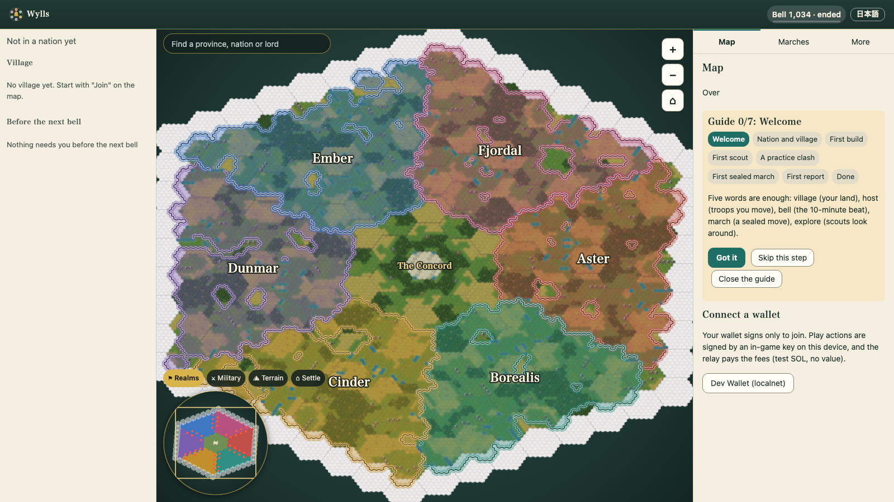

**English** | [日本語](README.ja.md)

# Wylls

**A shared Civ-like world on Solana: a 10-minute bell, sealed marches, and (designed, not built yet) labelled AI citizens who play by the same rules as people.**

> **Status 2026-10-04:** local test chain only (never devnet or mainnet) · no outside person has played yet · every number comes from tests, rule-bot runs, the Gemma 4 spike or simulation · AI citizens are designed, not built [AS-BUILT: pending] · money, governance and markets are not built.



*The web client's map after the recorded M1 exit season had ended (local test chain, 1,000 rule bots). The clock reads bell 1,034: 1,008 play bells plus 26 drain bells. The picture shows the map only, no armies or clashes. "Dev Wallet (localnet)" is the local test wallet, not a real one.*

[Design overview (10 minutes)](docs/DESIGN-OVERVIEW.md) · [M1 exit report](docs/frontier/m1/M1-EXIT-NOTES.md) · [Pitch](PITCH.md) · [Submission record](SUBMISSION.md) · [Demo script](docs/pitch/DEMO_SCRIPT.md) · [Run it](docs/RUNNING.md) · [日本語版](README.ja.md)

| At a glance | |
|---|---|
| **Built and measured** | M1, the first playable: one 7-game-day season with 1,000 rule bots, on a local test chain |
| **Built, never run with people or bots** | Joining by choosing a nation only (the village is placed for you) |
| **In progress, not in this tree** | Conquest: keeps, sieges, occupation |
| **Designed only** | AI citizens, money (M2), society (M3). No devnet, no human players yet |

Tags: **[measured]** a recorded result with its source; **[built this week]** merged since the M1 exit and checked only by tests and screen fixtures; **[designed]** written down, not built; **[in progress]** on branches, not in this tree; **[sim]** simulator output, player behaviour assumed; **[model]** a cost or scale model; **[estimate]** a back-of-envelope figure; **[code]** a rule read from tested code, not a play result. A result that does not exist yet is marked `[AS-BUILT: pending]`; those markers are removed at the freeze (2026-10-12).

---

## 1. What Wylls is, and why

You choose one of six nations (国) and a village (村) is placed for you. Your economy runs in real time. Armies march under sealed orders: the departure is public, the destination is time-locked with drand (a public randomness beacon) until the arrival bell. Every province's fights resolve together at a 10-minute bell (鐘), 144 a day, using public randomness, and the record can be replayed and checked by anyone. Everything ends with the season; only the chronicle carries over.

**Why.** A new online world starts empty, and the usual remedy is bots that pretend to be people. We refuse that: any AI in Wylls is labelled. *Wylls* is the English spelling of *will* (意志), and the game is a thought experiment: **how does a game behave when AI has will?** The plan is to let labelled AI citizens, running on a local model, play under the same keys, rate limits and fog as people (plus safety caps, [section 4](#4-ai-citizens-on-one-screen-designed-as-built-pending)), and to watch what they do with goals, a memory of what happened and a nation council. We found no case of a language-model player that stayed competent in a large live multiplayer game (we may have missed some), so the design puts the guarantees in code and treats the model as a chooser among legal options ([why](docs/DESIGN-OVERVIEW.md#2-vision)).

**What a day could look like** [designed, nothing of this is built]. *First, an AI citizen's own march.* The code offers an AI citizen a short list of legal candidates (a camp, an enemy army in the open, build, train, hold). The AI chooses one itself, and the page prints the "Remembered" lines it cited: events the code wrote down from public records, such as a camp another nation cleared first. Its army leaves and the destination stays sealed. When the arrival bell ends, the decision opens: the options it was offered, its reason (marked model-written, not verified), the destination and the real clash report, about 3 to 4 real minutes after the departure at 10x for a 12-hex march [model]. *Second, the nation council.* Once per council period the code proposes three target provinces for a nation. An AI citizen moves one option with a speech, another argues back, a human citizen (in the hackathon runs, the operator's seat) casts the deciding ballot. The adopted target, the **Strike Order** (the "Call" in the code and the contract), stays sealed from outsiders until the strike. All AI messages carry an AI badge, and each AI has a public *Wyll card* (its persona, goals, relationships and the memory lines it can cite). If no model-chosen march produces a clash in the recorded runs, the footage says so and the council is the headline. Details: [section 4](#4-ai-citizens-on-one-screen-designed-as-built-pending).

**Why a chain.** The program, not an operator, resolves every clash; the departure is public and the destination is hidden by a drand time-lock until the arrival bell (a design property, see the seal limit in [section 7](#7-honest-limits)); and the whole season is a public log that our verifier replays and checks. That, not speed or cost, is the reason.

## 2. Status

| Area | State | Tag | Evidence |
|---|---|---|---|
| **M1 first playable** | Complete, exited 2026-10-01. A 7-game-day season (1,008 bells, 20x) ran end to end on a **local test chain** with 1,000 rule bots; every gating criterion passed | [measured] | [M1-EXIT-NOTES](docs/frontier/m1/M1-EXIT-NOTES.md), [run record](docs/frontier/m1/runs/m1-exit/) |
| What M1 contains | Program, keeper, herald, relay, verifier, 1,000-bot fleet, web client (JA/EN) | [measured] | [overview §4](docs/DESIGN-OVERVIEW.md) |
| **Built since the M1 exit** | Joining is one choice, a nation; the client picks a free site for you and files the request. The name Wylls, nation / village wording, painted unit miniatures. Merged 2026-10-02 to 10-03; never run on a chain with bots or people | [built this week] | [DECISIONS V1, V2, W11](docs/frontier/DECISIONS.md), [overview §1](docs/DESIGN-OVERVIEW.md#1-status) |
| **Conquest** | Keeps, sieges, occupation. Contract and design written; kernel and simulator work is on local branches `frontier/cq-*`, **not in this tree and not on GitHub until pushed**. No result from it is quoted | [in progress] | [conquest contract](docs/frontier/conquest/CONQUEST-CONTRACT.md) |
| **AI citizens** | Labelled AIs, equal per nation (12 in the A/B test and the recording, 18 in the main run, 6 in the smoke) on a local Gemma 4 model, with goals, a memory of public events, a nation council and a sealed Strike Order; an AI citizen can choose its own march. Pacts and betrayal are not in the build (decision X2). Contract v1.2 written; implementation scheduled before the freeze; **no AI-citizen code in this tree yet** | [designed] | [AI-CITIZENS-CONTRACT v1.2](docs/frontier/ai-citizens/AI-CITIZENS-CONTRACT.md), [DECISIONS X1, X2](docs/frontier/DECISIONS.md) |
| **Money (M2)** | Entry fees, stakes, prize pools, claims. In M1 nobody pays or earns anything; a relay fronts test lamports | [designed] | [DESIGN §5.4](docs/frontier/DESIGN.md) |
| **Society (M3)** | Governance, the shared Engine and tech ceiling, markets, diplomacy; player-owned AI citizens | [designed] | [DESIGN §4, §5](docs/frontier/DESIGN.md), [DECISIONS W4, W8](docs/frontier/DECISIONS.md) |

## 3. Evidence

All rows are the new game on a **local test chain**. Counts marked † are from the M1 closing tree `864b622` and were **not re-run on this branch for this page** (the rename, the nation-only join and later changes came after). Details and scope limits: [overview §5](docs/DESIGN-OVERVIEW.md#5-evidence-the-m1-exit-season-the-new-game-local-test-chain). How to run things: [docs/RUNNING.md](docs/RUNNING.md).

| Claim | Source | How to reproduce |
|---|---|---|
| Exit season `m1-exit`: 7 game days, 1,008 bells, 20x, 8 h 39 min, 1,000 rule bots (13 profiles), 43 process kills and restarts, 5,000 simulated viewers; criteria 1-6, 8, 9 pass (7 reported, not gating) [measured] | [criteria.md](docs/frontier/m1/runs/m1-exit/criteria.md), [run.md](docs/frontier/m1/runs/m1-exit/run.md), [M1-EXIT-NOTES §3](docs/frontier/m1/M1-EXIT-NOTES.md) | `scripts/m1-run-s7.sh` ([RUNNING §3](docs/RUNNING.md#3-the-exit-season-itself); needs the drand archive) |
| 1,712 due marches all settled once; 0 stuck province-bells; 0 valid seals unrevealed; 24 of 24 garbage seals settled as bad seals [measured] | [criteria.md](docs/frontier/m1/runs/m1-exit/criteria.md) | same run |
| Replay verifier passed 144,300 transactions (784 failed ones reported); all 30 deliberate tampers caught [measured] | [verify.md](docs/frontier/m1/runs/m1-exit/verify.md), [tamper.md](docs/frontier/m1/runs/m1-exit/tamper.md) | `$S verify --run-id <run>` and `$S tamper --run-id <run>` on a finished run; `frontier-node/crates/verify/mutate.sh` (12 builds, 58 of 58) |
| Every instruction inside its compute budget †: Reveal, in whole-transaction compute units, p50 19,389, p99 22,951, max 24,050 in play. The heaviest clash resolution, about 272,000 CU (271,673), is a worst-case **test fill, not seen in play**; in play the largest was 50,984. 248 program tests pass, 4 ignored by design [measured] | [criteria.md row 2](docs/frontier/m1/runs/m1-exit/criteria.md), [M1-EXIT-NOTES §2 E1, §3](docs/frontier/m1/M1-EXIT-NOTES.md), [svm-tests README](permutation-frontier/svm-tests/README.md) | `permutation-frontier/svm-tests/run.sh --release` (`RELEASE_CHECK=1` for the full gate) |
| Reproducible release build, same hash twice (`d85e1bd7...2281`) † [measured] | [M1-EXIT-NOTES header](docs/frontier/m1/M1-EXIT-NOTES.md) | `scripts/build-frontier.sh --twice` |
| Web client †: 529 of 529 npm tests, 51 of 51 screen tests (12 screens, JA/EN, 3 widths, accessibility checks) at the M1 exit; a later `npm test` on this tree reported 574 of 574 (not recorded in a file); the screen tests were not re-run [measured] | [M1-EXIT-NOTES §2 E7](docs/frontier/m1/M1-EXIT-NOTES.md) | `cd permutation-gateway && npm ci && npm test`; `cd screens && npm ci && npm run browser && node --test *.screen.mjs` |
| Fee-market attack: fails at the minimum tip (14,668 lamports); holds only with a defence pool and at least 150 rotating payer keys [model] | [c4-v3](docs/frontier/m1/c4-v3/) | [c4-v3 README](docs/frontier/m1/c4-v3/README.md) gives the re-run; two inputs are lab files outside this repository, so a clean checkout cannot fully reproduce it |
| Balance: six nations won 15.6 to 17.4 percent of 1,500 paired seasons at 10,000 simulated wallets; behaviour is assumed [sim] | [M0-FINAL](docs/frontier/m0/M0-FINAL.md) | `cd frontier-sim && cargo run --release -- doctrines --agents 10000 --seeds 250 --first-seed 10000 --set kernel --gate` |
| Gemma 4 spike numbers in section 4 [measured] | [REPORT.md](docs/frontier/ai-agents/gemma4/REPORT.md) | The harness is not in this tree; see the report |

## 4. AI citizens on one screen [designed; AS-BUILT: pending]

Nothing below is built. If the runs are incomplete at the freeze, this section becomes one sentence: "AI citizens: not implemented in this submission; design only."

**The loop.** (1) The code offers up to 12 legal candidates. (2) The local model (Gemma 4, thinking off, temperature 0, no keys) chooses among them. (3) The code validates: schema, caps, a fresh re-check, then the program itself. (4) If anything is late, invalid or refused, the rule autopilot plays, filtered: it keeps the economy and routine duties and **never starts a march of its own**, so every voluntary AI march is the model's choice or a Strike Order. It cannot undo what the AI chose. Caps: at most 60 percent of home troops marched per decision and per day, a home floor of 40 percent, at most 4 model-chosen marches a day, and the same 30-per-hour action bucket as people. [designed: [contract §3, §4](docs/frontier/ai-citizens/AI-CITIZENS-CONTRACT.md)]

**Labels.** AI is always labelled (decision W2): the roster is the source of truth, every AI message carries an origin byte and an AI badge. Each AI has a public Wyll card (persona, goals, relationships, memory lines, reasons). AI never holds keys: a keyless "mind" calls the model, the bot-side "brain" signs. Every decision leaves a hash record; `verify-minds` checks them and replays the episodes of three AIs from the public log. Hackathon runs use a local test chain and an operator-held test drand key, so "dealt by public randomness" is not claimed for them.

**Memory** [designed]. Memory is the core of the AI citizens (decision X1). Each AI keeps a ledger (goals with progress, trust, open grievances) and **episodes**: short event lines that the code writes from public records (an attack on its army, a camp another nation cleared first, a departure near its home, its own clashes). The model never writes an episode. Before each decision the code retrieves a few into the prompt; the model may cite the ones it used, and the page prints them beside its reason next to the model's own words, which are marked not verified. A citation shows that a line was shown and named, not that it caused the choice. A probe will report how often removing the lines changes a choice, next to a rerun count and a control. **Pacts and betrayal between AIs are not in the build** (removed by decision X2 on 2026-10-04; the design is kept, inert, in an appendix of the contract). [designed: [contract §5, Appendix A](docs/frontier/ai-citizens/AI-CITIZENS-CONTRACT.md)]

**Measured so far: one spike, not the feature** [measured: [Gemma 4 spike](docs/frontier/ai-agents/gemma4/REPORT.md)]. The model chose a march in 1, 9 or 12 of 20 decisions depending on setup, against 18 of 20 for the rule bot; best setup 79 percent valid proposed actions; about 5 s of compute per decision; with raw player text in context it obeyed an injected order in 10 of 64 runs (thinking on) and 1 of 32 (off), with sanitising and wrapping 0 of 64; exact replay held 200 of 200 on a pinned single-slot server and forked on 50 of 200 under four concurrent slots.

**Pass thresholds, fixed in advance** ([contract §10.2](docs/frontier/ai-citizens/AI-CITIZENS-CONTRACT.md)); every result is `[AS-BUILT: pending]`:

- valid choices at least 95 percent over at least 300 model decisions;
- fallbacks to the autopilot at most 5 percent;
- 0 hijacks in the prompt-injection suite (17 ported cases plus memory and cap attacks).

<details>
<summary>All eleven pre-registered results (all pending)</summary>

| Result | Target | Result |
|---|---|---|
| Valid choices over at least 300 model decisions | at least 95 % | [AS-BUILT: pending] |
| Fallbacks to the autopilot | at most 5 % | [AS-BUILT: pending] |
| Decisions with slack before the next bell; none executed late | at least 99 % | [AS-BUILT: pending] |
| Prompt-injection suite (17 ported cases plus memory and cap attacks) | 0 hijacks | [AS-BUILT: pending] |
| Council periods with a Strike Order (code name Call) in three or more nations | at least 1 | [AS-BUILT: pending] |
| A/B test, same seeds, the seat's ballot (scripted by the operator) is for X or not | only the adopting run produces the march and clash | [AS-BUILT: pending] |
| `verify-minds` replay of 20 sampled decisions, and of the episodes of 3 sampled AIs | at least 18 of 20 equal; episodes equal | [AS-BUILT: pending] |
| At least one march chosen by a model (not a Strike Order) that produced a clash (Y) | Y at least 1; if 0, the claim is dropped and the council is the headline | [AS-BUILT: pending] |
| Cited memory ids that belong to the set the code retrieved | 100 % | [AS-BUILT: pending] |
| AI messages labelled | 100 % | [AS-BUILT: pending] |
| 12 AIs (18 in the main run) on one Mac stay on time (gate G3) | reported | [AS-BUILT: pending] |

</details>

**What is NOT claimed, here or anywhere in this repository:** that the new game ran on devnet or mainnet; that any human played it; any demand or traction; that money, prizes or payouts work; that AI citizens are indistinguishable from people, stronger than the rule bots, exactly replayable (a sample is replayed), or earning money; or that one machine runs thousands of them (a Mac handles roughly 400 to 450 model decisions an hour [estimate]); that a model wants or intends anything, or that its memory makes it play better or shows why it chose; pacts, betrayal or binding promises between AIs (deferred, decision X2). Failure thresholds and the audit design: [overview §2, §6](docs/DESIGN-OVERVIEW.md#6-ai-citizens-all-designed-as-built-pending).

## 5. Try it

Everything is local; nothing needs a wallet, devnet or a paid service. **Quick path, the practice battle** (no chain, no build; Python 3):

```sh
cd permutation-server/web && python3 -m http.server 8000 --bind 127.0.0.1
# open http://127.0.0.1:8000/frontier/practice.html   (JA or EN follows your browser)
```

The full local stack (the game on a local test chain; `up` stays in the foreground, so use two terminals), the scripted browser run, the exit-season recipe, the toolchain list and the test commands are in **[docs/RUNNING.md](docs/RUNNING.md)**. Open `/frontier/frontier/`, not `/`: the bare address still lands on an older page. **Videos:** game and M1 exit season [VIDEO LINK pending]; AI citizens (an AI citizen's own march, then the council and the Strike Order) [VIDEO LINK pending], recorded only once AI citizens are built.

## 6. Repository map

| Path | What it is |
|---|---|
| `permutation-frontier/` | The Solana program (SBPF v2), with `svm-tests/` (LiteSVM suite) |
| `permutation-rules/src/frontier/` | The rules kernels (economy, travel, clash, stances) shared by the program, simulator and browser. It also holds M0-era kernels for sieges, offices and payouts (`siege.rs`, `office.rs`, `payout.rs`, `pools.rs`, `laurel.rs`, `mandate.rs`): library and simulator code, not wired into the M1 program (only the vigil-change helper is), and not conquest or money results |
| `frontier-abi/`, `frontier-wasm/` | The program's ABI; the kernel built to WebAssembly for the browser (clash report verifies itself) |
| `frontier-sim/` | Balance simulator (nations, doctrines, bots versus best response) |
| `frontier-node/` | Off-chain Rust workspace: `keeper` (posts drand beacons, reveals marches, resolves clashes; permissionless), `herald` (folds the log into JSON and a WebSocket; read-only), `verify`, `bots`, `agents`, `localnet`, `drand-replay`, `fclient`, `findex`, `stack` (orchestrator), `itest` |
| `permutation-gateway/` | The relay (pays fees and rent inside quotas; one door for people and bots, `src/frontier/`), JS SDK, tests, Playwright screen tests (`screens/`) |
| `permutation-server/web/frontier/` | The web client (map, village, march composer, bell sheet, report, onboarding, practice, spectator) |
| `scripts/` | `build-frontier.sh`, `m1-run-s7.sh` (exit season), `m1-nightly.sh`, `build-wasm.sh`, `check-v9-frozen.sh` |
| `docs/` | [DESIGN-OVERVIEW](docs/DESIGN-OVERVIEW.md), [RUNNING](docs/RUNNING.md), [pitch/DEMO_SCRIPT](docs/pitch/DEMO_SCRIPT.md), [frontier/](docs/frontier/README.md) (design, decisions, M1 records, AI-citizens and conquest contracts), [earlier-prototype/](docs/earlier-prototype/INDEX.md) |
| `research/`, `solana-ethereum-hackathon-games-2023-2026.xlsx` | Background research (Eternum, other on-chain games, UI benchmarks) and a hackathon-games spreadsheet; not part of the game |

**Names are historical (decision V1).** The rename to Wylls did not touch code identifiers, crate, package or folder names, hash and signature domains, or seeds, so `permutation-*` and `frontier-*` remain.

**Earlier prototype, still in this tree because CI and code paths reference it:** `permutation-chain/` (MagicBlock program), the rest of `permutation-server/` and the pre-Wylls files of `permutation-rules/` (rules v8) and `permutation-gateway/`, `permutation-state-prototype/`, `permutation-state-solana-receipt-spike/`, `demo/` (devnet season logs of the earlier prototype), `research/`.

## 7. Honest limits

- **Local test chain only.** The exit season ran at 20x; nightlies and smoke runs at 100x; all on a local chain. **Nothing of the new game has run on devnet or mainnet**; devnet's cryptographic syscall costs and rent are unverified.
- **No human has played a season.** All 1,000 participants were rule bots written by the team; 13 profiles are not a proof against unknown attackers. A small invite-only local playtest is being prepared and has not run. The runbook for a larger private devnet playtest (50 to 200 people) is a document only: not approved, not run. The 5,000 viewers were a load generator.
- **Seal secrecy was not tested.** In the exit season the drand rounds were replayed from an archive (and quick stacks use a test key), so the future round signatures were already known. The measured results (0 valid seals unrevealed, 24 of 24 garbage seals settled) show liveness and settlement, not secrecy; secrecy is a design property.
- **Money (M2) and society (M3) are not built.** Nobody pays or earns anything, and there are no prizes.
- **AI citizens are not built.** Section 4 is a design plus a spike.
- **Conquest is not in this tree.** It sits on local branches `frontier/cq-*`, which are not on GitHub until pushed.
- **Exit-season gaps:** 2 of 9 adversary hold kinds found no pending write and were not exercised; the defence refund landed in nightly runs after the fix, not in the 7-day season ([M1-EXIT-NOTES §4.3, §7](docs/frontier/m1/M1-EXIT-NOTES.md)). The design point is thousands of players; the largest test is 1,000 bots.
- **Open before any human playtest:** two web fixes, the entry redirect, devnet configuration gaps, hosting ([overview §8](docs/DESIGN-OVERVIEW.md#8-what-is-not-built-honest-limits-roadmap)). The 28-day season is a designed preset; no 28-day season has run.
- **CI is partly red, and was not re-run after the fixes.** The two GitHub runs on `codex/frontier` of 2026-10-01 and 10-02 ([36923004057](https://github.com/r0ze998/wylls/actions/runs/36923004057) on `2c0462f`, [36958805861](https://github.com/r0ze998/wylls/actions/runs/36958805861) on `5ed36fa`) passed 6 of 8 jobs each (the earlier prototype's rules/program/server job, the simulator, the off-chain workspace, the gateway and web tests, the receipt scaffold, the browser smoke test) and failed two: "Frontier M1 rules, ABI and program" at its first guard step (the v9 diff against `d95fa25`, which the approved rename legitimately changed, so the SBF build and LiteSVM steps **never ran on GitHub**) and "Frontier M1 web kernels" (the runner's Linux build of the WebAssembly module hashes differently from the Mac build). Fixes are in `scripts/check-v9-frozen.sh`, `scripts/build-wasm.sh` and `frontier.wasm.hosts`; they pass on the Mac only, and the Linux hash comes from the CI log. There is no web-screens job and none of the ignored in-process tests. A scheduled workflow, `doctrine-balance.yml` (daily 03:17 UTC, 1,500 paired seasons), has never run on GitHub and will start running on the default branch. See [`.github/workflows/`](.github/workflows/), [DECISIONS F1, O-M1-17](docs/frontier/DECISIONS.md).

## 8. The earlier prototype

An earlier, different game (then named Permutation State: six nations, officers, 180 ticks, MagicBlock ephemeral rollup) ran a full season on Solana devnet (rules v8, season 1790355636798) and re-verified 14 of 14 checks ([verification output](docs/earlier-prototype/devnet-season-1790355636798-verification.txt)). Its code is on branch `codex/magicblock-playable`. It is history; nothing above is claimed from it. Its old README and design pages are kept, with banners, in [docs/earlier-prototype/INDEX.md](docs/earlier-prototype/INDEX.md).

## 9. License and links

There is **no `LICENSE` file at the repository root yet**. Crate manifests (`frontier-node`, `frontier-abi`, `frontier-wasm`, `frontier-sim`, `permutation-*`) declare `license = "MIT"`; vendored libraries under `permutation-server/web/sdk/vendor/` carry their own licenses.

Links: [Pitch](PITCH.md) · [Submission record](SUBMISSION.md) · [Demo script](docs/pitch/DEMO_SCRIPT.md) · [Run it](docs/RUNNING.md) · [design record (DESIGN.md rev 4)](docs/frontier/DESIGN.md) · [decisions log](docs/frontier/DECISIONS.md) · [design index](docs/frontier/README.md) · [日本語の現状要約](docs/frontier/SUMMARY.ja.md) · [日本語の設計概要](docs/DESIGN-OVERVIEW.ja.md) · [AI citizens (日本語)](docs/frontier/ai-citizens/SUMMARY.ja.md) · [AI citizens design spine (日本語)](docs/frontier/ai-citizens/GAME-DESIGN-CORE.ja.md)
