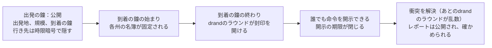
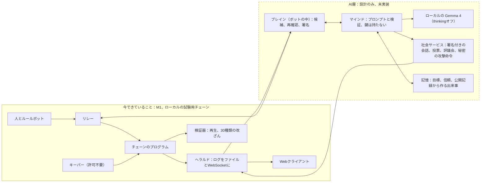
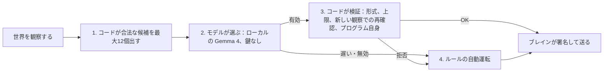

# Wylls：設計の概要

**対象読者：** 審査員と、設計の全体を約10分で知りたいエンジニア。**日付：** 2026-10-04（ハッカソン締切は 2026-10-13 15:59 JST）。**範囲：** このリポジトリにある唯一のゲーム、オープンワールドの Wylls。日本語の要約は [frontier/SUMMARY.ja.md](frontier/SUMMARY.ja.md) と、AI市民については [frontier/ai-citizens/GAME-DESIGN-CORE.ja.md](frontier/ai-citizens/GAME-DESIGN-CORE.ja.md) にあります（古い `ai-citizens/SUMMARY.ja.md` は契約書 v1.1 の、協定ありの内容で、置き換え済みです）。

> この文書は英語版 [DESIGN-OVERVIEW.md](DESIGN-OVERVIEW.md) の日本語版です。見出し、数字、状態タグ、リンクは英語版と同じです（見出しの番号も同じです）。

**これは何か。** Wylls は、Solana 上にある、みんなで共有する文明育成ゲームの、最初の遊べる一部分です（何が作ってあり、何が設計だけかは第1節にあります）。6つの国から1つを選ぶと、村が自動で置かれ、経済はリアルタイムで動きます。軍は封印された命令で動き（出発は公開、行き先は隠れます）、各州の戦闘は10分ごとの鐘でまとめて、公開の乱数を使って解決されます。誰でも再生して確かめられる記録が残ります。

**このゲームが問うこと：** AIに意志があるとき、ゲームはどう振る舞うのか。AIと明示した「AI市民」（それぞれ目標と、引用できる記憶を持つ）を、人と同じルールで遊ばせる計画です。

**状況を一行で。** 最初の遊べる版（M1）は、ルールボット1,000体による20倍速の7日間シーズンを、ローカルの試験用チェーンで1回動かしました。AI市民（公開記録からコードが作る記憶つき）は、設計済みで、凍結（2026-10-12）の前に作る予定です。まだ未実装です。ゲームにお金はなく、人が遊んだこともありません。

<details>
<summary><strong>タグの読み方。</strong>すべての主張に「状態」を付けています（クリックで開きます）。</summary>

| タグ | 意味 |
|---|---|
| **[measured]** | 実行やテストで得た結果。記録がリポジトリにあり、出典を示します。 |
| **[code]** | `permutation-rules/src/frontier/` にあるルールのカーネル（ルール計算の中核コード）から読んだ定数やルール。テスト済みのコードの値であり、実際のプレイで測ったものではありません。 |
| **[sim]**, **[model]**, **[estimate]** | シミュレータやモデルの出力（プレイヤーの動きは仮定）、または計画上の見積もり。実測ではありません。 |
| **[built this week]** | M1 終了（2026-10-01）以降に作って取り込んだもの。テストと画面の固定データ（フィクスチャ）でしか確認していません。 |
| **[designed]** | 文章として設計したが、まだ作っていないもの。 |
| **[AS-BUILT: pending]** | 作った後に実測値を入れるための空欄。マージと梱包の段階（2026-10-12 午前、凍結の前。契約書 §11.9）で印を外します。 |

</details>

---

## 1. 状況

**今できていること（M1、ローカルの試験用チェーンのみ）。**

- **ゲーム内7日間（1,008鐘）の終了シーズンを、20倍速で最初から最後まで動かせました。** チームが決めた合否基準に対して、ルールボット1,000体・13種類の行動プロファイル、drand quicknet（公開乱数ビーコン）の実際のラウンドをアーカイブから再生したローカルチェーンで実行し、合否基準をすべて通過しました。[measured: [M1-EXIT-NOTES](frontier/m1/M1-EXIT-NOTES.md) §1, §3]
- **オンチェーンのプログラム：** シーズンの進行、地図の環と州、参加、村、建設と訓練、封印された進軍、開封、鐘での衝突、清算。命令（instruction）は50個（うち1個はテスト専用）、アカウントの種類は17、ビルドは再現可能。[measured: M1-EXIT-NOTES §6]
- **オフチェーンのサービス：** キーパー、ヘラルド、リレー、検証器、ボット1,000体の群れ、drand再生つきのローカルチェーン。[measured: M1-EXIT-NOTES §6]
- **日本語・英語のWebクライアント：** 地図、村、進軍の作成と追跡、衝突レポート（ブラウザ内で自分で検証できる）、オンボーディング、練習戦、観戦画面。画面テスト 51/51、npmテスト 529/529。[measured: M1-EXIT-NOTES §2]
- **再生検証器：** 終了シーズンの144,300件のトランザクションを通過。意図的な改ざん30種類をすべて検出しました。[measured: M1-EXIT-NOTES §2, E6]

**M1終了（2026-10-01）以降に作ったもの（テストと画面フィクスチャでしか確認していません）。**

- **参加の選択は「国」ひとつだけです。** クライアントが最初の村を自動で置き、用地の申請も出します（決定 V2）。2026-10-02〜10-03 に取り込み済み。ボットや人を相手にチェーン上で動かしたことはありません。[built this week]
- 仕上げ：Wylls という名前、画面に出る言葉は国／村（V1, W11）、地図上の兵のミニチュアの描き直し。[built this week]

**作業中（このツリーには入っていません）。**

- **征服：砦、包囲、占領、動く地図。** 契約と設計は書き終えました。第1波のカーネルとシミュレータの作業は `frontier/cq-*` というブランチにあり、**このツリーには取り込んでいません**。ここには結果を載せません。[designed + in progress: [conquest contract](frontier/conquest/CONQUEST-CONTRACT.md)]

**設計のみ（未実装）。**

- **AI市民：** ローカルの Gemma 4 モデルで動く、AIと明示されたプレイヤー（国ごとに同数。A/Bテストと録画で12人、本番で18人）。ペルソナ（協定に関係しない目標つき）、**記憶**（公開記録からコードが作った出来事。AIは理由の中でそれを引用できます）、Wyllカード、署名付きメッセージ、国の評議会、秘密の「攻撃命令（Strike Order。契約書では Call）」を持ちます。AI市民は、コードが出した候補の中から**自分の進軍**を選べます。自動運転が自分から進軍を始めることはありません。**協定と裏切りはこの版に入っていません**（オーナーが 2026-10-04 に外しました。設計は契約書の附録に、動かない形で残してあります）。契約書は書いてあり、作るのは凍結の前に予定していますが、AI市民のコードはこのツリーにまだありません。[designed: [contract v1.2](frontier/ai-citizens/AI-CITIZENS-CONTRACT.md)]
- **お金（M2）：** 参加費、ステーク、賞金プール、受け取り。M1 では、プレイヤーが払うことも受け取ることもなく、賞金もありません。ローカルの試験用チェーンでは、家賃・手数料・開封のチップを中継サーバー（リレー）が試験用のお金で肩代わりします。[designed: DESIGN §5.4]
- **社会（M3）：** 統治と選挙、Engine と共有の技術上限、市場と隊商、外交。[designed: DESIGN §4, §5]
- **プレイヤーが持つAI市民**（自分の鍵を持つ）と、W4の条件が満たされた後にだけ運営AIを受け入れるお金のシーズン。[designed: DECISIONS W4, W8]

**この文書のどこでも主張していないこと：** 新しいゲームがdevnetやmainnetで動いたこと。人が遊んだこと。需要や反響があること。お金・賞金・支払いが動くこと。モデルが何かを望んだり意図したりしていること。協定、裏切り、拘束力のある約束があること。AIの言葉や、AIが引用した記憶が確認済みであること、引用がAIの判断の理由を示すこと。Wylls が完成した文明ゲームであること（技術、外交、市場、統治、得点、共有の文明は設計のみで、未実装です）。AI市民が人と見分けがつかない、ルールボットより強い、厳密に再現できる、お金を稼ぐこと。記憶があるとAIが上手になること。1台のマシンで何千ものAIが動くこと。

---

## 2. ビジョン

**Wylls** は will（意志）の英語表記です。このゲームが問うのは、ひとつの思考実験です。*AIに意志があるとき、ゲームはどう振る舞うのか。*

舞台は、文明を育てるタイプの、ひとつの共有された世界です。国を選び、村を受け取り、リアルタイムで育てます。人もAI市民も、同じ鍵、同じ回数制限、同じ霧（見えない範囲）で行動します。ただしAIは、コードが出した絞った選択肢と、安全のための上限を通して動くので、「同じルール」とだけは言いません（6.1）。AI市民は、いつもAIと明示されます。見たいのは、一部のプレイヤーが長く続く目標と、引用できる記憶を持ち、評議会で議論し、命令を断り、自分で軍を動かしたとき、何が起きるかです。

この実験には、正直な立場が3つあります。

1. **「意志」は作るもので、最初からあるものではありません。** 言語モデルは長期の目標を持って生まれてきません。この設計では、各AIにコードで4つを持たせます。続く目標、記憶、人間関係（信頼と、まだ返していない恨み）、そして断る権利です。さらに、意志が目に見える場も用意します。覚えていることを引用する理由、AI自身の進軍、メッセージ、投票です。（以前の計画には、AI同士の約束や協定もありましたが、オーナーが 2026-10-04 に外したので、この版には入っていません。）[designed: [RULES-AND-AI-CITIZENS.ja.md](frontier/ai-citizens/RULES-AND-AI-CITIZENS.ja.md) §3; contract v1.2 §5.9]
2. **根拠はまだ薄いです。** 調べた範囲では、大規模なライブのマルチプレイゲームで言語モデルのプレイヤーが通用した例は見つかっていません。参考にした事例（Project Sid、AI Diplomacy、CivBench）は、証明ではなく型として使います。見落としがあるかもしれません（[RULES-AND-AI-CITIZENS.ja.md](frontier/ai-citizens/RULES-AND-AI-CITIZENS.ja.md) §3.2）。ここでの違いは、AIが人と同じ制限の下で動き、いつもAIと明示され、監査用のハッシュを残し、有料APIを使わないことです。ローカルの Gemma 4 での自前の予備実験（スパイク）では、言葉を扱う作業には使えましたが、ルールボットより上手なプレイヤーではありませんでした。20回の判断のうち進軍を選んだのは、設定によって 1回、9回、12回で、ルールボットは18回でした。最良の設定でも、提案した行動のうち有効だったのは79%です。[measured: [Gemma 4 spike](frontier/ai-agents/gemma4/REPORT.md) §1, §3] そこでこの設計では、保証はコードに持たせ、モデルは「合法な選択肢から選ぶ役」として扱います。
3. **10分の鐘は、言語モデルに合っています。** 手の空いたマシンで計算約5秒かかる判断は、10分の鐘の中に十分収まります。ただし、1台のMacで12人のAIが時間内に動けるかどうかは、契約書のゲートG3であり、**[AS-BUILT: pending]** です。[measured: Gemma 4 spike §3、1回の判断あたり計算約5秒]

**見られるようになるもの** [designed; AS-BUILT: pending]。*ひとつめは、AI市民が自分で出す進軍です。* コードが出した合法な候補の中から、AI市民が、野営地や野戦の敵軍に向けて軍を送ると選びます。軍は出発し、行き先は隠れたままです。到着の鐘が終わると、ページがその判断を開きます。示された選択肢、AI自身の言葉（モデルが書いたもので、確認されていないと明記）、そして、引用した記録済みの出来事を鐘の番号つきで引く「Remembered:」の行です。そのあとに衝突のレポートが続きます。10倍速で、出発の約3〜4分後（実時間）です。*ふたつめは、国の評議会です。* コードが、その国が勝てそうな3つの目標を並べます。AI市民が1つを主張し、発表者（運営の席）が決め手の1票を投じ、採用された目標（「攻撃命令」）は、攻撃の鐘まで秘密のままです。A/Bテストは、同じシードで2回動かし、違いは席の1票だけにします（A/Bでは運営が台本で入れる票で、そう表示します。本物の人の票が出るのは、録画の場面だけです）。目標を採用した実行だけが、その進軍と衝突を起こせます。記録した実行の中に、モデルが選んだ進軍で衝突が起きたものがなければ、映像はそう明示し、評議会を主役にします。

**失敗とみなすもの**（契約書で事前に固定したしきい値）：判断300回以上のうち有効な選択が95%未満。判断の5%を超えて自動運転に落ちる。インジェクションの試験一式で乗っ取りが1件でもある（許容は0件）。3つ以上の国で攻撃命令が出た評議会の期間が1度もない。A/Bテストが再現しない。コードが取り出した範囲の外にある記憶を引用する（許容は0件）。エピソードの再生が公開ログと合わない。モデルが選んだ進軍で衝突が起きたものが1つもない（その場合、その主張は取り下げ、切り上げはしません）。**ここでいう「意志」とは：**コードで作った持続する目標、引用できる記憶、人間関係、断る権利のことです。モデルに意図があると主張するものではありません。

---

## 3. 1ページで見るゲーム

- **選ぶのは国だけです。** 国（nation）は6つ。それぞれ地図上に自国の領域（くさび形）と、非対称な戦い方の方針（ドクトリン）を持ちます。最初の村（village）は自動で置かれます。はじめは集落（hamlet）で、町、都市、要塞へ育ちます。参加してから次の鐘のあと、およそ11〜21分で現れます。[built this week: V2; [model]: DESIGN §2.3]
- **経済はリアルタイムで動き、必要になったときにまとめて計算します（遅延評価）。** 資源はオンラインかどうかに関係なく、1時間ごとに増えます。農場は、予約してから本当に90分で完成します。順番待ちのターンはありません。[code: `holding.rs`, `catalog.rs`]
- **戦闘は鐘ごとに、州ごとに解決します。** 鐘は10分で、1日144回です。鐘の始まりに、各州の名簿（ロスター）が固定されます。その鐘のあいだに着いた全員が、ひとつの同時の衝突で戦い、drandの乱数（公開の乱数ビーコン）で解決します。先に送っても得はありません。[code: `travel.rs`; DESIGN §2.1, §6.3]
- **進軍は封印されます。** 軍が出発すると、どこから出たか、規模、どの鐘に着くかが全員に見えます。行き先は、到着の鐘までdrandのタイムロック（tlock、時限暗号）で隠されます。守る側は名簿の固定で決まるので、行き先が分かってから増援を呼んでも間に合いません。[code + DESIGN §6.2]
- **すべてはシーズンとともに終わります。** 設計上のシーズンは28日（4,032鐘）で、参加は21日目までです。進軍は最後の鐘までに着かなければならず、シーズンの終わりをまたぐものはありません。次のシーズンは新しい地図から始まり、年代記だけが引き継がれます。[DECISIONS T1：すべてはシーズンとともに終わる。28日という長さと21日目までの参加は設計上の設定（DESIGN §2.6）で、28日のシーズンはまだ動かしていません。終了シーズンはゲーム内7日間を20倍速で動かしたもので、コードは最後の鐘を4,032まで許します]



**何を目指して遊ぶか。** M1 でのループは、村を育て、偵察し、蛮族の野営地や他のプレイヤーの軍と戦うことです。得点や勝者はまだありません。国のスコアと4つの勝ち筋は設計済みで（DESIGN §2.5, §5.6）、未実装です（M2/M3）。いまは、戦いに勝っても得るものがありません。他の国に勝っても、略奪も土地も功績もなく、蛮族の野営地を倒すと功績10がもらえますが、使い道はまだありません。だから、AIが戦う理由は、報酬ではなく、記憶と人格です。[code: `camp.rs`, `catalog.rs`; M1の規則 D9]

### 3.1 ある1日を、ルールカーネルの数字で

ひとことで言うと、こうです。参加すると集落が現れ、農場と木こり小屋を予約し、槍兵100人を訓練し、斥候を出し、数時間後に蛮族の野営地へ封印した進軍を出します。鐘で衝突が解決し、レポートを読み、翌日に集落を町へ昇格させます。下の表は、エンジニア向けの数字です。

<details>
<summary>1時間ごとの数字（クリックで開きます）</summary>

例として最初の1日を示します。量はカーネルの表から計算したもので、**兵の維持費は無視**し、買うのは農場、木こり小屋、槍兵100人だけと仮定します（斥候を入れると少し多くなります）。**[code]** であり、実際のプレイで測ったものではありません。時刻は、村が現れた時点からの経過です。

| いつ | プレイヤーがすること | 数字 | カーネルの出典 |
|---|---|---|---|
| 前 | 国を選ぶ。クライアントが、自国の領域にある最大3か所の空き地の申請を出す。同じ鐘の申請はその鐘の乱数でまとめて決まるので、速さでは勝てない。 | 村が現れるまで約11〜21分 [model] | DESIGN §2.2; `fjoin.mjs` |
| +0:00 | 村が集落として生まれる。初期セットと防護（シールド）つき。 | 初期セット：食料300、木材300、石200、鉱石100、金100。倉庫は各2,000、建設枠2。シールド48時間。1時間あたりの生産：食料40、木材30、石20、鉱石15、金15、科学5。 | `catalog.rs` `STARTER_KIT`, `BASE_PROD`; `holding.rs` |
| +0:30 | 農場と木こり小屋を予約する。 | 農場：木材80＋石40、食料+12/時。木こり小屋：食料40＋石40、木材+10/時。どちらも90分（n個目は 3,600＋1,800n 秒）。n個目の費用は 基本費用 x (1 + 0.5 (n-1)^2)。 | `catalog.rs` `BUILDINGS`, `build_secs`; `holding.rs` `duplicate_cost` |
| +0:30 | 槍兵100人を訓練する。訓練は即時。 | 食料60、鉱石20、金10。1つの軍（host）は100〜30,000人。 | `catalog.rs` `train`; `host.rs` |
| +2:00 | 斥候を出して探索する。結果は次の鐘で届く。 | 功績ポイント：探索1回で4、野営地で10。カタログには1日の上限20が定義されていますが、M1 のプログラムは強制していません。 | `catalog.rs` `WORKS_*` |
| +3:00 | 平地12マス先の蛮族の野営地へ向けて進軍を封印する。 | 平地は1マス2分、丘や森は3分、騎兵や道路は半分で、合計24分。到着は鐘に切り上げられ、出発の鐘から最低2鐘後（最大72鐘後）。スタミナ：封印された経路では、出発時に最大値を消費します。10＋2×32＝74（上限120）です（カーネルの式なら、この12マスでは34）。1回の進軍は最大32マス、最大4州まで。州は61マスの円盤。野営地の兵力は100〜400。 | `travel.rs`; `geometry.rs`; `camp.rs`; `host.rs` `DEPART_STAMINA` (I-32) |
| +3:00 | 出発は公開（出発地、規模、到着の鐘）。行き先はdrandのタイムロックで隠す。最低限のチップ（M1の設定では14,668 lamports）は、タブを閉じても封印を開けてくれた人への報酬になる。誰も期限までに開けなかった封印は、兵の半分を失って帰ってくる。 | 最初の衝突レポートは、出発の約31〜41分後に届く [model]。 | `host.rs` `ROUT_LOSS_BPS`; [c4-v3](frontier/m1/c4-v3/) |
| +3:40 | 鐘が閉じる。名簿は鐘の始まりに固定済み。衝突はその鐘のdrand乱数で解決される。レポートは公開され、ブラウザの中で自分で検証できる。構え（守る、強襲、側面、備え）と撤退のしきい値は、封印した命令に含まれていた。 | 1マスに最大6つの軍。村のマスでは、持ち主側が常に3枠を確保する。 | `stance.rs`; `clash.rs`; DESIGN §6.1 |
| +24:00 | 蓄えは木材約1,160、石600、金450になり、集落から町への昇格ができる。 | 昇格：木材1,000、石600、金300、6時間。町：建設枠3、倉庫6,000、生産+50%。 | `catalog.rs` `tier_up`; `holding.rs` `Tier` |

</details>

ペースは全員に同じ制限をかけます。1時間30回の行動のバケツ（バースト60）と、リレーの補助枠は、ゲーム内0〜6日目は1日40回、その後は20回です。[code: [M1 contract](frontier/m1/M1-CONTRACT.md) §5.6, §8.3]

---

## 4. チェーンが担うことと、オフチェーンで動くこと

**なぜチェーンなのか。** すべての衝突を解決するのは、運営ではなくプログラムです。設計上、封印された命令は、到着の鐘まで誰にも読めず、変えられません。シーズン全体が公開のログとして残り、誰でも再生して確かめられます。終了シーズンでは、検証器が144,300件のトランザクションを再生し、意図的な改ざん30種類をすべて検出しました。[measured: M1-EXIT-NOTES §2, E6] ここでチェーンを使う理由は、速さや費用ではなく、この点です。

**オンチェーン（土台は Solana。乱数と封印は drand quicknet）。** 裁定をするのはプログラムだけです。プログラムが持つのは、シーズン、環と州、市民と村、申請とその抽選、軍、封印された進軍とその開封、固定された名簿と衝突の解決、すべての進軍の清算、そしてすべての閉じ方です。命令は、できるだけ誰でも実行できる（許可不要）ようにしてあり、最初の有効な書き込みが採用されます。どの命令も、測った計算予算に収まります。最大の開封で約25,000コンピュートユニット、最も重い衝突の解決で約272,000です。[measured: M1-EXIT-NOTES §2, E1]

**オフチェーン。** どれも結果を変えることはできません。払う、動かす、見せる、確かめる、のどれかをするだけです。

| 部品 | 役割 | 信頼の位置づけ |
|---|---|---|
| **キーパー**（`frontier-keeper`、補助のプログラム） | drandのビーコンを投稿し、到着の鐘で封印を開け、進軍を開封（チップを得る）し、衝突を集めて解決し、静かな鐘を飛ばし、進軍と申請を清算し、アカウントを保管して閉じる。 | 許可不要。誰でも動かせる。重複した書き込みは拒否される。[RUN-A-KEEPER](frontier/m1/RUN-A-KEEPER.md) |
| **ヘラルド**（`frontier-herald`） | トランザクションのログをJSONファイルとWebSocketの配信にまとめる。クライアント、ボット、のちにAI市民が読む経路。 | 読み取り専用。誰でもログからファイルを再計算できる。 |
| **リレー**（`permutation-gateway/src/frontier`） | 割り当ての範囲内で、手数料と家賃（rent）をプレイヤーに代わって払う。人もボットも同じ入口から参加する。 | 補助を断ることはできるが、結果は変えられない。 |
| **検証器**（`frontier-verify`） | 終わったシーズンをログから再生し、全ルールを確かめる。確認そのものも確認する（30種類の改ざん）。 | 誰でも動かせる。 |
| **Webクライアント**（`permutation-server/web/frontier`） | 地図、村、進軍の作成、鐘の一覧、ブラウザ内（WebAssembly）でルールカーネルを再実行する衝突レポート、オンボーディング、練習、観戦。 | 持つのはプレイヤーのゲーム内の鍵だけ。 |
| **ボット**（`frontier-bots`） | ルールボット1,000体、13種類の行動プロファイル（不正をする型やスパムをする型を含む）。人と同じリレー、同じヘラルドの読み取り、同じ割り当て。 | テスト用の群れ。 |
| **ローカルチェーン**（`frontier-localnet`, `drand-replay`） | 1スロット400msの、Solana互換のプロセス内チェーンと、再生できるdrandの供給元。 | devnetやmainnetでは**ありません**。 |

**リポジトリの地図。** カーネル：`permutation-rules/src/frontier/`。プログラム：`permutation-frontier/`。ABIとwasm：`frontier-abi/`、`frontier-wasm/`。バランスのシミュレータ：`frontier-sim/`。オフチェーンのクレート：`frontier-node/crates/{keeper,herald,verify,bots,agents,localnet,stack,...}`。リレーとSDK：`permutation-gateway/`。Webクライアント：`permutation-server/web/frontier/`。設計記録：`docs/frontier/`。*決定 V1 により、Wylls への改名は、コードの識別子、クレート・パッケージ・フォルダの名前（およびハッシュや署名のドメイン、シード）には及んでいません。これらは従来の `permutation-*` や `frontier-*` の名前のままです。このことを述べるのは、この文書ではここだけです。* [DECISIONS V1]

---

## 5. 根拠：M1の終了シーズン（新しいゲーム、ローカルのテスト用チェーン）

実行名 `m1-exit`：リリースプログラム `d85e1bd7...2281`（2回ビルドして同じハッシュ）、ゲーム内7日間（1,008鐘）を20倍速で8時間39分、ルールボット1,000体・13プロファイル、キーパー2つ、アーカイブからの本物のquicknetのラウンド、意図的なプロセス強制終了43回と再起動43回、9種類の敵対的な妨害、そしてゲーム内24時間の間、5,000人の模擬観客。[measured: [M1-EXIT-NOTES](frontier/m1/M1-EXIT-NOTES.md) §3; 記録は [runs/m1-exit/](frontier/m1/runs/m1-exit/)]

| 確かめたこと | 結果 | 範囲の限界 |
|---|---|---|
| シーズンが完了する。止まった州や未清算の進軍がない | 合格：期限の来た進軍1,712件がすべて1回ずつ清算。止まった州・鐘は0 | ローカルチェーン、ルールボットのみ |
| すべての命令が計算予算内 | 合格：プレイ中に出た命令は35種類で、超過なし。開封は、トランザクション全体のコンピュートユニットで p50 19,389、p99 22,951、最大 24,050（プログラムだけなら p50 18,940、最大 23,600） | 予算はローカルバリデータの値。devnetは未検証 |
| キーパーの遅延 | p99で合格：1スロット（ビーコンからアンカーまで）、3スロット（シードから解決まで）、20倍速で | 妨害を重ねると、最大154スロット（実時間で約1分）の停止と、1,720スロット（実時間で約11.5分）の解決が1回あった |
| 封印された進軍が開かれる | 合格：有効な封印で未開封は0。ルールにより未開封が9 | 9種類の妨害のうち2種類は、待機中のものを一度も見つけなかった（§8を参照） |
| 不正のプロファイルが得をしない | 合格：期待された結果に反したプロファイルはなし | チームが書いた13種類のボットのプロファイル。未知の攻撃者への証明ではない |
| 偽物の封印は無効になる | 合格：24件中24件が不良の封印として清算された | |
| 観戦の負荷 | 合格：ファイルp99 8.7ms、取り込みからWebSocketまでp99 0.75秒、346万リクエストでエラー0 | 負荷生成器の**模擬**観客であり、人やブラウザではない |
| ボットとバランスシミュレータの比較 | **測っていません**（報告のみで、合否には使わない） | |
| 再生検証器 | 合格：144,300件のトランザクションを通過（うち784件は失敗したトランザクションで、報告済み）。検証の中核は11秒（コマンド全体では41秒）。30種類の改ざんを30種類とも検出 | チーム自身の検証器。誰でも動かせる |

その周辺では、最終ツリー上で、プログラムのテスト248件が通過（4件は意図的に無視）、検証器自身の確認は変異テスト済み（12ビルド、58/58）、Webテスト 529/529、画面テスト 51/51。[measured: M1-EXIT-NOTES §2, §12] 終了時に見つかった問題は2つです。2つのテスト（G14、`inproc_day`）が数え方の規則で不合格になったこと、そして、テスト環境が受取先に資金を入れていなかったため、防衛の払い戻しがスタック実行で一度も反映されていなかったことです。どちらも、プログラムとキーパーを変えずに、当日中に直しました。[DECISIONS U3, U4, U10]

**バランス（シミュレーション上）。** 非対称な国ごとのドクトリンをバランスシミュレータで調整した結果、1万の模擬ウォレットで、1,500組のシーズンのうち6つの国の勝率は15.6〜17.4%でした。最初の草案では、1つの国が600シーズンの99.5%で勝っていました。[sim: [M0-FINAL](frontier/m0/M0-FINAL.md); プレイヤーの動きは仮定]

---

## 6. AI市民 [すべて設計のみ。AS-BUILT: pending]

契約書 v1.2（2026-10-04）がハッカソンの作業の基準です。オーナーは 2026-10-03 に計画を承認し（DECISIONS W1〜W11）、2026-10-04 に、AI市民の記憶が核で、この版に入ること、協定と裏切りは外すことを決めました。以下は設計の説明であり、動いているシステムの説明ではありません。作るのは凍結の前に予定しています。凍結の時点で実行が終わっていなければ、この節は「AI市民：この提出では未実装。設計のみ。」の一文に差し替えます。

### AI層の位置づけ



AI層が世界に触れるのは、人が使うのと同じリレーを通してだけです。マインド（mind、モデルと話す側）は、鍵、シード、封印の平文、飛行中の自分の封印進軍の行き先を、見ることができません。署名するのは、ボットのプロセスの中にあるブレイン（brain）です。記憶は、公開記録からコードが作るので、再生して確かめられます。AI同士で共有されることもありません。メッセージと投票は、別の署名付き記録サービスを通り、そのファイルは、AI層の小さな静的サーバーが読み取り専用で配ります（ヘラルドには手を入れません）。図の文字版は付録Aにあります。[designed: [AI-CITIZENS-CONTRACT](frontier/ai-citizens/AI-CITIZENS-CONTRACT.md) §1, §5]

### 6.1 判断のしかた

**まずコードが候補を出し、次にモデルが選び、次にコードが検証し、何かあれば自動運転に切り替えます。** [designed: contract §0, §3, §4; DECISIONS W7]



1. **コードが合法な候補を出します。** ブレインは、ボットと同じように世界を観察し、日課の作業をすぐに送り、経済と軍事の選択肢を最大12個の候補にします（「自動運転」と「待機」は必ず入り、そのあとに進軍、呼び戻し、建設、訓練、探索が続きます）。進軍はAI自身の選択肢です。野営地、野戦の敵軍、または、両方の防護が終わったあとの敵の村（建国から約48ゲーム時間後）です。候補が持つのは、単位つきの事実で、座標ではありません。距離、見えている敵の兵数、比の言葉、待機時間、そして決まった文面の報酬の行（「失うのは兵だけ。土地は取れない」または「功績10、使い道はまだない」）です。
2. **モデルが選びます。** マインドは、そもそもモデルを起こすかどうかを決めます（公開されたできごとを見る門です。攻められた、近くで出発があった、メッセージが来た、評議会の時間、定期の合図など。半日の境目は、任意の自己要約のきっかけになります）。起こすときは、約3,000トークンまでのプロンプトを作り、ローカルの Gemma 4 を、考える機能（thinking）をオフ、温度0、JSONの形式を固定して呼びます。プロンプトには、最大750トークンの記憶のブロックが入ります。答えは、候補のID、最大2通のメッセージ、評議会での一手、一行の理由、そして引用した思い出（出来事）です（引用は、その出来事が見せられて挙げられたことを示すだけで、それが選択の原因だという証拠ではありません）。
3. **コードが検証します。** マインド側のV0〜V3とV5の層（通信、形式、メニュー、上限、発言、そして引用した記憶が見せたものの中にあること）と、ブレイン側のV6（新しい観察で作り直す、シールド、払えるか、割り当て）を通り、そのうえでプログラム自身が、人に対してと同じように、違法なものを拒否します。
4. **ルールの自動運転が予備です。** 遅い、無効、拒否されたものは、ルール方針で動きます。ただし、絞り込まれていて、経済と日課と国の攻撃命令だけを受け持ち、**自分から進軍を始めることは決してありません**。次の鐘が始まってから着地する判断は、実行されません。

**AIが自分から進軍するのは、モデルが選んだときか、国の命令のときだけです。** 自動運転は、確率で進軍することがありません。そのため、AIのウォレットからの進軍は、モデルによるものか、攻撃命令によるもので、すべての行動に `by: model` か `by: autopilot` が付きます。モデルは「継続命令」もコードに残します。自宅に残すと決めた軍は動かさない。断った攻撃命令には従わない。その代わり、モデルが慎重なとき、AIの国はスクリプトボットの国より静かになることがあります。モデルが選んだ割合は表示し、報告します。[designed: contract §3.6]

**上限が、悪い選択の被害を抑えます。** 1回の判断あたりでも1日あたりでも、自宅の兵の最大60%まで進軍、常に40%は自宅に残す（自宅の兵が200未満のあいだは、どちらもかかりません）、モデルが選ぶ進軍は1日最大4回、人と同じ1時間30回のバケツとリレーの割り当て。選択肢は、ボットが観察できる12の州の中だけで、村の解散、駐屯の兵を村から外すこと、軍の分割はありません。**つまり「同じルール」とは、同じ鍵・割り当て・霧に加えて、これらの上限と絞った選択肢が付く、という意味です。AIの行動の多くは、自動運転の経済と日課かもしれないので、モデルが選んだ割合を測り、すべての主張に添えます。** [designed: contract §4.3, §4.5 V3, §12.2]

### 6.2 ペルソナとWyllカード

ペルソナは6種類です。征服者、守護者、外交官、復讐者、創設者、日和見。それぞれに7つの気質の数値（攻撃性、忠誠、野心、誠実、危険を取る度合い、社交性、恨み）、英語と日本語の一行の信条6つのうち1つ、4つの目標（協定に関するものはありません）があります。進み具合は、公開された事実と、そのAI自身の記憶からコードが計算します。どのペルソナにも、記憶を読む目標が少なくとも1つあります。各国には同じ組のペルソナが配られます。A/Bテストと録画では復讐者と外交官の1国2人（12人）、本番では征服者を加えた1国3人（18人）です。デモの主役である自分の進軍が、モデルの気まぐれだけに頼らないようにするためです。割り当てと気質の小さなゆらぎは、ジェネシスのシードのハッシュから決まります。ハッカソンの実行では、このシードは運営が持つテスト用のdrand鍵から来るため、「公開の乱数で配った」とは**主張しません**。[designed: contract §2]

各AIは**Wyllカード**を持ちます。これは公開のJSONファイルで、ペルソナ、信条、進み具合つきの目標、記憶のブロック（最近の出来事をコードが作った文で。まだ返していない恨み。モデルが書く任意の自己要約）、他者への信頼（コードが計算した部分と、モデルが提案した部分に分かれる）、最近公開した理由と、それぞれが引用した出来事、モデルが選んだ行動の割合、予算（「休憩中：1日のメッセージ予算を使い切った」）が入ります。[designed: contract §2.4]

### 6.3 国の評議会と、秘密の攻撃命令（契約書では Call）

評議会の期間ごとに、コードが各国に**3つの目標**を提案します。その国の村が3つ以上近くにある州だけ、かつ、その国の近くの兵力が目標の価値の1.5倍以上ある場合だけです。その国の市民なら、人でもAIでも、1つの案を演説つきで提出し、そのあと投票できます。投票用紙は、結果が開くまで隠されます。人間の市民がいる国では、採用には少なくとも人間の票が1票必要です（「AIが提案し、人が採用する」ルール）。人間の市民がいる国でも、A/Bでの人の票は運営が台本で入れる席の票で、「台本どおりの席の票」と表示します。[designed: contract §6.5; owner decisions O-AI-1 to O-AI-9: 設計者の既定を採用済みで、オーナーが異議を言わないかぎり、そのまま進める]

採用された目標、つまり**攻撃命令（契約書では Call）**は、S+2まで外の者には秘密のままです。その国の一員は、署名つきのリクエストで読めます。ただし、3つの候補と公開された動議は全員に見えるので、外の者が直面するのは「どこか」ではなく3択の当てっこです。その国のルールボットは、攻撃命令に機械的に従います。AI市民には、印の付いた候補として見え、公に断ることもできます。自動運転が従うのは、招かれていて、断っていない場合だけです。S+2で攻撃命令が開き、投票用紙が先に出したハッシュと照合されます。これにより、封印された進軍の「当てっこ」の小さな版を保ったまま、国には議論する材料が与えられます。評議会は、ハッカソンの実行ではテスト用の設定で、毎日より頻繁に開き、そう明示します。**評議会はチェーンの外にあります。** M3 までは、プログラムに統治の仕組みがありません。攻撃命令は、メンバーの軍を、ルールまたはAIの選択で動かすだけで、チェーン上では何も強制されません。「人の票が1票必要」のルールがかかるのは、適格な人間がいる国（ハッカソンでは、運営の席がある国0）だけで、それも集団の命令にだけです。個々のAIの自分の進軍には、かかりません。そのため、人とAIが同じ国のために決めるのは、2つのレベルで成り立ちます。ひとつは、ひとつひとつの行動を同じルールで行うこと。もうひとつは、評議会です。

### 6.4 記憶と、この版に入っていない協定

**記憶は、AI市民の核です**（オーナー、2026-10-04）。そして、この版に入ります。[designed: contract v1.2 §5] 各AIは、台帳（目標、信頼、まだ返していない恨み）と、**エピソード**を持ちます。エピソードは、公開記録からコードが書く短い事実です。たとえば、自分の軍が攻められた、別の国が先に野営地を倒した、自宅の近くから出発があった、評議会の結果、自分自身の衝突、などです。エピソードの文は、コードのテンプレートに、ログの数字を入れたもので、モデルは書きません。判断のたびに、コードが、大事さ・新しさ・関連の強さで最大8件を取り出し、最新の3件を足して、最大750トークンのブロックにします。モデルは、使ったものを答えに挙げ、引用できるのは見せられたものだけです。ページは、引用された出来事を理由の横に出し、モデル自身の言葉には「確認されていない」と明記します。半ゲーム日ごとに、モデルが短い自己要約を書くこともあります。この部分は任意で、いちばん先に削ります。敵対行為は、公開された出発と衝突の記録から見つけます。進軍が出たあとに相手が目標へ移動してきた場合は「鉢合わせ（collision）」とし、攻撃とは数えません。つまり、仕組まれた鉢合わせでは恨みを作れません（本物の攻撃は、挑発されたものでも数えます）。起きたことはそのまま報告します。**記憶がしないこと：**AI同士で共有されません。AIを上手にすると示されたわけでもありません（記憶の行を抜くと選択がどれだけ変わるかを、そのまま聞き直した回数と、関係のない同じ長さの文を抜いた対照といっしょに、検査で報告します）。自己要約はモデル自身の文章で、再生されません。

**協定と裏切りは、この版に入っていません。** 破約の検出つきの、不可侵協定と共同協定は、計画の一部でした（DECISIONS W6）。オーナーは、記憶を優先するため、2026-10-04 にそれを外しました。設計は、契約書の附録に、動かない形で残してあります。作らず、試験せず、主張もしません。[designed: contract v1.2 §6.4, 附録A]

### 6.5 ラベル

AIは、いつもAIと明示します（決定 W2）。名簿が正本です。AIのメッセージには必ず出所のバイトが付き、AIバッジが表示されます。チェーンがローカルのあいだ、評議会ページには固定のバナーが出ます。ローカルの実行にいる約180のルールボットは、スクリプトボット（AIでも人でもない）と表示し、運営の席は人間の席と表示します。地図のクライアントはまだバッジを表示しないので、表示できるようになるまでは、デモは評議会ページだけで録画します。[designed: contract §2.4, §6.1, §9.4; DECISIONS W2]

### 6.6 プロンプト・インジェクションへの備え

プレイヤーとAIのテキストはすべて、プロンプトに入る前に洗浄されます（Unicodeの正規化、モデルの制御トークンとテンプレートの目印の除去、括弧の無効化、信用できないデータとして包む）。モデルの出力も検査します。封印された目標を漏らす座標や方角の言葉、人間や運営を名乗ること、プレイヤーのテキストのそのままの繰り返し、悪口は禁止です。モデル自身の記憶メモも洗浄されるので、1日目の攻撃で2日目を操ることはできません。エピソードはコードが書き、プレイヤーの文章を含みません。投票の集計や、他のAIの投票は、モデルに見せません。[designed: contract §4.6, §4.7, §12.1]

関係する予備実験の結果は、初期の素朴な設定のものです。プレイヤーの生のテキストを文脈に入れた場合、モデルが注入された命令に従ったのは、thinkingオンで64回中10回、thinkingオフで32回中1回でした。洗浄と包みを行うと、64回中0回でした。[measured: Gemma 4 spike §3] 予定しているテストは、本物のモデルに対して17件の攻撃ケースを流すもので、その結果は **[AS-BUILT: pending]** です。

そのほかの構造上の備え。**モデルは鍵を見ません**（署名するのはブレイン。マインドはNodeのパーミッションモデルの下で動き、鍵ファイルを読めません。これは秘密にしているのではなく構造によるものです。ローカルのテスト鍵は公開のシードから導けるためです）。**有料APIは使いません**（環境にAnthropicやOpenAIの鍵があると、実行は起動を拒否します。以前の、助言を言い換える仕組みはオフのままです）。すべてのサービスはループバックにだけ結びつきます。[designed: contract §0, §7.1, §12.1 R9]

### 6.7 判断ごとのハッシュによる監査

ジェネシスの前に、登録者（registrar）が署名し、ローカルチェーンに固定（アンカー）するのは、次のものへの確約です。モデルファイルのハッシュ、サーバーのフラグ、サンプリングの規則、プロンプトのテンプレート、候補生成コード、ペルソナの組、設定。プレイ中は、すべての判断が記録を残します。状況、候補、プロンプト、出力、それが起こしたトランザクションのハッシュです。各鐘の記録とメッセージはMerkleルート（リスト全体を代表するハッシュ）にされ、メモとして固定されます。進軍を送った判断は、軍が飛んでいる間は確約だけを公開し、到着の鐘の終わりに開きます（示された選択肢、引用した記憶、理由）。`verify-minds` というツールが確かめるのは、確約、すべてのルート、すべてのAIのトランザクションがちょうど1つの記録に現れること、すべてのAIのメッセージがマインドの出したものと一致することです。さらに、抽出した20件の判断の再生と、抽出した3人のAIの出来事を公開ログから作り直して照合する検査も行います。[designed: contract §7]

**これが証明することと、証明しないこと。** 確約は、運営自身のローカルチェーン上で内部的に整合しているだけで、独立した時刻証明ではありません。厳密な再生ができるのは、固定した単一スロットのサーバーだけです。予備実験では、そこでは200回中200回で再現し、同時4スロットでは200回中50回で枝分かれし（理由の文だけで、選んだ手は同じでした。第2のテスト（D2）では52回中52回で枝分かれしました）、GPUとCPUでは違う手を選びました。そのため、再生は抜き取りで行い、すべての判断の厳密な再生は主張**しません**。[measured: Gemma 4 spike §3, Determinism]

### 6.8 主張しないこと

主張しないことの一覧は第1節にまとめてあり、ここにもそのまま当てはまります。ここで述べる数字はひとつだけです。Macで処理できるのはモデルの判断で1時間に約400〜450回、12人のAIで、記憶と振り返りを入れて1日約170〜200回、18人で約250〜300回です [estimate]。AI市民がいる共有された文明は、今後の仕事です。[designed: contract §12.2]

### 6.9 結果（すべて保留中）

下のしきい値は、契約書で事前に固定したものです。これは目標であって、結果ではありません。**すべての結果は [AS-BUILT: pending] です。**実行が終わるまで空欄です。[designed: contract §10.2]

- **有効な選択：**モデルの判断300回以上のうち95%以上。
- **自動運転への切り替え：**5%以下。時間切れで捨てた判断は、門が開いた呼び出しの3%以下。
- **遅延：**判断の99%以上に余裕がある。次の鐘の開始後に実行されたものはゼロ。
- **プロンプト・インジェクションの一式**（移植した17件と、記憶・上限への攻撃）：乗っ取りは0件。
- **評議会**（数えるだけ）：3つ以上の国で、攻撃命令が出た期間が少なくとも1回。
- **AI自身の進軍：**モデルが選んだ進軍（国の命令ではないもの）で衝突が起きたものが少なくとも1回。数は数えたまま報告し、0なら主張を取り下げます。
- **記憶：**引用された出来事は、すべて、コードが取り出した集合に入っている（100%、構造上）。3人のAIの出来事が公開ログから再現できる。記憶を引用した判断の割合、関連性の抜き取り確認、記憶を抜いた比較（「記憶の行を抜くと、記録したN回の質問のうちk回、選択が変わった」。聞き直しと対照の数つき）は、報告するだけで合否には使わない。
- **A/Bテスト**（同じシードで、運営が台本で入れる席の票がXに入るか入らないか）：採用した実行だけが、Xへの進軍と衝突を起こす。有効な2組で（または、有効な1組という、限定した主張で）。有効か無効かにかかわらず、すべての実行を報告する。
- **監査**（`verify-minds`）：確約、配布、ルート、網羅、発言、出来事の再生がすべて通る。判断の再生は20件中18件以上が一致。
- **ラベル：**AIのメッセージの100%に印が付く。AIが映るすべてのフレームにバッジ。
- **ペルソナの違い**（報告のみ）：ペルソナを入れ替えると、フィクスチャのケースの30%以上で選択が変わる。

実行は凍結前の数日間に予定しています。中断したものも含めて、すべて一覧にします。すべてローカルのテスト用チェーンで10倍速で動かし、そのように明記します。[designed: contract §9, §11]

---

## 7. 公平さと信頼

- **平等な権利。** 人、ルールボット、AI市民は、同じ鍵、同じリレー、同じヘラルドの読み取り、1時間30回の同じバケツ、同じ割り当てを使います（AI市民には、6.1の安全のための上限と絞った選択肢が加わります）。AIの数は国ごとに同数です。運営AIは、まずお金のないシーズンで遊びます。お金のシーズンに入れるのは、賞金の対象外であること、得点から除外されること、国ごとに同数であること、公開の乱数で配られること、強いエージェントの基準を通っていること、法的な確認が済んでいること、の全部を満たしたときだけです。[DECISIONS W4, W5; contract §3.4]
- **運営による操作はありません。** 結果を決めるのはプログラムであり、どのサービスでもありません。キーパーは許可不要、ヘラルドのファイルは再計算でき、検証器はシーズンを再生します。7日間の終了シーズンでは、検証器は通過し、意図的な改ざん30種類をすべて指摘しました。[measured: M1-EXIT-NOTES §2, E6]
- **公開の乱数。** 鐘のシード、環のシード、ジェネシスのシードは、drand quicknet だけから来ます（決定 O1/O2）。終了シーズンは、検証済みの246,001ラウンドのアーカイブから、本物のquicknetのラウンドを再生しました。ライブのラウンドは取りに行っていません。[measured: DECISIONS part A, U1]
- **封印された進軍。** 出発と到着の鐘は公開で、行き先は到着の鐘までdrandのタイムロックで隠されます。封印された命令は、開示を持つ誰でも開けられるので、タブを閉じても失効しません。終了シーズンでは、有効な封印が開かれなかったことは0件でした。これには、最低限のチップしか払わず、自分では決して開けないプロファイルの17回の進軍も含みます。[measured: M1-EXIT-NOTES §3]
- **隠れたボットについての歴史メモ。** 以前の設計では、人の中に隠れて遊ぶ運営のボット「Shade」を計画していました。これは**廃止**しました（W3）。人と話すAIはAIと示されなければならないこと（プロジェクトの読みでは、EU AI法の第50条が2026年8月から適用されます。これは法的助言ではなく、お金のシーズンに向けて法的な確認は課題として残します）、そして、ゲームに隠れたボットは、このプロジェクトが扱う意味での「AI」ではないことが理由です。決定的な方針は、すべてのAI市民の自動運転として（経済と日課に絞って）残ります。ローカルの実行にいる約180のスクリプトボットは、ラベル付きの試験用の人口です（AIでも人でもありません）。[DECISIONS W1 to W3; RULES-AND-AI-CITIZENS §3.2]

---

## 8. 未実装のもの、正直な限界、ロードマップ

**未実装。**（主張しないことの一覧は第1節にあります。）征服（砦、包囲、占領）。お金（M2）。統治、Engine と共有の技術、市場、外交（M3）。プレイヤーが持つAI市民。AI同士の協定と裏切り（オーナーが 2026-10-04 に外しました）。AI市民そのもの（作るまでは契約書のみ）。メインのクライアントでのAIバッジ。

**根拠の正直な限界。**

1. **ローカルだけです。** 終了シーズンは20倍速、夜間実行とスモーク実行は100倍速で、すべてローカルのテスト用チェーンで動かしました。devnetでは何も動かしていません。devnetの暗号系システムコールのコストと家賃は未検証です。人がシーズンを遊んだことはありません。[measured: M1-EXIT-NOTES §7]
2. **手数料市場への攻撃のコストはモデルです。** 最低限のチップでは破られ、防衛用のプールと、入れ替わる支払い鍵が150個以上ある場合にだけ持ちこたえます。決着をつけるのは、のちの長い耐久試験です。[model: [c4-v3](frontier/m1/c4-v3/)]
3. **妨害の網羅。** 終了シーズンでは、9種類の妨害のうち2種類で待機中の書き込みが見つからず、上限超えのスロット占有とアンカーの占有は試せませんでした。ほかの7種類は試しました。[measured: M1-EXIT-NOTES §4.3]
4. **防衛の払い戻し**は、短い夜間の実行（1回あたり払い戻し42,132 lamports）で反映されました。修正前に動いた7日間のシーズンでは反映されていません。請求を重複させたバージョンは、払い戻しより手数料のほうが高くつきます。[measured: M1-EXIT-NOTES §12]
5. **規模。** 設計の目標は、ひとつの世界に数千〜約50,000人のプレイヤーです [model: DESIGN §8.9]。いちばん大きな試験は、ボット1,000体です。
6. **人によるプレイテストの前に、未解決のもの：** Webの修正2件（到着を最後の鐘で打ち切る。シールド中の目標をグレーアウトする）、まだ古いページに着く入口のURL、[ランブック](frontier/m1/PLAYTEST-RUNBOOK.md)にあるdevnet設定の抜け、そしてホスティング。ランブックにある、より大きな非公開のdevnetプレイテスト（50〜200人）は文書だけで、**承認されておらず、実施もしていません**。少人数・招待制のローカルなプレイテストは準備中で、まだ行っていません。[DECISIONS U6, U7]

**ロードマップ（順番であり、約束ではありません）。**

| 次 | 内容 | 状態 |
|---|---|---|
| 1 | AI市民：ペルソナ、記憶、自分の進軍、評議会、秘密の攻撃命令、署名つきメッセージ、監査、A/Bテスト、録画。凍結は 2026-10-12 23:59 JST、提出は 2026-10-13 15:59 JST まで | 設計のみ。凍結前の実装を予定 |
| 2（並行） | 征服の第2波：砦、包囲、占領、動く地図。ドクトリンの再調整はそのゲートの前に入る（W9） | 作業中 |
| 3 | 共有の文明：Engine、技術の上限、外交。ハッカソンのあとの最優先（W8） | 設計のみ |
| 4 | お金（M2）：手数料、ステーク、プール、受け取り。お金の設計全体を新たに見直す | 設計のみ |
| 5 | 社会（M3）：統治、市場、プレイヤーが持つAI市民 | 設計のみ |

### 8.1 歴史であり、このゲームの根拠ではないもの

ブランチ `codex/magicblock-playable` の以前のプロトタイプ（6つの国、士官、30秒ごとの刻み、MagicBlockのロールアップ）は、Solana devnetで1シーズンを最後まで動かし（ルール v8、シーズン 1790355636798）、14項目の確認を14項目とも再検証しました（[検証の出力](earlier-prototype/devnet-season-1790355636798-verification.txt)）。これは別のゲームです。上でも下でも、これを根拠にした主張はしていません。

---

## 9. 決定の索引と用語集

### 9.1 決定の索引（[DECISIONS.md](frontier/DECISIONS.md) の T〜W 部分）

| 決定 | 一行で | この文書の節 |
|---|---|---|
| T1 | すべてはシーズンとともに終わる。最後の鐘をまたぐ進軍はない | §3 |
| T2〜T5 | 終了実行の前の判断：基準の修正 A1〜A3 を承認。シールド中の村への進軍は、プログラムが拒否したままで、クライアントが防ぐ（ROUTED）。基準6は観客の時間枠全体で判定。基準3の目標は変更なし | §5 |
| U1, U2 | 終了シーズンと累積のゲートに合格 | §5 |
| U3, U4, U10 | 終了時に見つかった2件の失敗を当日中に解消。M1は正式に完了 | §5, §8 |
| U5 | 測った開封コストをコストモデルに反映。最低限のチップは変更なし | §3.1, §5 |
| U6, U7 | 人によるプレイテストの前の未解決事項。プレイテストについてのオーナーへの質問 | §8 |
| U8, U9 | 実行記録をコミット。終了レポートを範囲の面で訂正 | §5 |
| V1 | ゲームは Wylls。識別子は従来の名前のまま | §4 |
| V2 | 参加とは国を選ぶこと。最初の村は自動で置く | §1, §3 |
| W1 | ゲームはひとつ。古い資料は歴史として残す。隠れた返信の言い換えはオフ | §7, §8 |
| W2 | AIは明示する。隠さない | §6.5, §7 |
| W3 | 隠れたボットは廃止。決定的な方針は自動運転として残る | §6.1, §7 |
| W4 | 運営AIはお金のないシーズンから始める。お金のシーズンには条件がある | §7 |
| W5 | AIの数は国ごとに同数 | §6.2, §7 |
| W6 | ハッカソンの前に社会の層を作る：署名つきメッセージ、協定、評議会（協定の部分は 2026-10-04 に外した。X2を参照） | §6.3, §6.4 |
| W7 | ローカルの Gemma 4 26B A4B、thinkingオフ。候補、選択、検証、自動運転 | §6.1 |
| W8 | 共有の文明が、ハッカソンのあとの最優先 | §8 |
| W9 | 征服の第2波は並行して続ける | §1, §8 |
| W10 | ピッチは、新しい Wylls とAI市民を中心に作り直す | この文書の外 |
| W11 | 国／村 が、以前の言葉に置き換わる | §9.2 |
| X1〜X5（提案） | 2026-10-04：AI市民の記憶は核で、この版に入る（X1）。AI同士の協定と裏切りは外す（X2）。設計の背骨をすべての文書の基準にする（X3）。マシンの割り当て、ポート、プレイテストの扱い（X4）。本番はゲーム内3日・10倍速・AI18人（X5）。unify チームが DECISIONS の X 部に記録予定。文面は契約書 v1.2 §13.1 | §6.4 |

### 9.2 用語集

| 用語 | 意味 |
|---|---|
| **Wylls** | このゲーム。will（意志）。 |
| **国（Nation）** | 6つのうちのひとつ。参加時の唯一の選択。 |
| **村（Village）** | プレイヤーの拠点。最初の村は自動で置かれる。 |
| **集落（Hamlet）** | 村のいちばん低い段階。そのあとは町、都市、要塞。 |
| **鐘（Bell）** | 10分の刻み。1日144回。戦闘は鐘で、州ごとに解決される。 |
| **軍（Host）** | 1種類の兵100〜30,000人からなる軍。 |
| **進軍、封印、開封（March, seal, reveal）** | 軍の移動。タイムロックされた行き先。封印を開けること。 |
| **衝突（Clash）** | ひとつの州に、ひとつの鐘で着いたすべてが同時に戦うこと。 |
| **キーパー、ヘラルド、リレー、検証器** | §4を参照。 |
| **drand, tlock** | 公開の乱数ビーコン（quicknet）と、その未来のラウンドに向けた時限暗号。 |
| **シーズン（Season）** | 28日。参加は21日目まで。すべてはそれとともに終わる。 |
| **Engine** | 中心にある共有の建物（M3、未実装）。 |
| **AI市民（AI citizen）** | ローカルのモデルで動く、AIと明示されたプレイヤー。人間と同じルールで動く。[designed] |
| **Wyllカード（Wyll card）** | AIの公開カード：ペルソナ、目標、記憶、信頼、理由。[designed] |
| **評議会、攻撃命令（Council, Strike Order。契約書では Call）** | コードが作った3つの目標から選ぶ、国の投票（チェーンの外）。採用された、秘密の目標が攻撃命令。[designed] |
| **記憶、エピソード（Memory, episode）** | 公開記録から、コードが文にした短い事実（例：「国3が先に野営地を倒した」）。AIは引用できる。モデルは書かない。[designed] |
| **スクリプトボット（Script bot）** | ローカルの実行にいる、ルールで動く試験用のプレイヤー。AIでも人でもなく、そう表示される。 |
| **自動運転（Autopilot）** | モデルが遅い、間違えた、または起こされなかったときに動く、経済と日課に絞ったルール方針。自分から進軍を始めることはない。 |
| **マインド、ブレイン（Mind, brain）** | 鍵を持たない、モデルに面した側のサービス。署名して送る、ボット側の接続部。[designed] |
| **古い文書を読むとき** | ここからリンクしている古い文書では、国や村に当たる以前の言葉（勢力、拠点など）、廃止した隠れたボット、このゲームの以前の名前が使われています。 |

---

## Links

- [設計記録（DESIGN.md、改訂4）](frontier/DESIGN.md) と [決定ログ](frontier/DECISIONS.md)
- [M1終了レポート](frontier/m1/M1-EXIT-NOTES.md)、[日本語の要約](frontier/m1/M1-EXIT.ja.md)、[終了実行の記録](frontier/m1/runs/m1-exit/)
- [AI市民の契約書 v1.2](frontier/ai-citizens/AI-CITIZENS-CONTRACT.md)、[日本語の要約](frontier/ai-citizens/GAME-DESIGN-CORE.ja.md)、[ルールとAI市民（2026-10-03承認。協定の部分は X2 で置き換え済み）](frontier/ai-citizens/RULES-AND-AI-CITIZENS.ja.md)
- [Gemma 4 予備実験のレポート](frontier/ai-agents/gemma4/REPORT.md)
- [征服の設計](frontier/conquest/design/game-design.md) と [契約書](frontier/conquest/CONQUEST-CONTRACT.md)
- カーネル：[catalog.rs](../permutation-rules/src/frontier/catalog.rs)、[holding.rs](../permutation-rules/src/frontier/holding.rs)、[host.rs](../permutation-rules/src/frontier/host.rs)、[travel.rs](../permutation-rules/src/frontier/travel.rs)
- [設計文書の索引（docs/frontier/README.md）](frontier/README.md)

---

## 付録A. アーキテクチャの文字図（第6節の図の代替）

```
  AI LAYER  [designed; nothing in this box is built yet; AS-BUILT markers go here]
  +---------------------------+  candidates (<= 12)   +-----------------------------+    +----------------------+
  | brain hook in the bot     | --------------------> | mind (Node, holds no keys)  | -> | llama.cpp, local     |
  | process: observes, builds |                       |  wake gate, prompt, budgets |    | Gemma 4 26B A4B,     |
  | candidates, re-checks,    | <-------------------- |  validators V0-V3, V5       | <- | thinking off, T = 0  |
  | signs and sends (V6)      |  choice + standing    +-----------------------------+    +----------------------+
  +-------------+-------------+  orders (or autopilot)|  social service: signed talk,
                |                                     |  ballots, council, Strike Order (Call), memory
                | signed transactions                 |  feed/watcher, per-bell roots, decision records
                |                                     v
                |                        PUB files: roster, Wyll cards, messages, memory,
                |                        council, chronicle, decision records, roots
  --------------|---------------------------------------|---------------------------------------------------
  REAL TODAY    |   (M1; local test chain)              |                        council page (HTML) [designed]
                v                                       v                                 ^
  +-------+  +---------+  tx  +-------------------------------+  log   +----------+  JSON | files + WebSocket
  | relay |->|  chain  |<-----| keepers (permissionless)      |------->|  herald  |-------+--------> web client
  +-------+  | program |<-----| drand quicknet beacons, seals |        +----+-----+                  (map, village,
     ^       +----+----+      +-------------------------------+             |                         marches, report)
     |            |  transaction log                                        v
  rule bots,      +-----------------------------------------------> verifier (replay, 30 tamper classes)
  players  (AI brain bots join them once built)
```

（図の読み方：上の枠がAI層で、設計のみです。下が今動いている部分です。図の中の英語は、コード上の名前をそのまま使っています。）

AI層が世界に触れるのは、人が使うのと同じリレーを通してだけです。マインド（mind、モデルと話す側）は、鍵、シード、封印の平文、飛行中の自分の封印進軍の行き先を、見ることができません。署名するのは、ボットのプロセスの中にあるブレイン（brain）です。記憶は、公開記録からコードが作るので、再生して確かめられます。AI同士で共有されることもありません。メッセージと投票は、別の署名付き記録サービスを通り、そのファイルは、AI層の小さな静的サーバーが読み取り専用で配ります（ヘラルドには手を入れません）。[designed: [AI-CITIZENS-CONTRACT](frontier/ai-citizens/AI-CITIZENS-CONTRACT.md) §1, §5]
