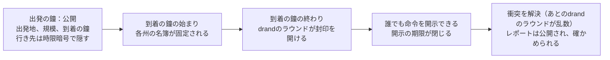
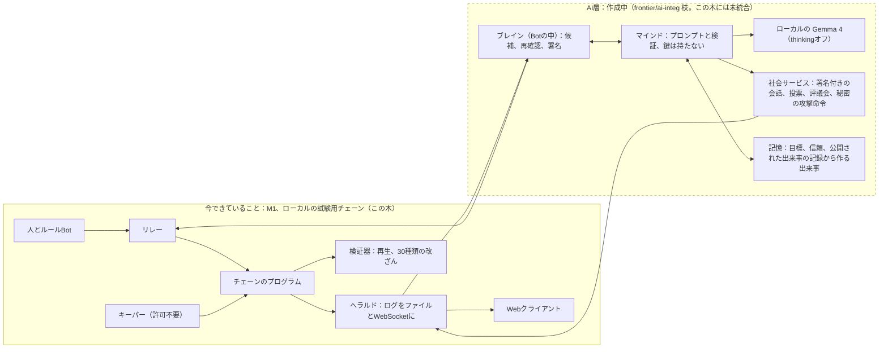
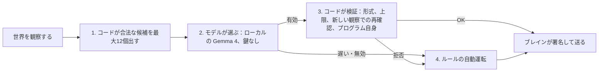

# Wylls：設計の概要

**対象読者：** 審査員と、設計の全体を約10分で知りたいエンジニア。**日付：** 2026-10-04（ハッカソン締切は 2026-10-13 15:59 JST）。**範囲：** このリポジトリにある唯一のゲーム、オープンワールドの Wylls。

> この文書は英語版 [DESIGN-OVERVIEW.md](DESIGN-OVERVIEW.md) の日本語版です。見出し、数字、状態タグ、リンクは英語版と同じです（見出しの番号も同じです）。

**この文書の位置づけ。** 完成形の設計（2026-10-04 の決定 D1〜D12 を含む）と現在の状態を、項目ごとに並べて書いた要約です。全文は統一設計書 [GAME-DESIGN.ja.md](GAME-DESIGN.ja.md) にあり、設計書と既存文書の食い違い 48 件の整理は [GAME-DESIGN-DISCREPANCIES.ja.md](GAME-DESIGN-DISCREPANCIES.ja.md) にあります。数字や状態が食い違う場合は、統一設計書と、各契約書（[M1-CONTRACT](frontier/m1/M1-CONTRACT.md)、[AI市民の契約書 v1.3](frontier/ai-citizens/AI-CITIZENS-CONTRACT.md)、[征服の契約書](frontier/conquest/CONQUEST-CONTRACT.md)）が優先します。統一設計書は、あなた（プロジェクトの持ち主）の確認前の版です。日本語の状況要約 [frontier/SUMMARY.ja.md](frontier/SUMMARY.ja.md) と [frontier/ai-citizens/GAME-DESIGN-CORE.ja.md](frontier/ai-citizens/GAME-DESIGN-CORE.ja.md) は、統一設計書の確認後に置き換える予定です（[ai-citizens/SUMMARY.ja.md](frontier/ai-citizens/SUMMARY.ja.md) は契約書 v1.3 の要約です）。

**出典の書き方。** 〔出典: ファイル:行〕は、リポジトリの根からの相対パスです。他のブランチにあるファイルには `ai-integ:`、`cq-integ:`、`playtest:` を付けます（そのブランチの中のパスです）。ai-integ の `.local/` の下の実行結果は、git で管理されない生成物です。

**これは何か。** Wylls は、Solana を土台にした、シヴィライゼーション風の共有世界の、最初に遊べる部分です。国を選び、村をもらい、建て、訓練し、封印した進軍を出し、10分ごとの鐘で戦います。軍の出発は公開で、行き先は隠れます。各州の戦闘は鐘ごとにまとめて、drand の公開の乱数で解決され、検証器が再生して確かめられる取引の記録が残ります。ここまでは、ローカルの試験用チェーンで、ルールBot が遊ぶ形で動かしました【動いている】。技術、外交、市場、統治、得点、共有の文明は設計であり、作っていません【設計のみ】。

**このゲームの軸（決定 D12）：「AIがプレイヤーのように振る舞うゲーム」。** 問いは、AIに意志があるとき、ゲームはどう振る舞うのか、です。AI市民（それぞれ目標と、引用できる記憶を持つ）が、人と並んで、同じ鍵・回数制限・霧で遊ぶ設計です。加えて、安全のための上限と、絞った候補が付きます（6.1、6.5）。国の評議会は、2つ目の見せ場です。AI市民は【作成中】で、動いた結果は6体のスモークテストまでです。

**状況を一行で。** 最初の遊べる版（M1）【動いている】は、ルールBot 1,000体による20倍速のゲーム内7日間のシーズンを、ローカルの試験用チェーンで1回通しました。AI市民【作成中】は、コードが別ブランチ（frontier/ai-integ）にあり、6体のスモークテストまで実行しました。この提出の木には未統合で、12体の A/B テストと18体の本走は未実施です。征服、国ごとの総合得点、14日のシーズン、参加と同時の土地の付与、共有の文明は設計です【設計のみ】。ゲームにお金はなく、プロジェクトの外の人はまだ誰もこのゲームを遊んでいません（友人プレイテストは開きません。D11a）。

**状態タグ。** すべての項目に、次のどれかを付けます。

| タグ | 意味 |
|---|---|
| 【動いている】 | コードがあり、実際に実行した。実行した範囲（試験、スモークテスト、通しの走行）を添える。提出する木の外の別ブランチにあるコードは「ブランチ上で」と書く |
| 【作成中】 | 今回のハッカソンの提出に向けて、実装または実行を続けているもの |
| 【設計のみ】 | 書いてあるが作っていない |
| 【計画】 | 時期の決まっていない予定 |
| 【やめた】 | 決定により外した |
| 【確認】 | 状態ではなく、あなたの返事が要る点の印。番号 Q は [GAME-DESIGN.ja.md の付録A](GAME-DESIGN.ja.md) のものです |

[AS-BUILT: pending] は、作った後に実測値を入れる空欄です。マージと梱包の段階（2026-10-12 午前、凍結の前。契約書 §11.9）で、実測値か、代わりの一文に置き換えます。値の種類は、本文に「（モデル値）」「（シミュレータ値）」「（見積り）」と書きます。ルールのコードから読んだ定数は、実行した範囲を【動いている】として示し、人が遊んで測った値ではないことを添えます。

---

## 1. 状況

**【動いている】M1（ローカルの試験用チェーンのみ）。**

- **ゲーム内7日間（1,008鐘）の終了シーズンを、20倍速（実時間8時間39分）で、最初から最後まで動かしました。** ルールBot 1,000体・13種類の行動プロファイル、drand quicknet（公開乱数ビーコン）の実際のラウンドをアーカイブから再生したローカルの試験用チェーンで、チームが決めた合否の基準をすべて満たしました（基準7は報告のみで、合否に使いません）。〔出典: docs/frontier/m1/M1-EXIT-NOTES.md:13,57-58〕
- **オンチェーンのプログラム：** シーズンの進行、地図の環と州、参加、村、建設と訓練、封印された進軍、開封、鐘での衝突、清算。命令のタグは50（うち1つの ResolveClash は試験用ビルドにだけあり、実際に使える命令は49）、アカウントの種類は17、ビルドは再現可能（同じ木から2回ビルドして同一）。〔出典: docs/frontier/m1/M1-CONTRACT.md:16,29、docs/frontier/m1/M1-EXIT-NOTES.md:5〕
- **オフチェーンのサービス：** キーパー、ヘラルド、リレー、検証器、ルールBot 1,000体の群れ、drand 再生つきのローカルの試験用チェーン。〔出典: docs/frontier/m1/M1-EXIT-NOTES.md:98〕
- **日本語・英語の Web クライアント：** 地図、村、進軍の作成と追跡、衝突レポート（ブラウザ内で規則のコードを再実行して確かめる）、案内、練習戦、観戦画面。画面テスト 51/51、npm テスト 529/529。〔出典: docs/frontier/m1/M1-EXIT-NOTES.md:32-33,195〕
- **再生検証器：** 終了シーズンの 144,300 件の取引を通過し、意図的な改ざん 30 種類をすべて検出しました。〔出典: docs/frontier/m1/M1-EXIT-NOTES.md:31、docs/frontier/m1/runs/m1-exit/criteria.md:18〕
- **参加の選択は「国」ひとつだけ（決定 V2）。** クライアントが自国のくさびの空き地を最大3つ選んで、村の申請を出します。2026-10-02〜03 に作り、台本どおりに動く訪問者（人ではない）20人と Bot で通しました（playtest 枝、ローカル、1倍速）。〔出典: docs/frontier/DECISIONS.md:425、playtest:docs/frontier/playtest/PT-C-NOTES.md:31〕
- 仕上げ：Wylls という名前、画面に出る言葉は国／村（V1、W11）、地図上の兵のミニチュアの描き直し。〔出典: docs/frontier/DECISIONS.md:424,443〕

**【作成中】AI市民（コードは frontier/ai-integ 枝にあり、この木には未統合）。** 運営がローカルの Gemma 4（26B A4B）で動かす、人と並んで遊ぶ AI のプレイヤーです。契約書 v1.3 はこの木にあります（commit 19fe89c）。ai-integ 枝のコードで、ローカルのスモークテスト smoke-b3（6体）が完走し、検証（verify-minds）に合格しました。標本は小さく（モデルの判断 52 件。契約の合格条件は 300 件以上）、率として一般化しません。前のスモークテスト smoke-b2 は検証が不合格で、修正を入れました。smoke-b4 は 2026-10-04 21:07 JST に始まり、終了の記録がありません。12体の A/B テスト、18体の本走、録画は未実施で、この木への統合は、契約上 10-12 朝の工程（I-C）です。詳細は第6節です。[AS-BUILT: pending]〔出典: ai-integ:docs/frontier/ai-citizens/RUNS.md:8-37、docs/frontier/ai-citizens/AI-CITIZENS-CONTRACT.md:3,865-869〕

**【設計のみ】決めた目標の設計で、まだ作っていないもの。** 2026-10-04 の決定（9.1 の D1〜D12）は、完成形の設計として書き、状態を並べます。

- **征服（D7）：砦、包囲、占領、動く地図。** 製品設計に含め、領土を得点に数えます。コードは別ブランチ frontier/cq-integ にあります（契約書 v1.5、プログラム v2）。Gate CQ2 の各行が成功し、svm テスト 342 件、ワークスペース 534 件、npm 573 件が通過しました。これはプログラムの試験とシミュレータで実行した範囲で、ブランチ上で【動いている】と数えます。検証器、通し、Web、長時間運転（Wave 3〜5）は未着手です。提出する木には入っていません。人もAIも、征服で遊んだ記録はありません。契約水準の未決のルール質問 15 件は、既定が入ったまま未決です（D8〜D10）。〔出典: cq-integ:docs/frontier/conquest/integ-CQ2-NOTES.md:133-153,168,229-237〕
- **国ごとの総合得点（D1）：** シーズン末に、国の順位を付けます（3 節の「何を目指して遊ぶか」）。
- **14日のシーズン（D6）、参加と同時の土地の付与（D3）。**
- **共有の文明：** 技術、時代、エンジン、外交、市場、統治（M3）。ハッカソン後の最優先です（W8）。
- **お金（M2）：** 参加費、賭け金、賞金プール、受け取り。M1 では、プレイヤーが払うことも受け取ることもなく、賞金もありません。ローカルの試験用チェーンでは、家賃・手数料・開示のチップを、リレーが試験用のお金で肩代わりします。〔出典: docs/frontier/DESIGN.md:521、docs/GAME-DESIGN.ja.md 6.4〕
- **プレイヤーが持つAI市民**（自分の鍵を持つ）。M3 の拡張で、ハッカソンの範囲外です。お金のシーズンに運営のAIを入れる条件は 7 節にあります（W4）。

**【計画】時期の決まっていないもの。** 無料のシーズンを先に開き、あとでお金のシーズンを開く順序（D4）。事業の計画（D5、9.1）。ハッカソン後の作業の順序は 8 節です。

**【やめた】** 友人プレイテスト（D11a）。AI同士の約束・協定・裏切り（X2）。AI市民を必ず画面に表示する方針（W2。D2 で変更）。隠れて人のふりをする Bot（W3）。28日のシーズン（D6）。

**この文書のどこでも主張していないこと：** 新しいゲームが devnet や mainnet で動いたこと。人が遊んだこと。需要や反響があること。お金・賞金・支払いが動くこと。モデルが何かを望んだり意図したりしていること。協定、裏切り、拘束力のある約束があること。AIの言葉や、AIが引用した記憶が確認済みであること、引用がAIの判断の理由を示すこと。AI市民が「必ず表示される」こと。Wylls が完成した文明ゲームであること（征服、技術、外交、市場、統治、得点、共有の文明は設計のみで、未実装です）。AI市民が人と見分けがつかない、ルールBotより強い、厳密に再現できる、お金を稼ぐこと。記憶があるとAIが上手になること。1台のマシンで何千ものAIが動くこと。ゲーム会社と話したこと。

---

## 2. ビジョン

**Wylls** は will（意志）の英語表記です。このゲームが問うのは、ひとつの思考実験です。*AIに意志があるとき、ゲームはどう振る舞うのか。*

舞台は、文明を育てるタイプの、ひとつの共有された世界です。国を選び、村を受け取り、リアルタイムで育てます。人もAI市民も、同じ鍵、同じ回数制限、同じ霧（見えない範囲）で行動します。ただしAIは、コードが出した絞った候補と、安全のための上限を通して動くので、「同じルール」とだけは言いません（6.5）。ゲームの画面では、AI市民を人のプレイヤーと同じに表示する設計です（決定 D2、6.5）。見たいのは、一部のプレイヤーが長く続く目標と、引用できる記憶を持ち、評議会で議論し、命令を断り、自分で軍を動かしたとき、何が起きるかです。

この実験の前提は3つあります。

1. **「意志」は作るもので、最初からあるものではありません。** 言語モデルは長期の目標を持って生まれてきません。この設計では、各AIにコードで次の5つを持たせ、外から見える形で出します。続く目標（進み具合はコードが数え、数えられないものは「未計算」と出す）、記憶を引用した理由、信頼とまだ返していない恨み、断ること（攻撃命令に従わない、「待つ」を選ぶ）、評議会での発言と投票です。状態は【作成中】で、動いた結果はスモークテストの完走（smoke-b3）だけです。5つのうち、返していない恨み、断ること、自軍への攻撃の記録は、どの走行でも観測されていません。（以前の計画には、AI同士の約束や協定もありましたが、2026-10-04 に外したので入っていません。X2）〔出典: docs/GAME-DESIGN.ja.md 1.1、4.9、docs/frontier/ai-citizens/RULES-AND-AI-CITIZENS.ja.md §3、docs/frontier/DECISIONS.md:452〕
2. **根拠はまだ薄いです。** 調べた範囲では、大規模なライブのマルチプレイゲームで言語モデルのプレイヤーが通用した例は見つかっていません。参考にした事例（Project Sid、AI Diplomacy、CivBench）は、証明ではなく型として使います。見落としがあるかもしれません（[RULES-AND-AI-CITIZENS.ja.md](frontier/ai-citizens/RULES-AND-AI-CITIZENS.ja.md) §3.2）。ローカルの Gemma 4 での自前の予備実験（スパイク）では、言葉を扱う作業には使えましたが、ルールBotより上手なプレイヤーではありませんでした。進軍を選んだのは 20 回の判断のうち、設定により 1 回または 9 回（報告の結論欄は 12 回とも書きますが、本文で確認できるのは 1 回と 9 回です）で、ルールBotは 18 回でした。最良の設定でも、提案した行動のうち有効だったのは 79% です。〔出典: docs/frontier/ai-agents/gemma4/REPORT.md:11,31〕そこでこの設計では、保証はコードに持たせ、モデルは「合法な候補から選ぶ役」として扱います。
3. **10分の鐘は、言語モデルに合っています。** 手の空いたマシンで計算約5秒かかる判断は、10分の鐘の中に十分収まります〔出典: docs/frontier/ai-agents/gemma4/REPORT.md:32〕。ただし、1台のMacで12体のAIが時間内に動けるかどうかは、契約書のゲート G3 であり、[AS-BUILT: pending] です。

**見られるようになるもの** 【作成中】[AS-BUILT: pending]。どちらも、コードは ai-integ 枝にあり、スモークテストまで実行しました。本走と録画が未実施なので、見せ場としては作成中です。*ひとつめは、AI市民が自分で出す進軍（主役）です。* コードが出した合法な候補の中から、AI市民が、野営地や野戦の敵軍に向けて軍を送ると選びます。軍は出発し、行き先は隠れたままです。到着の鐘が終わり、公開の記録（REVEAL）で行き先が公開されると、ページがその判断を開きます。示された候補、AI自身の言葉（モデルが書いたもので、確認されていないと明記）、そして、引用した記録済みの出来事を鐘の番号つきで引く「Remembered:」の行です。そのあとに衝突のレポートが続きます。12ヘクス先なら、出発の約3〜4分後（実時間、10倍速）です。*ふたつめは、国の評議会です。* コードが、その国が勝てそうな3つの目標を並べます。AI市民が1つを主張し、発表者（運営の席）が決め手の1票を投じ、採用された目標（「攻撃命令」）は、攻撃の時まで秘密のままです。A/Bテストは、同じシードで2回動かし、違いは席の1票だけにします（A/Bでは運営が台本で入れる票で、そう表示します。本物の人の票が出るのは、録画の場面だけです）。AIの自分の進軍で衝突になった数（Y）は、本走を実行して数えるまで分かりません。Yが0なら、「モデルが選んだ進軍が衝突に至った例は記録した実行にはない」と明記し、評議会を主役にします。〔出典: docs/frontier/ai-citizens/AI-CITIZENS-CONTRACT.md:14,761、docs/GAME-DESIGN.ja.md 1.5、4.5〕

**失敗とみなすもの**（契約書で事前に固定したしきい値）：判断300回以上のうち有効な選択が95%未満。判断の5%を超えて自動運転に落ちる。インジェクションの試験一式で乗っ取りが1件でもある（許容は0件）。3つ以上の国で攻撃命令が出た評議会の期間が1度もない。A/Bテストが再現しない。コードが取り出した範囲の外にある記憶を引用する（許容は0件）。エピソードの再生が運営のヘラルドのログ（チェーンではない）と合わない。モデルが選んだ進軍で衝突が起きたものが1つもない（その場合、その主張は取り下げ、切り上げはしません）。**ここでいう「意志」とは：**コードで作った持続する目標、引用できる記憶、人間関係、断る権利のことです。モデルに意図があると主張するものではありません。

---

## 3. 1ページで見るゲーム

次の表は、決めた完成形（2026-10-04 の決定を含む）と、現在の状態を並べたものです。全文は [GAME-DESIGN.ja.md](GAME-DESIGN.ja.md) の 1.2 と各章にあります。

| 項目 | 完成形（決定） | 現在の状態 |
|---|---|---|
| 世界と国 | 一つの地図を6国が共有。シーズンごとに新しい地図 | 【動いている】M1 の地図、6国、鐘、封印行軍（ローカル、ルールBot のみ）〔docs/frontier/m1/M1-EXIT-NOTES.md:57〕 |
| 村の受け取り（D3） | 国を選ぶと土地をすぐ渡す。待ち、仮の村、練習戦はない | 【設計のみ】プログラムは変えない。現状は抽選で、村が約11〜21分後に現れ、最大約4時間は仮（3.1） |
| 戦い | 10分の鐘で一斉に解決。行き先は封印 | 【動いている】ただし戦っても得るものはない〔docs/frontier/ai-citizens/AI-CITIZENS-CONTRACT.md:55〕 |
| 領土と征服（D7） | 征服を設計に含め、領土を得点に数える | 【設計のみ】製品として。cq-integ 枝にコードがあり、プログラム試験とシミュレータまでを、ブランチ上で【動いている】と数える。Wave 3〜5 は未着手。提出する木には入らない（1 節） |
| 勝ち方（D1） | シーズン末に、国ごとの総合得点1つ（領土を持った時間＋繁栄＋知識）で国の順位を付ける。「勝者なし」を置き換える | 【設計のみ】M1 に得点も勝者もない。式の重みと人数あたりの補正は未決【確認 Q6】 |
| シーズン（D6） | 14日（2,016鐘） | 【設計のみ】14日のプリセットはなく、走らせたのは7ゲーム日が1回。旧設計値の28日は仮の数字で、【やめた】 |
| 共有の文明 | 技術、時代、エンジン、外交、市場、統治。ハッカソン後の最優先（W8） | 【設計のみ】プログラムの命令に含まれない |
| AI市民（D12、D2、X1） | 人と並んで遊ぶ設計。ゲームの画面では人と同じ表示（印なし）。記憶が核 | 【作成中】6 節 |
| お金、事業（D4、D5） | 無料のシーズンが先、あとでお金のシーズン。事業は9.1 | 【計画】M1 にお金はない |
| 遊ぶ場所 | ブラウザ。スマホ向けの版は作らない | 【動いている】Web クライアント（日本語・英語） |

仕組みの要点です。

- **選ぶのは国だけです。** 国（nation）は6つ。それぞれ地図上に自国の領域（くさび形）と、非対称な戦い方の方針（ドクトリン）を持ちます。村（village）は、はじめは集落（hamlet）で、町、都市、要塞へ育ちます。【動いている】現在の村の受け取りは、参加してから約11〜21分後に現れ、確定まで最大約4時間は仮です。完成形は、参加と同時に渡します（D3、【設計のみ】）。〔出典: docs/frontier/DECISIONS.md:425、docs/GAME-DESIGN.ja.md 2.2〕
- **経済はリアルタイムで動き、必要になったときにまとめて計算します（遅延評価）。** 資源はオンラインかどうかに関係なく、1時間ごとに増えます。農場は、予約してから本当に90分で完成します。順番待ちのターンはありません。【動いている】〔出典: permutation-rules/src/frontier/holding.rs、permutation-rules/src/frontier/catalog.rs〕
- **戦闘は鐘ごとに、州ごとに解決します。** 鐘は10分で、1日144回です。鐘の始まりに、各州の名簿（ロスター）が固定されます。その鐘のあいだに着いた全員が、ひとつの同時の衝突で戦い、drandの乱数で解決します。先に送っても得はありません。【動いている】〔出典: permutation-rules/src/frontier/host.rs:1-15、permutation-rules/src/frontier/travel.rs:28-30〕
- **進軍は封印されます。** 軍が出発すると、どこから出たか、規模、どの鐘に着くかが全員に見えます。行き先は、到着の鐘までdrandのタイムロック（tlock、時限暗号）で隠されます。守る側は名簿の固定で決まるので、行き先が分かってから増援を呼んでも間に合いません。【動いている】封印の秘密性そのものは、ローカルの試験では確かめていません。〔出典: docs/GAME-DESIGN.ja.md 1.6、3.2〕
- **すべてはシーズンとともに終わります。** 設計上のシーズンは14日（2,016鐘）です（D6、【設計のみ】）。この長さで走らせたことはなく、専用のプリセットもありません。走らせたのは、ゲーム内7日（1,008鐘、参加の締切は756鐘）のM1のプリセットです。AIの本走の予定は、ゲーム内3日・10倍速です。従来の28日（4,032鐘、参加は21日目まで）は仮の初期値で、D6 で置き換えました【やめた】。進軍は最後の鐘までに着かなければならず、シーズンをまたぐものはありません【動いている】。次のシーズンは新しい地図から始まり、年代記だけが引き継がれる設計です【設計のみ】（年代記のコードはありません）。14日のとき参加を何日目まで受け付けるかは未決です【確認 Q14】。〔出典: docs/frontier/DECISIONS.md:397、frontier-abi/src/presets.rs:359-360、docs/GAME-DESIGN.ja.md 6.2〕



**何を目指して遊ぶか。** 完成形では、シーズンの終わりに、国ごとの総合得点（領土を持った時間＋繁栄＋知識）で国の順位が付き、次のシーズンは新しい地図で始まります（D1。D7 により領土の争奪が得点に入ります）【設計のみ】。式の重み、単位のそろえ方、人数あたりの補正（旧設計の4つの勝ち筋の式は、一人あたりの値と大きな国への減衰を使うので、国ごとの合計とは食い違う）は決まっていません【確認 Q6】。繁栄と知識を国ごとに集計する命令やファイルはなく、知識は、技術と科学の使い道の設計が先に要ります。いまの M1 でのループは、村を育て、偵察し、蛮族の野営地や他のプレイヤーの軍と戦うことで、得点や勝者はありません【動いている】。いまは、戦いに勝っても得るものがありません。他の国に勝っても、略奪も土地も功績もなく、蛮族の野営地を倒すと功績10がもらえますが、使い道はまだありません。だから、AIが戦う理由は、報酬ではなく、記憶と人格です。完成形では領土が得点に入るので、攻める理由が得点として生まれます【設計のみ】。ただし、AIが領土を目標にする候補、プロンプト、記憶の種類を定めた文書はまだありません。〔出典: docs/GAME-DESIGN.ja.md 5.2、6.3、docs/frontier/DESIGN.md:529-556、permutation-rules/src/frontier/camp.rs、permutation-rules/src/frontier/catalog.rs:138〕

### 3.1 ある1日を、ルールカーネルの数字で

ひとことで言うと、こうです。参加すると集落が現れ、農場と木こり小屋を予約し、槍兵100人を訓練し、斥候を出し、数時間後に蛮族の野営地へ封印した進軍を出します。鐘で衝突が解決し、レポートを読み、翌日に集落を町へ昇格させます。下の表は、現在の動き【動いている】のエンジニア向けの数字です。完成形（D3）では、「前」と「+0:00」の待ちがなくなり、村は参加の時点で確定して渡されます【設計のみ】。

<details>
<summary>1時間ごとの数字（クリックで開きます）</summary>

量はルールのコードの表から計算したもので、**兵の維持費は無視**し、買うのは農場、木こり小屋、槍兵100人だけと仮定します。人が実際に遊んで測った値ではありません。時刻は、村が現れた時点からの経過です。

| いつ | プレイヤーがすること | 数字 | 出典 |
|---|---|---|---|
| 前 | 国を選ぶ。クライアントが、自国の領域にある最大3か所の空き地の申請を出す。同じ鐘の申請はその鐘の乱数でまとめて決まるので、速さでは勝てない。 | 村が現れるまで約11〜21分（モデル値）。台本どおりの訪問者20人の実行では、中央値18.0分（最短11.4分、最長20.7分。ローカル、1倍速） | docs/frontier/DESIGN.md:167,179、playtest:docs/frontier/playtest/PT-C-NOTES.md:31 |
| +0:00 | 村が集落として生まれる。ただし「仮」で、収穫・建設・訓練はできるが、招集・探索・出発はできない。確定は、同じ州の同じ鐘の申請の組がすべて決まったときか、24鐘（約4時間）後。初期セットと保護つき。 | 初期セット：食料300、木材300、石200、鉱石100、金100。保護48ゲーム時間。1時間あたりの生産：食料40、木材30、石20、鉱石15、金15、科学5。 | permutation-rules/src/frontier/catalog.rs:37,133、docs/frontier/m1/M1-CONTRACT.md:69、permutation-rules/src/frontier/holding.rs:128 |
| +0:30 | 農場と木こり小屋を予約する。 | 農場：木材80＋石40、食料+12/時。どちらも90分（n個目は 3,600＋1,800n 秒）。n個目の費用は 基本費用 × (1 + 0.5 (n-1)^2)。 | permutation-rules/src/frontier/catalog.rs:60-91,100-102、permutation-rules/src/frontier/holding.rs:161-171 |
| +0:30 | 槍兵100人を訓練する。訓練は即時。 | 食料60、鉱石20、金10。1つの軍（host）は100〜30,000人。 | permutation-rules/src/frontier/catalog.rs:117-120、permutation-rules/src/frontier/host.rs:27-32 |
| 確定後 | 斥候を出して探索する。結果は次の鐘で届く。 | 功績ポイント：探索1回で4、野営地で10。カタログには1日の上限20が定義されていますが、M1 のプログラムは強制していません。 | permutation-rules/src/frontier/catalog.rs:135-138 |
| 数時間後 | 蛮族の野営地へ向けて進軍を封印する。野営地の兵力は100〜400。出発は公開（出発地、規模、到着の鐘）。行き先はdrandのタイムロックで隠す。 | 到着は出発の鐘から最低2鐘後（最大72鐘後）。最初の衝突レポートは、12ヘクスの行軍で出発の約31〜41分後（モデル値）。台本どおりの訪問者の実行では15件で33〜42分、中央値39分（ローカル、1倍速）。参加から最初の行軍までは、中央値83分、最短50分。 | permutation-rules/src/frontier/travel.rs:36-38、frontier-abi/src/presets.rs:351-393、playtest:docs/frontier/playtest/PT-C-NOTES.md:32,35 |
| +3:40 | 鐘が閉じる。名簿は鐘の始まりに固定済み。衝突はその鐘のdrand乱数で解決される。レポートは公開され、ブラウザの中で自分で検証できる。 | 1ヘクスに最大6つの軍。村のヘクスでは、持ち主側が常に3枠を確保する。 | permutation-rules/src/frontier/host.rs:36-44 |
| +24:00 | 町への昇格に必要な資源がそろう。 | 昇格：木材1,000、石600、金300、6時間。町：建設枠3、倉庫6,000、生産+50%。 | permutation-rules/src/frontier/catalog.rs:40-47,106-113 |

</details>

ペースは全員に同じ制限をかけます。1時間30回の行動のバケツ（バースト60）はチェーン上の規則で、リレーの代払いの枠は、ゲーム内0〜6日目は1日40回、その後は20回です（運営がローカルの試験用の資金で払う、別の枠）。〔出典: docs/frontier/m1/M1-CONTRACT.md:560,882、permutation-gateway/src/frontier/quota.mjs:1-22〕

---

## 4. チェーンが担うことと、オフチェーンで動くこと

**なぜチェーンなのか。** すべての衝突を解決するのは、運営ではなくプログラムです。設計上、封印された命令は、到着の鐘まで誰にも読めず、変えられません。シーズン全体の取引の記録が残り、検証器が再生して確かめます。終了シーズンでは、検証器が 144,300 件の取引を再生して通り、意図的な改ざん30種類をすべて検出しました（外部の人が再生した記録はありません）。ここでチェーンを使う理由は、速さや費用ではなく、この点です。【動いている】（ローカルの試験用チェーン）〔出典: docs/frontier/m1/runs/m1-exit/criteria.md:18〕もうひとつの理由は、ルールと状態をオープンなチェーンに置けば、組み合わせ可能な改造と許可不要の経済が可能になる、という考えです【設計のみ】。トークノミクスの設計はどの文書にもありません。〔出典: docs/GAME-DESIGN.ja.md 1.6〕

**オンチェーン（土台は Solana。乱数と封印は drand quicknet）。** 裁定をするのはプログラムだけです。プログラムが持つのは、シーズン、環と州、市民と村、申請とその抽選、軍、封印された進軍とその開封、固定された名簿と衝突の解決、すべての進軍の清算、そしてすべての閉じ方です。命令は、できるだけ誰でも実行できる（許可不要）ようにしてあり、最初の有効な書き込みが採用されます。プレイ中に出た命令は35種類で、どれも測った計算予算に収まりました（開封は最大 24,050 コンピュートユニット）。【動いている】〔出典: docs/frontier/m1/runs/m1-exit/criteria.md:8、docs/frontier/m1/M1-EXIT-NOTES.md:58〕

**オフチェーン。** どれも結果を変えることはできません。払う、動かす、見せる、確かめる、のどれかをするだけです。

| 部品 | 役割 | 信頼の位置づけ |
|---|---|---|
| **キーパー**（`frontier-keeper`、補助のプログラム） | drandのビーコンを投稿し、到着の鐘で封印を開け、進軍を開封（チップを得る）し、衝突を集めて解決し、静かな鐘を飛ばし、進軍と申請を清算し、アカウントを保管して閉じる。 | 許可不要。誰でも動かせる。重複した書き込みは拒否される。[RUN-A-KEEPER](frontier/m1/RUN-A-KEEPER.md) |
| **ヘラルド**（`frontier-herald`） | トランザクションのログをJSONファイルとWebSocketの配信にまとめる。クライアント、Bot、AI市民が読む経路。運営のサービスで、チェーンそのものではない。 | 読み取り専用。誰でもログからファイルを再計算できる。 |
| **リレー**（`permutation-gateway/src/frontier`） | 割り当ての範囲内で、手数料と家賃（rent）をプレイヤーに代わって払う。人もBotも同じ入口から参加する。 | 補助を断ることはできるが、結果は変えられない。 |
| **検証器**（`frontier-verify`） | 終わったシーズンの記録から再生し、全ルールを確かめる。確認そのものも確認する（30種類の改ざん）。 | 誰でも動かせる。 |
| **Webクライアント**（`permutation-server/web/frontier`） | 地図、村、進軍の作成、鐘の一覧、ブラウザ内（WebAssembly）でルールカーネルを再実行する衝突レポート、案内、練習、観戦。 | 持つのはプレイヤーのゲーム内の鍵だけ。 |
| **Bot**（`frontier-bots`） | ルールBot 1,000体、13種類の行動プロファイル（不正をする型やスパムをする型を含む）。人と同じリレー、同じヘラルドの読み取り、同じ割り当て。AI市民の実行では、スクリプトBotと、AI のブレインがこの枠組みに加わる（ai-integ 枝）。smoke-b3 では30体、本走用に計画したスタックでは約180体。 | テスト用の群れ。 |
| **ローカルの試験用チェーン**（`frontier-localnet`, `drand-replay`） | 1スロット400msの、Solana互換のプロセス内チェーンと、再生できるdrandの供給元。 | devnetやmainnetでは**ありません**。 |

**リポジトリの地図。** カーネル：`permutation-rules/src/frontier/`。プログラム：`permutation-frontier/`。ABIとwasm：`frontier-abi/`、`frontier-wasm/`。バランスのシミュレータ：`frontier-sim/`。オフチェーンのクレート：`frontier-node/crates/{keeper,herald,verify,bots,agents,localnet,stack,...}`。リレーとSDK：`permutation-gateway/`。Webクライアント：`permutation-server/web/frontier/`。設計記録：`docs/frontier/`。AI市民のコード（`permutation-gateway/citizens` など）は frontier/ai-integ 枝にあり、この木にはありません。征服のコードは frontier/cq-integ 枝にあります。*決定 V1 により、Wylls への改名は、コードの識別子、クレート・パッケージ・フォルダの名前（およびハッシュや署名のドメイン、シード）には及んでいません。これらは従来の `permutation-*` や `frontier-*` の名前のままです。このことを述べるのは、この文書ではここだけです。* [DECISIONS V1]

---

## 5. 根拠：M1の終了シーズン（新しいゲーム、ローカルのテスト用チェーン）

実行名 `m1-exit`：リリースプログラム `d85e1bd7...2281`（2回ビルドして同じハッシュ）、ゲーム内7日間（1,008鐘）を20倍速で8時間39分、ルールBot 1,000体・13プロファイル、キーパー2つ、アーカイブからの本物のquicknetのラウンド、意図的なプロセス強制終了43回と再起動43回、9種類の敵対的な妨害、そしてゲーム内24時間の間、5,000人の模擬観客。【動いている】〔出典: [M1-EXIT-NOTES](frontier/m1/M1-EXIT-NOTES.md) §3、記録は [runs/m1-exit/](frontier/m1/runs/m1-exit/)〕

| 確かめたこと | 結果 | 範囲の限界 |
|---|---|---|
| シーズンが完了する。止まった州や未清算の進軍がない | 合格：期限の来た進軍1,712件がすべて1回ずつ清算。止まった州・鐘は0 | ローカルの試験用チェーン、ルールBotのみ |
| すべての命令が計算予算内 | 合格：プレイ中に出た命令は35種類で、超過なし。開封は、トランザクション全体のコンピュートユニットで p50 19,389、p99 22,951、最大 24,050（プログラムだけなら p50 18,940、最大 23,600） | 予算はローカルバリデータの値。devnetは未検証 |
| キーパーの遅延 | p99で合格：1スロット（ビーコンからアンカーまで）、3スロット（シードから解決まで）、20倍速で | 妨害を重ねると、最大154スロット（実時間で約1分）の停止と、1,720スロット（実時間で約11.5分）の解決が1回あった |
| 封印された進軍が開かれる | 合格：有効な封印で未開封は0。ルールにより未開封が9 | 9種類の妨害のうち2種類は、待機中のものを一度も見つけなかった（§8を参照） |
| 不正のプロファイルが得をしない | 合格：期待された結果に反したプロファイルはなし | チームが書いた13種類のBotのプロファイル。未知の攻撃者への証明ではない |
| 偽物の封印は無効になる | 合格：24件中24件が不良の封印として清算された | |
| 観戦の負荷 | 合格：ファイルp99 8.7ms、取り込みからWebSocketまでp99 0.75秒、346万リクエストでエラー0 | 負荷生成器の**模擬**観客であり、人やブラウザではない |
| Botとバランスシミュレータの比較 | **測っていません**（報告のみで、合否には使わない） | |
| 再生検証器 | 合格：144,300件のトランザクションを通過（うち784件は失敗したトランザクションで、報告済み）。検証の中核は11秒（コマンド全体では41秒）。30種類の改ざんを30種類とも検出 | チーム自身の検証器。誰でも動かせる |

その周辺では、最終ツリー上で、プログラムのテスト248件が通過（4件は意図的に無視）、検証器自身の確認は変異テスト済み（12ビルド、58/58）、Webテスト 529/529、画面テスト 51/51。〔出典: docs/frontier/m1/M1-EXIT-NOTES.md:25,195、§12〕終了時に見つかった問題は2つです。2つのテスト（G14、`inproc_day`）が数え方の規則で不合格になったこと、そして、テスト環境が受取先に資金を入れていなかったため、防衛の払い戻しがスタック実行で一度も反映されていなかったことです。どちらも、プログラムとキーパーを変えずに、当日中に直しました。[DECISIONS U3, U4, U10]

この結果は、現在の提出ビルドに対して有効です。決定 D3 によりプログラムは変えないので、M1 の終了シーズンの結果は、提出するビルドのプログラムのまま成り立ちます。〔出典: docs/GAME-DESIGN.ja.md 8.2〕

**バランス（シミュレーション上）。** 非対称な国ごとのドクトリンをバランスシミュレータで調整した結果、1万の模擬ウォレットで、1,500組のシーズンのうち6つの国の勝率は15.6〜17.4%でした（シミュレータ値。プレイヤーの動きは仮定）。最初の草案では、1つの国が600シーズンの99.5%で勝っていました。〔出典: [M0-FINAL](frontier/m0/M0-FINAL.md)〕

---

<a id="ai-citizens"></a>
<a id="6-ai-citizens-all-designed-as-built-pending"></a>
<a id="6-ai市民-すべて設計のみas-built-pending"></a>

## 6. AI市民

この節は、統一設計書 [GAME-DESIGN.ja.md](GAME-DESIGN.ja.md) の第4章と一致させています。AI市民は、運営がローカルの Gemma 4 26B A4B（llama.cpp、thinking オフ、温度0、出力は JSON スキーマで制約）で動かす、人と並んで遊ぶ AI のプレイヤーで、有料の API は使いません【作成中】。

コードは frontier/ai-integ 枝にあり、提出用の木 frontier/unify には未統合です（unify にあるのは契約書 v1.3 などの文書だけで、この木の `permutation-server/web` 以下には、AI市民、`roster.json`、`/h/ai` を参照するコードがありません）。統合は、契約上 10-12 朝の工程（I-C）です。この節の「ブランチ上で【動いている】」は、ai-integ 枝のコードをスモークテスト（smoke-b3 など）で実行したことを指します。提出用の木に入っていることではありません。凍結（2026-10-12 23:59 JST）の時点で実行が終わっていない、または必須の関門に落ちた場合は、この節を「AI市民：この提出では未実装。設計のみ。」の一文に差し替えます（8.1）。契約書は v1.3 です。ai-integ の契約書は、これに 2026-10-04 20:54〜21:00 JST の改訂（R12、FB1〜FB5）が加わっています。〔出典: docs/frontier/ai-citizens/AI-CITIZENS-CONTRACT.md:3,865-869、ai-integ:docs/frontier/ai-citizens/AI-CITIZENS-CONTRACT.md:420-422,431,639,763,1077、docs/GAME-DESIGN.ja.md 0.2、4〕

### AI層の位置づけ



AI層が世界に触れるのは、人が使うのと同じリレーを通してだけです。マインド（mind、モデルと話す側）は、鍵、シード、封印の平文、飛行中の自分の封印進軍の行き先を、見ることができません。署名するのは、Botのプロセスの中にあるブレイン（brain）です。記憶は、運営のヘラルドのログ（チェーンではない）の出来事からコードが作るので、再生して確かめられます。AI同士で共有されることもありません。メッセージと投票は、別の署名付き記録サービスを通り、そのファイルは、AI層の小さな静的サーバーが読み取り専用で配ります（ヘラルドには手を入れません）。図の文字版は付録Aにあります。〔出典: [AI-CITIZENS-CONTRACT](frontier/ai-citizens/AI-CITIZENS-CONTRACT.md) §1、§5〕

### 6.1 判断のしかた

**まずコードが候補を出し、次にモデルが選び、次にコードが検証し、署名して送ります。遅い、不正、拒否されたときは、ルールの自動運転が代わります。**〔出典: docs/frontier/ai-citizens/AI-CITIZENS-CONTRACT.md:11-12,176-189,338-355〕



1. **コードが合法な候補を出します。** ブレインは、Botと同じように世界を観察し、義務の操作（参加、村の用地の申請、行軍の公開と精算など）をすぐ送り、経済と軍事の選択肢を最大12個の候補にします。並びは固定で、自動運転、待機、攻撃命令の行軍（国の評議会の構成員のみ）、到着済みの軍の呼び戻し、行軍候補（近い野営地2つ、最寄りの敵の野戦部隊、両方の保護が終わった後の村への襲撃）、建設・城壁・訓練・招集・探索の順です。分割や解散の候補はありません。観測の窓は、そのBotが見ている12州までです。候補が持つのは、単位つきの事実で、座標ではありません。報酬の行は固定文だけで、野営地は「10 Works（いまは使い道のない点）」、それ以外は「兵を失うだけ。土地は取れない」です。
2. **モデルが選びます。** マインドは、モデルを起こすかどうかを決め（出来事、予算、締め切り）、記憶を付け、変動部分3,000トークン以内（うち記憶は750まで）のプロンプトを作って、ローカルの Gemma 4 を呼びます。答えは、候補のID、発言、評議会での一手、一行の理由、そして引用した記憶です。
3. **コードが検証します。** マインド側の検証（形式、候補の範囲、兵の上限、発言と理由の検査、引用した記憶が見せたものの中にあること）と、ブレイン側の検証（盤面を取り直して再検証する。モデルの答えは数秒かかるので毎回）を通し、そのうえでプログラム自身が、人に対してと同じように、違法なものを拒否します。
4. **ルールの自動運転が予備です。** 自動運転は、既存のルール方針をブレインが絞ったものです。経済（収穫、建設、訓練、招集、探索）と義務、そして攻撃命令に従う行軍だけを進め、**自分から出す戦闘の行軍は決して始めません**。

**AIの自発の行軍は、「モデルの選択」か「国の攻撃命令」のどちらかです。** チェーン上にAI市民の財布からの出軍があっても、それだけではAIが決めた証拠にはならず、判断記録が証拠です。そのため、AIの国は、モデルが慎重なときにはスクリプトBotの国より静かになることがあります。契約書はこれを受け入れた帰結として明記しています。〔出典: docs/frontier/ai-citizens/AI-CITIZENS-CONTRACT.md:246-266,252〕

**安全のための上限が、悪い選択の被害を抑えます。**【動いている】（ブランチ上）

| 上限 | 値 |
|---|---|
| 1回の判断で出す行軍の兵の合計 | 本拠の兵の60%まで |
| 1日の行軍の兵の合計 | その日の最初の本拠の兵の60%まで |
| 本拠に残す兵 | その日の最初の40%以上 |
| 例外 | その日の最初の本拠の兵が200未満のあいだは、1日の60%上限と40%の残しはかかりません（1回の判断の60%上限はかかります） |
| モデルが選べる行軍 | 1日4回まで |
| 行動の回数 | 人と同じ1時間30回のバケツとリレーの割り当て |
| 発言と呼び出し | 1人あたり1鐘に3件、1ゲーム日に40件の発言（人もAIも同じ）。モデルの呼び出しにも1日の予算がある |

〔出典: docs/frontier/ai-citizens/AI-CITIZENS-CONTRACT.md:107-114,219,229-235,345〕

**実測（スモークテスト smoke-b3、6体、すべて征服者、閉じた鐘86）。**【動いている】（ブランチ上）モデルが呼ばれた判断は52回（判断34、評議会の動議9、投票9）で、有効な選択は52回中52回、フォールバックは0、時間切れで落ちた判断は0でした。判断の応答時間は、中央値（p50）が3,193ミリ秒、p90 が4,052ミリ秒です（判断34回）。ただし標本は小さく、契約の合格条件（有効率95%以上、判断300回以上）の「300回以上」には届いていません。AIの財布から送った操作171件のうち、モデルが選んだ判断の中で送られたものは51件（29.8%。上限値で、同じ手順で送った義務や経済の操作を含みます）、自動運転の経済は110件（64.3%）です。操作の大半は自動運転です。「AIが決めた」と書くときは、この割合と判断の数 n、実行の名前、コミットを必ず並べます。〔出典: ai-integ:.local/frontier/ai/smoke-b3/report.md:7-35、docs/frontier/ai-citizens/AI-CITIZENS-CONTRACT.md:252,916-918〕

| 実行の種類 | AIの数 | 構成 | 状態 |
|---|---|---|---|
| スモークテスト | 6 | deck-1：国ごとに1体（全員が征服者） | 【動いている】smoke-b3 が完走 |
| A/Bと録画 | 12 | deck-2：国ごとに2体（復讐者、外交官） | 【作成中】まだ一度も実行していない |
| 本走 | 18 | deck-3：国ごとに3体（復讐者、外交官、征服者） | 【作成中】まだ一度も実行していない |

12と18は決定 D11b で確定した数です（契約書 v1.3 のとおり）。将来の無料のシーズンでは、「国ごとに約12体、または人3人に1体」を目安にします【計画】（W5）。〔出典: docs/GAME-DESIGN.ja.md 4.1、docs/frontier/DECISIONS.md:437〕

### 6.2 人格とWyllカード

人格は6種類です。征服者（Conqueror）、守護者（Guardian）、外交官（Diplomat）、復讐者（Avenger）、建国者（Founder）、日和見（Opportunist）。それぞれに7つの気質の数値（攻撃性、忠誠、野心、誠実、危険を取る度合い、社交性、恨み。各0〜100）、英語と日本語の信条6つのうち1つ、4つの目標（約束・同盟に関するものはありません）があります。気質が変えるのは、プロンプトの言葉、信頼の減衰の速さ、1日の発言数の上限だけです。どの人格にも、記憶を読む目標が少なくとも1つあります。【動いている】（ブランチ上）

目標の進み具合は、事実があるものはコードが0〜100で計算します。次の8つの目標キーは、この版ではその事実を作る部分がなく、進み具合を「未計算」と表示します（0とは書きません。目標の文は表示されます）【作成中】。外交官の4目標のうち3つと、日和見の4目標のうち3つが該当します。日和見はライブラリにありますが、どの固定デッキにも入っていません。〔出典: docs/frontier/ai-citizens/AI-CITIZENS-CONTRACT.md:107-131、ai-integ:docs/frontier/ai-citizens/integ-A-NOTES.md:251-253〕

各国には同じ組の人格が配られます（スモークテストは征服者のみ、A/Bと録画は復讐者と外交官の1国2人、本番は征服者を加えた1国3人）。デモの主役である自分の進軍が、モデルの気まぐれだけに頼らないようにするためです。割り当てと気質の小さなゆらぎ（±10）は、ジェネシスのシードのハッシュから、公開の記録から再計算できる形で決まります。名前は、プレイヤーが自由に書ける表示名ではなく、市民の識別子から作った名前だけを使います。スモークテストでは、配りの再計算（M2）が合格しました。ただし、ハッカソンの実行のシードは運営が持つテスト用のdrand鍵から来るため、「公開の乱数で配った」とは**主張しません**。〔出典: docs/frontier/ai-citizens/AI-CITIZENS-CONTRACT.md:133-138,925、ai-integ:.local/frontier/ai/smoke-b3/report.md:5〕

各AIは**Wyllカード**を持ちます。これは公開のJSONファイルで、人格、信条、進み具合つきの目標（または「未計算」）、信頼（コード由来の部分とモデル由来の部分に分かれる。最大8件）、記憶の抜粋、最近公開した理由と、それぞれが引用した出来事、モデルが選んだ操作と自動運転の操作の割合、予算が入ります。【動いている】（ブランチ上。smoke-b3 でカードを書き出した）〔出典: docs/frontier/ai-citizens/AI-CITIZENS-CONTRACT.md:140-170〕

### 6.3 記憶

**記憶は、AI市民の核であり、ハッカソン用の版に入っています**（決定 X1）。4つの部分からなります。〔出典: docs/frontier/ai-citizens/AI-CITIZENS-CONTRACT.md:377-482〕

- **台帳**（コードが持つ）：目標、信頼（コード由来とモデル由来、各−100〜100。モデルは1判断で±10、1日に1人あたり±15まで。1ゲーム日に1回、気質に応じて0へ減衰）、恨み（解消するのはコードだけ）、待機中の軍の指定。約束を入れる欄は予約されていますが、常に空です。
- **出来事の記録（エピソード）**：公開された出来事の記録からだけコードが作る定型文（英日）です。プレイヤーやモデルの文は入りません。種類は、自軍への攻撃（重要度8）、攻撃命令の結果、自軍の衝突、野営地を自軍が落とした、野営地を他国に先に落とされた、他国の出軍、メッセージを受けた、動議、評議会の結果、建設完了などです。1体あたり最新200件で、重要度の低く古いものから消えます。
- **取り出し**：重要度、新しさ、関連する名前や場所の一致で点を付け、上位8件と、未解消の恨みの元になった記録（最大3件）と、最新3件を、古い順にプロンプトの「Remembered」行として見せます（最大750トークン）。
- **引用 `mem`**：モデルは、その選択や理由が拠った行を、見せられた行の番号から答えます。見せていない行を引用することは、仕組み上できません。公開ページには、「モデルが書いた言葉（未検証）」と並べて、引用された記録の定型文をコードが描画して出します。

R12 による注意：unify の契約書 v1.3 は、衝突で敵の損害が自軍の損害より多ければ「勝ち」としていました。ai-integ の R12 は、「勝ち」を、野営地を落とした場合か、衝突した敵の軍を全滅させた場合に限り、落とさなかった衝突を別の種類 clash_own_fought にしました。smoke-b2 と smoke-b3 の記録は、R12 より前の定義で作られています。映像とピッチに、旧定義の「勝ち」を勝利として使いません。〔出典: ai-integ:docs/frontier/ai-citizens/AI-CITIZENS-CONTRACT.md:420-422,1077、ai-integ:docs/frontier/ai-citizens/FB5-NOTES.md:42-45〕

**書き方の規則。** この仕組みが示すのは「その行を見せ、名指しした」ことまでで、「その行が理由だった」ことではありません。したがって、「記憶している」とは書かず、「引用した（cited）」と書きます。「記憶が効いた」「記憶で遊びが良くなる」とも書きません。〔出典: docs/frontier/ai-citizens/AI-CITIZENS-CONTRACT.md:471-478,920〕

**測ったこと**（smoke-b3、6体、閉じた鐘86、判断52回）。【動いている】（一部。ブランチ上）記録は82件（建設完了41、他国の出軍17、評議会の結果9、自軍が戦った衝突9、野営地を自軍が落とした4、動議2）。判断52回のうち26回（50%）が記憶を引用しました（報告書の集計で、モデル側の記憶カウンタは16件と数えます。この差の原因は確認していません）。引用された記録の種類は、建設完了が最多です。自軍への攻撃の記録は、どの走行でも自然には起きていません。引用された記録の最大の古さは32鐘（約5ゲーム時間）で、「シーズンの序盤の出来事を覚えている」とは言えません。記憶の影響を測る検査（記憶の行を外すと選択が変わるか）は、前の走行 slice-4 で、事前登録した40件以上に対して3件しか実施できず、率は出していません。〔出典: ai-integ:.local/frontier/ai/smoke-b3/report.md:59-66、ai-integ:docs/frontier/ai-citizens/AC9-NOTES.md:44-54、ai-integ:docs/frontier/ai-citizens/FB2-NOTES.md:57〕

**記憶でないもの。** 埋め込みは使いません。AI同士で記憶は共有しません。公開された出来事の記録にないことは記憶になりません。記憶はシーズンをまたぎません。記憶は公開されるので、「記憶は非公開」とは言えません。AIを上手にすると示されたわけでもありません。モデルが書く自己要約（1ゲーム日に2回）は任意で、公開しますが、検査は文字列規則だけで、再生も決定論の主張もしません。〔出典: docs/frontier/ai-citizens/AI-CITIZENS-CONTRACT.md:434-438,478-480,558-566〕

**約束・同盟・裏切りは、この版に入っていません**【やめた】（決定 X2、2026-10-04）。破約の検出つきの不可侵協定と共同協定は、2026-10-03 の計画の一部でした（W6）。記憶を優先するため、あらゆる種類の約束、裏切りと違反の検出、約束に関する信頼の変化と目標、「評判」は、ビルドから外しました。設計は契約書の附録に、動かない形で残してあり、再び入れるには、新しい契約の版と新しい決定が要ります。敵対行為の検出と恨みは残っています。これは「裏切り」ではありません。進軍が出たあとに相手が目標へ移動してきた場合は「鉢合わせ（collision）」とし、攻撃とは数えないので、仕組まれた鉢合わせでは恨みを作れません。〔出典: docs/frontier/ai-citizens/AI-CITIZENS-CONTRACT.md:24,346,520-524,1084-1109、docs/frontier/DECISIONS.md:452〕

### 6.4 見せ場：AI自身の行軍と、国の評議会

**ひとつめ：AI市民が自分で出す行軍**（主役）。AI市民が、示された候補の中から行軍を選びます。軍は行き先を封印したまま出発します。判断の記録は、到着の鐘が終わり、公開の記録（REVEAL）で行き先が公開されるまで、コミット（ハッシュ）だけです。公開後に、候補、引用した記憶、理由、行き先（計画と実際の到着の鐘）が開かれ、衝突の報告が続きます。封印された判断の理由は、開示のときに公開され、行き先の種類（野営地など）は書けても、座標や地名は書けません。仕組みはブランチ上で【動いている】（smoke-b3 で実行）。見せ場として使えるか（本走と録画）は【作成中】です。「次の鐘で」とは書きません。〔出典: docs/frontier/ai-citizens/AI-CITIZENS-CONTRACT.md:14,55,620,706-712〕

| 実行 | モデルの行軍 | 記録が開かれた数 | 衝突した数（Y。出来事の記録による代用値） | 備考 |
|---|---|---|---|---|
| slice-4（6体） | 7 | 0 | 0 | 開示の工程がまだなく、Yは0 |
| smoke-b3（6体） | 10 | 10 | 9 | 相手はすべて野営地。征服者6体、閉じた鐘86。野営地を落とした記録は4件 |

Y は、契約では「モデルが選んだ行軍で、記録が開かれ、自軍が戦った衝突が出たものの数」です。smoke-b3 の 9 は、公開の出来事の記録から数えた代用値で、ヘラルドの衝突の行では確かめていません。数えたとおりに報告し、丸めません。18体の本走での Y は未測定です【作成中】。1以上にならない場合は、評議会の見せ場を主役にし、そう書きます。理由の文はモデルが書いた未検証の文章で、選択と食い違うことがあります（実機の確認では、13判断のうち4判断が、訓練や招集を選びながら理由に「行軍する」と書きました）。ページは理由を、実際の送信記録と並べて出します。〔出典: docs/frontier/ai-citizens/AI-CITIZENS-CONTRACT.md:761,780、ai-integ:.local/frontier/ai/smoke-b3/report.md:41-57、ai-integ:docs/frontier/ai-citizens/FB2-NOTES.md:15,52-54、ai-integ:docs/frontier/ai-citizens/AC10a-NOTES.md:39-47〕

**ふたつめ：国の評議会と、秘密の攻撃命令**（契約書では Call）。評議会の期間ごとに、コードが各国に**3つ以内の目標**を提案します。その国の村3つ以上から2州以内にある目標だけ、かつ、その国の兵力が目標の価値の1.5倍以上ある場合だけです。その国の市民なら、人でもAIでも、1つの案を演説つきで提出し、そのあと投票できます。動議の窓が3鐘、その後の投票の窓が3鐘で、投票用紙は結果が開くまで隠されます。決まるのは、投票が2票以上あり、他の選択肢と「なし」のどれよりも厳密に多い場合です。採用された目標、つまり**攻撃命令**は、攻撃の鐘の2鐘後（S+2）まで外の者には秘密のままで、その国の一員だけが署名つきのリクエストで読めます。ただし、3つの候補と公開された動議は全員に見えるので、外の者が直面するのは「どこか」ではなく3択の当てっこです。スクリプトBotとAIの自動運転は、招かれた場合だけ従います。AI市民は公に断ることができます。〔出典: docs/frontier/ai-citizens/AI-CITIZENS-CONTRACT.md:526-552,718-732〕

**評議会はチェーンの外にあります**【作成中】。M3 までは、プログラムに統治の仕組みがなく、攻撃命令は、メンバーの軍を、ルールまたはAIの選択で動かすだけで、チェーン上では何も強制されません。「人の票が1票必要」という規則がかかるのは、人の有権者がいる国0（運営の席がある国）だけです。国1〜5は、AIの票だけで決まります。A/Bでは席の票を運営が台本で入れ（そう表示します）、本物の人の票が出るのは、あなたが投票する録画の場面だけです。「人とAIが一緒に決めた」と言えるのは、その録画の場面だけです。周期は試験設定で、本走は48鐘（1ゲーム日に3回）、A/Bとデモは24鐘です。設計上の周期は1日1回です【設計のみ】。〔出典: docs/frontier/ai-citizens/AI-CITIZENS-CONTRACT.md:528,544,718-732,940、docs/frontier/DECISIONS.md:438〕

現状：smoke-b3 では評議会が9回開かれ、動議の呼び出し9回と投票の呼び出し9回が実行されましたが、9回とも定足不足で閉じました（国ごとにAIが1体で、2票に届きません）。攻撃命令が採択され、封印され、従われ、開かれた例は、まだ一度もありません。A/B（席の票あり・なしの対照）は、実際のスタックでは一度も実行していません。〔出典: ai-integ:.local/frontier/ai/smoke-b3/report.md:70-72〕

### 6.5 表示と開示（決定 D2）と、「同じルール」の言い方

**ゲームの画面での表示（決定 D2）【設計のみ】。** 決定は、ゲームの画面で AI市民を人のプレイヤーと同じに表示し、印を付けない、です。2026-10-03 の決定 W2「AIは必ず表示する」は、この決定で変更され、W2 の方針は【やめた】です。READMEとピッチとSUBMISSIONには、「AIは必ず表示される」「常にラベル付き」と書きません。〔出典: docs/frontier/DECISIONS.md:434、docs/GAME-DESIGN.ja.md 4.6〕

現状との対応です。

- 主な地図のクライアントには、AIの印がありません。AI市民そのものが、まだこのクライアントに出ていません（確認済みの事実で、決定を実装した結果ではありません）。デモは、評議会ページで録画します（契約の設計者の既定。返事の記録がないので【確認 Q10】）。
- 評議会・監査ページ（council.html）と、公開名簿 `roster.json` は、AI（`ai`）、スクリプトBot（`script`）、運営の席（`seat`）のラベルを持っています。Wyllカードと各メッセージの送信記録にも、AI市民であること・発信元の種別があります【動いている】（ブランチ上）。これらを残すかどうかは、あなたの確認が要ります【確認 Q2】。外す場合は、契約書の「常にラベルを付ける」（§0、ゲート G9、§12.2）を改める必要があります。
- 既定として、あなたが異議を出すまで残すもの：(1) 本当に知りたくて「あなたはAIですか」と問われたとき、AI市民は「運営が動かすAI市民です」と答えます（システムプロンプトの規則と、人間・運営を名乗る発言を拒否する検査）【動いている】（規則と検査は実行しましたが、実際に問われた例を測った記録はありません）。(2) READMEとルールに、「この世界にはAIが動かす市民がいる」と全体の開示を書きます【作成中】。
- 表示や開示についての法的確認（たとえば EU AI 法 第50条）は、まだ行っていません。

ローカルの実行にいる約180体のルールで動く試験用のプレイヤーは、「スクリプトBot（AIでも人でもない）」と呼び、名簿でそう区分します。運営の席は、人間の席として区分します。M1 の終了シーズンの1,000体は、これとは別で「ルールBot」と呼びます。〔出典: docs/frontier/ai-citizens/AI-CITIZENS-CONTRACT.md:44-46,140-146,346,355,492,706、docs/GAME-DESIGN.ja.md 9.1〕

**「同じルール」の言い方。** 使ってよいのは、次の言い方だけです。「AI市民は、人と同じ鍵、リレーの回数枠、霧、ヘラルドの読み取りで遊びます。加えて、安全のための上限があります」。上限とは、候補が12個まで（12州の窓の内側）、1判断と1日で兵の60%まで、本拠に40%を残す、モデルの行軍は1日4回まで、発言と呼び出しの予算、自動運転は自分から行軍しない、評議会の人の票の規則（国0のみ）です。「同じルール」とだけ書くこと、「だれもズルできない」と書くことはしません。鍵については、「モデルは鍵を見ません」と書きます（署名するのはブレインで、これは秘密にしているのではなく構造によります）。AIが鍵をまったく持たないという書き方はしません。署名するのはAI自身のBotプロセス（ブレイン）であり、全AIと席のローカルのテスト鍵は、コミット済みの設定の公開シードから導けるためです。〔出典: docs/frontier/ai-citizens/AI-CITIZENS-CONTRACT.md:15,92,229-235,345,885,906,925、docs/GAME-DESIGN.ja.md 4.7〕

### 6.6 プロンプト・インジェクションへの備え

プレイヤーとAIのテキストはすべて、プロンプトに入る前に洗浄されます（Unicodeの正規化、モデルの制御トークンとテンプレートの目印の除去、括弧の無効化、信用できないデータとして包む）。モデルの出力も検査します。封印された目標を漏らす座標や方角の言葉、人間や運営を名乗ること、プレイヤーのテキストのそのままの繰り返し、悪口は禁止です。モデル自身の記憶メモも洗浄されるので、1日目の攻撃で2日目を操ることはできません。エピソードはコードが書き、プレイヤーの文章を含みません。投票の集計や、他のAIの投票は、モデルに見せません。【作成中】〔出典: docs/frontier/ai-citizens/AI-CITIZENS-CONTRACT.md:346 と §4.6、§4.7、§12.1〕

関係する予備実験の結果は、初期の素朴な設定のものです。プレイヤーの生のテキストを文脈に入れた場合、モデルが注入された命令に従ったのは、thinkingオンで64回中10回、thinkingオフで32回中1回でした。洗浄と包みを行うと、64回中0回でした。〔出典: docs/frontier/ai-agents/gemma4/REPORT.md:82,94〕実機の Gemma に対する注入耐性の試験（G5）は、試験器と判定器はありますが、実行は代役のモデルだけで、「Gemma については何も言えない」と記録されています（144回、主張不可）。本物のモデルに対して17件の攻撃ケースを流す試験の結果は、[AS-BUILT: pending] です。〔出典: ai-integ:docs/frontier/ai-citizens/AC9-NOTES.md:56-74,100-104〕

そのほかの構造上の備え。**モデルは鍵を見ません**（署名するのはブレイン。マインドはNodeのパーミッションモデルの下で動き、鍵ファイルを読めません。ただし全AIの鍵は公開のシードから導出され、マインドは同じ macOS ユーザで動くので、OSユーザの分離はハッカソン後の課題です）。**有料APIは使いません**（環境にAnthropicやOpenAIの鍵があると、実行は起動を拒否します）。すべてのサービスはループバックにだけ結びつきます。〔出典: docs/frontier/ai-citizens/AI-CITIZENS-CONTRACT.md:15,92,885〕

### 6.7 判断ごとのハッシュによる監査

ゲーム開始の前に、運営の登録鍵が署名し、ローカルチェーンにメモとして記録するのは、モデルファイルのハッシュ、サーバーの設定、サンプリングの規則、プロンプトのテンプレート、コードの木、人格のデッキ、設定への確約です。これは内部の整合性を示すもので、第三者のタイムスタンプではありません。プレイ中は、すべての判断が記録を残し（入力と出力のハッシュ、それが起こした取引）、鐘ごとの根（Merkle ルート）をローカルチェーンのメモとして記録します。進軍を送った判断は、軍が飛んでいる間は確約（ハッシュ）だけを公開し、到着の鐘が終わり行き先が公開されたあとに開きます。`verify-minds` が確かめるのは、確約（M1）、配りと名簿（M2）、ルートと開示の照合（M3）、送信とチェーン上の取引の対応（M7）、発言の出所（M8）、判断の再生（M9）、出来事の記録の再生（M11）です。M9 は、公開された要求をピン留めした1スロットのサーバに再送し、出力が一致するかを20件の見本で見ます。M11 は、運営のヘラルドのログ（チェーンではない）から3体の記憶を作り直し、取り出しの結果20件を再計算します。**判断の全件再生ではなく、見本の再生です。**【動いている】（ブランチ上）〔出典: docs/frontier/ai-citizens/AI-CITIZENS-CONTRACT.md:570-642、docs/GAME-DESIGN.ja.md 4.8〕

結果：smoke-b3 の verify-minds は合格しました（M9 は20件中20件一致、M11 は440件の照合）。前の走行 smoke-b2 は不合格で、その原因は修正済みです。ただし、この合格は、あとで直した検証器（FB3）より前のものです。FB3 は、一部の検査だけを走らせても全体の合格と書いてしまう誤りや、末尾の鐘のファイルが欠けても通ってしまう誤りなどを直しましたが、直した検証器を smoke-b2 や smoke-b3 の実際の記録に当てた記録はありません。また、smoke-b2 と smoke-b3 では、鐘0〜84の根は記録され、最後の鐘85は記録されていません。FB1 でこの欠けを直しましたが、実走では見ていません。〔出典: ai-integ:docs/frontier/ai-citizens/RUNS.md:30-34、ai-integ:docs/frontier/ai-citizens/FB3-NOTES.md:5,13,23、ai-integ:docs/frontier/ai-citizens/FB1-NOTES.md:9,18-20〕

**これが証明することと、証明しないこと。** 厳密な再生ができるのは、固定した単一スロットのサーバーだけです。予備実験では、そこでは200回中200回で再現し、同時4スロットでは200回中50回で枝分かれし（理由の文だけで、選んだ手は同じでした。第2のテスト（D2）では52回中52回で枝分かれしました）、GPUとCPUでは違う手を選びました。そのため、再生は抜き取りで行い、すべての判断の厳密な再生は主張**しません**。〔出典: docs/frontier/ai-agents/gemma4/REPORT.md:106-109〕

### 6.8 主張しないこと

主張しないことの一覧は第1節にまとめてあり、ここにもそのまま当てはまります。さらに、AI市民が征服を遊ぶことも主張しません（征服はAI市民のビルドと合流していません）。ここで述べる数字はひとつだけです。Macで処理できるのはモデルの判断で1時間に約400〜450回、12人のAIで、記憶と振り返りを入れて1日約170〜200回、18人で約250〜300回です（見積り）。AI市民がいる共有された文明は、今後の仕事です。〔出典: docs/frontier/ai-citizens/AI-CITIZENS-CONTRACT.md:223,926〕

### 6.9 結果と合否の基準

下のしきい値は、契約書で事前に固定したものです。これは目標であって、結果ではありません。スモークテスト smoke-b3 の値は参考で、標本が小さいので合否に使いません。**本走とA/Bの結果は [AS-BUILT: pending] です。**実行が終わるまで空欄です。

| 項目 | 事前に固定した基準 | 現状 |
|---|---|---|
| 有効な選択 | モデルの判断300回以上のうち95%以上 | smoke-b3：52回中52回（n が基準未満）。本走 [AS-BUILT: pending] |
| 自動運転への切り替え | 5%以下。時間切れで捨てた判断は、門が開いた呼び出しの3%以下 | smoke-b3：0%、0%。本走 [AS-BUILT: pending] |
| 遅延 | 判断の99%以上に余裕がある。次の鐘の開始後に実行されたものはゼロ | 本走 [AS-BUILT: pending]。12体が1台のMacで時間内に動けるか（G3）も未測定 |
| プロンプト・インジェクションの一式 | 乗っ取りは0件 | 実機の Gemma では未実施（6.6）[AS-BUILT: pending] |
| 評議会 | 3つ以上の国で、攻撃命令が出た期間が少なくとも1回 | smoke-b3：採択0（9回とも定足不足）。本走 [AS-BUILT: pending] |
| AI自身の進軍 | モデルが選んだ進軍（国の命令ではないもの）で衝突が起きたものが少なくとも1回。数は数えたまま報告し、0なら主張を取り下げる | smoke-b3：代用値9（ヘラルドの行では未確認、征服者6体）。本走 [AS-BUILT: pending] |
| 記憶 | 引用された出来事は、すべて、コードが取り出した集合に入っている（構造上100%）。3人のAIの出来事が運営のヘラルドのログから再現できる。引用した割合、関連性の抜き取り確認、記憶を抜いた比較は、報告するだけで合否には使わない | smoke-b3：引用26/52。記憶を抜いた比較は率を出せていない（6.3）。本走 [AS-BUILT: pending] |
| A/Bテスト | 同じシードで、運営が台本で入れる席の票が入るか入らないか。採用した実行だけが、その目標への進軍と衝突を起こす（有効な2組、または、有効な1組という限定した主張）。すべての実行を報告する | 未実施 [AS-BUILT: pending] |
| 監査（`verify-minds`） | 確約、配布、ルート、網羅、発言、出来事の再生がすべて通る。判断の再生は20件中18件以上が一致 | smoke-b3：合格（FB3 より前の検証器）。本走 [AS-BUILT: pending] |
| ラベル | 契約書の関門 G9（書かれているとおり）：AIの署名つき記録の100%にAIを示す発信元の値が付く。評議会ページのAI・スクリプトBot・運営の席のすべてにバッジが付く。録画で、人でない行為者が映るすべてのフレームにラベルがある | 決定 D2 により見直しが要る【確認 Q2】 |
| 人格の違い（報告のみ） | 人格を入れ替えると、固定ケースの30%以上で選択が変わる | 未実施 [AS-BUILT: pending] |

実行は凍結前に予定しています（8.1）。中断したものも含めて、すべて一覧にします。すべてローカルの試験用チェーンで10倍速で動かし、そのように明記します。〔出典: docs/frontier/ai-citizens/AI-CITIZENS-CONTRACT.md:806-869〕

---

## 7. 公平さと信頼

- **権利と、その限界。** 人、ルールBot、AI市民は、同じ鍵、同じリレー、同じヘラルドの読み取り、1時間30回の同じバケツ、同じ割り当て、同じ霧を使います。AI市民には、6.1 の安全のための上限と、絞った候補が加わります。「同じルール」とだけは書きません。ハッカソンの実行では、AIの数は国ごとに同数です。運営AIは、まずお金のないシーズンで遊びます。お金のシーズンに入れるのは、賞金の対象外であること、得点から除外されること、国ごとに同数であること、人格を公開の乱数で配ること、強いエージェントの基準を通っていること、法的な確認が済んでいること、の全部を満たしたときだけです（W4）。決定 D2 で画面の印をなくしたため、前の2つは、画面の印ではなく運営の名簿で実現することになります。W4 の条件を D2 のあとも保つかは、あなたの確認が要ります【確認 Q17】。〔出典: docs/frontier/DECISIONS.md:436-437、docs/frontier/ai-citizens/AI-CITIZENS-CONTRACT.md:229-235、docs/GAME-DESIGN.ja.md 4.9、6.5〕
- **運営による操作はありません。** 結果を決めるのはプログラムであり、どのサービスでもありません。キーパーは許可不要、ヘラルドのファイルは再計算でき、検証器はシーズンを再生します。7日間の終了シーズンでは、検証器は通過し、意図的な改ざん30種類をすべて指摘しました。【動いている】〔出典: docs/frontier/m1/runs/m1-exit/criteria.md:18〕
- **公開の乱数。** 鐘のシード、環のシード、ジェネシスのシードは、drand quicknet だけから来ます（決定 O1/O2）。終了シーズンは、検証済みの246,001ラウンドのアーカイブから、本物のquicknetのラウンドを再生しました。ライブのラウンドは取りに行っていません。ただし、AI市民の実行は、運営が持つ試験用の drand 鍵を使うので、「公開の乱数で配った」とは書きません。〔出典: docs/frontier/m1/runs/m1-exit/run.md、docs/frontier/ai-citizens/AI-CITIZENS-CONTRACT.md:925〕
- **封印された進軍。** 出発と到着の鐘は公開で、行き先は到着の鐘までdrandのタイムロックで隠されます。封印された命令は、開示を持つ誰でも開けられるので、タブを閉じても失効しません。終了シーズンでは、有効な封印が開かれなかったことは0件でした。これには、最低限のチップしか払わず、自分では決して開けないプロファイルの17回の進軍も含みます。【動いている】〔出典: docs/frontier/m1/M1-EXIT-NOTES.md:58〕
- **隠れたBotについての歴史メモ。** 以前の設計では、人の中に隠れて遊ぶ運営のBot「Shade」を計画していました。これは**廃止**しました（W3）【やめた】。D2 のあとも、人のふりをして隠れるBotは廃止のままです。D2 の「印のないAI市民」は別のもので、モデルが選び、判断の記録を残し、本当に知りたくて尋ねられればAIだと答え、READMEと規則が世界にいると書きます。決定的な方針は、すべてのAI市民の自動運転として（経済と日課に絞って）残ります。表示や開示についての法的確認（たとえば EU AI 法 第50条）は未実施で、お金のシーズンに向けても課題として残ります（法的助言ではありません）。〔出典: docs/frontier/DECISIONS.md:435,453、docs/GAME-DESIGN.ja.md 4.6、6.7〕

---

## 8. 未実装のもの、限界、ロードマップ

**未実装。**（主張しないことの一覧は第1節にあります。）征服（砦、包囲、占領）の、提出する木への統合と、Wave 3〜5。国ごとの総合得点。14日のシーズンのプリセット。参加と同時の土地の付与（PlaceHome。実時間で約11〜14時間、機械の稼働で約6〜8時間と見積もったが、実装していない）。お金（M2）。統治、エンジンと共有の技術、市場、外交（M3）。プレイヤーが持つAI市民。AI同士の約束と裏切り（X2 で外した）。AI市民のこの木への統合（作るまでは契約書のみ）。メインのクライアントでのAI市民の表示。〔出典: docs/GAME-DESIGN.ja.md 2.2、8.2〕

**根拠の限界。**

1. **ローカルだけです。** 終了シーズンは20倍速、夜間実行（100体のBot、ゲーム内1日）は100倍速、AIのスモークテストは10倍速で、すべてローカルの試験用チェーンで動かしました。devnetでは何も動かしていません。devnetの暗号系システムコールのコストと家賃は未検証です。プロジェクトの外の人がシーズンを遊んだことはありません。〔出典: docs/frontier/m1/M1-EXIT-NOTES.md:105〕
2. **手数料市場への攻撃のコストはモデルです。** 最低限のチップでは破られ、防衛用のプールと、入れ替わる支払い鍵が150個以上ある場合にだけ持ちこたえます。決着をつけるのは、のちの長い耐久試験です。（モデル値）〔出典: [c4-v3](frontier/m1/c4-v3/)〕
3. **妨害の網羅。** 終了シーズンでは、9種類の妨害のうち2種類で待機中の書き込みが見つからず、上限超えのスロット占有とアンカーの占有は試せませんでした。ほかの7種類は試しました。〔出典: docs/frontier/m1/M1-EXIT-NOTES.md:75〕
4. **防衛の払い戻し**は、短い夜間の実行（1回あたり払い戻し42,132 lamports）で反映されました。修正前に動いた7日間のシーズンでは反映されていません。請求を重複させたバージョンは、払い戻しより手数料のほうが高くつきます。〔出典: docs/frontier/m1/M1-EXIT-NOTES.md §12〕
5. **規模。** 設計上、無理なく動かせる規模は数千人から約50,000人です（敵対的な想定で、ブロックの計算量の8.8%、30/hのバケット）。基本のブロック占有率が10%を超えるのは約60,000人です（モデル値、DESIGN §8.9）。いちばん大きな試験は、ルールBot 1,000体です。
6. **友人プレイテストは開きません（D11a）。** 道具は frontier/playtest 枝にあり、文書化され、台本どおりに動く約20人の訪問者で予行しただけです。README、ピッチ、提出文書には「プロジェクトの外の人は、まだ誰も遊んでいません」と書き、「人が遊んだ」枠は使いません。将来、人に公開する前に未解決のもの：Webの修正2件（到着を最後の鐘で打ち切る。保護中の目標をグレーアウトする）、まだ古いページに着く入口のURL、[ランブック](frontier/m1/PLAYTEST-RUNBOOK.md)にあるdevnet設定の抜け、そしてホスティング。ランブックにある、より大きな非公開のdevnetプレイテスト（50〜200人）は文書だけで、**承認されておらず、実施もしていません**。〔出典: docs/frontier/DECISIONS.md U6, U7、docs/GAME-DESIGN.ja.md 8.2〕

### 8.1 ハッカソンの提出までの日程【作成中】

提出するのは、ピッチ、デモ、README、リポジトリです。開発を締切までに終える必要はない、というのがあなたの方針です。作ったものは作ったものとして出し、決めた目標は設計として出します。次の日程は予定で、実施済みではありません（友人プレイテストは日程から外しました）。

| 日時（JST） | 内容 |
|---|---|
| 〜10-08 | 残りの修正、合流の検査、実際の Gemma での注入試験、A/B の予行 |
| 10-09 13:00〜20:30 | A/B（12体。2回×A・Bの4走）。3回目と再走は10-10の昼 |
| 10-09 21:00〜10-10 05:00 | 本走（18体、ゲーム内3日、10倍速、約7.2時間） |
| 10-10 | 報告、verify-minds、記憶の影響を測る試験 |
| 10-11 | あなたと録画（国の評議会の場面は、発表者の席であなたが投票する。AIの自分の行軍の場面は、本走のスタックを残して録画する） |
| 10-12 朝 | I-C：frontier/ai-integ を frontier/unify に統合（ローカルのみ、push なし）。[AS-BUILT: pending] を実測値で埋める |
| 10-12 23:59 | 凍結 |
| 10-13 15:59 まで | 提出 |

〔出典: docs/frontier/ai-citizens/AI-CITIZENS-CONTRACT.md:849-869、docs/GAME-DESIGN.ja.md 8.3〕

**AIの走行が間に合わなかった場合。** (1) AIの自分の行軍が戦闘にならなかった（Yが0）：その主張を外し、評議会の場面を見せ場にします。(2) 日程が遅れた場合は、反省と自己要約、A/Bの2回目、人格の差の測定、1国3体（18体）の順に削ります。鍵とチェーンの安全策、封印と開示、記憶の根拠づけ（`mem`）、モデルが選んだ行軍の走行は削りません。評議会ページのラベルを残すかどうかは未決です【確認 Q2】。(3) 走行が凍結までに終わらない、または必須の関門（G13の引用の正しさ、G15の再生の一致）に落ちた場合：すべての文書のAI市民の節を「AI市民：この提出では未実装。設計のみ。」の一文に置き換えます。〔出典: docs/frontier/ai-citizens/AI-CITIZENS-CONTRACT.md:863,865-869、docs/GAME-DESIGN.ja.md 8.4〕

### 8.2 提出後の順序（決まったところまで）

順番であり、約束ではありません。作業量は、コードの読み取りだけで作った見積りです。

| 次 | 内容 | 状態 |
|---|---|---|
| 1 | 共有の文明：エンジン、技術、時代、外交。ハッカソンのあとの最優先（W8） | 【設計のみ】中身は未設計 |
| 並行（仮置き） | 征服の統合（Wave 3〜5：検証器、リレー、Web、長期試験）。W9。ハッカソン後の位置の記録はない | ブランチ上で【動いている】（Wave 1〜2）。Wave 3〜5 は【設計のみ】。見積りは合算64〜116エージェント時間 |
| 並行（仮置き） | 国ごとの総合得点（D1）と14日のシーズン（D6） | 【設計のみ】 |
| 未定 | 参加と同時の土地の付与（D3） | 【設計のみ】 |
| 次 | 無料のシーズンを先に、そのあとでお金のシーズン（M2）（D4、W4） | 【計画】 |
| その後 | 統治・市場・自分のAIの持ち込み（M3の残り） | 【設計のみ】 |

共有の文明と征服のどちらを先に進めるかは、決定の記録がありません【確認 Q13】。この表は、決まるまでの仮置きです。事業の計画（9.1 の D5）は【計画】です。〔出典: docs/GAME-DESIGN.ja.md 7.9、8.5〕

**あなたの確認が要る点（抜粋。全件は設計書の付録A）。** Q2（評議会・監査ページと名簿のラベルを残すか）。Q3（土地を即時に渡すと、第一の村の取り合いは先着順になることを受け入れるか）。Q6（総合得点の式：重み、単位、人数あたりの補正）。Q9（無料のシーズンで、AI市民の貢献を国の得点に入れるか）。Q10（AI契約の設計者の既定への返事）。Q13（ハッカソン後の順序）。Q14（14日のシーズンの参加の締切）。Q17（D2 のあとの W4 の条件）。Q18（事業の計画を公の場でどこまで言うか）。〔出典: docs/GAME-DESIGN.ja.md 付録A〕

### 8.3 歴史であり、このゲームの根拠ではないもの

ブランチ `codex/magicblock-playable` の以前のプロトタイプ（6つの国、士官、30秒ごとの刻み、MagicBlockのロールアップ）は、Solana devnetで1シーズンを最後まで動かし（ルール v8、シーズン 1790355636798）、14項目の確認を14項目とも再検証しました（[検証の出力](earlier-prototype/devnet-season-1790355636798-verification.txt)）。これは別のゲームです。上でも下でも、これを根拠にした主張はしていません。

---

## 9. 決定の索引と用語集

### 9.1 決定の索引（[DECISIONS.md](frontier/DECISIONS.md) の T〜Y 部分と、2026-10-04 の決定 D1〜D12）

| 決定 | 一行で | この文書の節 |
|---|---|---|
| T1 | すべてはシーズンとともに終わる。最後の鐘をまたぐ進軍はない | §3 |
| T2〜T5 | 終了実行の前の判断：基準の修正 A1〜A3 を承認。シールド中の村への進軍は、プログラムが拒否したままで、クライアントが防ぐ（ROUTED）。基準6は観客の時間枠全体で判定。基準3の目標は変更なし | §5 |
| U1, U2 | 終了シーズンと累積のゲートに合格 | §5 |
| U3, U4, U10 | 終了時に見つかった2件の失敗を当日中に解消。M1は正式に完了 | §5, §8 |
| U5 | 測った開封コストをコストモデルに反映。最低限のチップは変更なし | §3.1, §5 |
| U6, U7 | 人によるプレイテストの前の未解決事項。プレイテストについての質問（のち D11a で中止） | §8 |
| U8, U9 | 実行記録をコミット。終了レポートを範囲の面で訂正 | §5 |
| V1 | ゲームは Wylls。識別子は従来の名前のまま | §4 |
| V2 | 参加とは国を選ぶこと。最初の村は自動で置く（待ちは D3 が目標として置き換える） | §1, §3 |
| W1 | ゲームはひとつ。古い資料は歴史として残す。隠れた返信の言い換えはオフ | §7, §8 |
| W2 | AIは必ず表示する。**D2 で変更**【やめた】 | §6.5 |
| W3 | 隠れたBotは廃止。決定的な方針は自動運転として残る | §6.1, §7 |
| W4 | 運営AIはお金のないシーズンから始める。お金のシーズンには条件がある | §7 |
| W5 | AIの数は国ごとに同数 | §6.1, §7 |
| W6 | ハッカソンの前に社会の層を作る：署名つきメッセージ、協定、評議会（協定の部分は X2 で外した） | §6.3, §6.4 |
| W7 | ローカルの Gemma 4 26B A4B、thinkingオフ。候補、選択、検証、自動運転 | §6.1 |
| W8 | 共有の文明が、ハッカソンのあとの最優先 | §8 |
| W9 | 征服の第2波は並行して続ける | §1, §8 |
| W10 | ピッチは、新しい Wylls とAI市民を中心に作り直す | この文書の外 |
| W11 | 国／村 が、以前の言葉に置き換わる | §9.2 |
| X1〜X5 | 2026-10-04。DECISIONS.md の X 部に記録済み。X1：AI市民の記憶は核で、この版に入る（あなたの決定）。X2：AI同士の協定と裏切りは外す（あなたの決定）【やめた】。X3：設計の背骨（GAME-DESIGN-CORE.ja.md）をすべての文書の基準にする（設計担当の既定。統一設計書 GAME-DESIGN.ja.md がこの役割を引き継ぐ予定）。X4：マシンの割り当てとポート（設計担当の既定）。友人プレイテストの部分は D11a で不要になった。X5：本番はゲーム内3日・10倍速・AI18体（設計担当の既定。D11b で確認） | §6.1, §6.3 |

**2026-10-04 の決定 D1〜D12**（あなた、チャットでの回答）。完成形の設計として書き、現在の状態を並べます。[DECISIONS.md](frontier/DECISIONS.md) には、Y 部として Y1〜Y12 で記録してあります（D1 が Y1 にあたります）。この番号は、DECISIONS.md と DESIGN.md の決定表の番号（D2、D22 など）とは別です。〔出典: docs/GAME-DESIGN.ja.md 10.1〕

| 決定 | 内容 | 現在の状態 | 節 |
|---|---|---|---|
| D1 勝ち方 | シーズン末に、国ごとの総合得点1つ（領土を持った時間＋繁栄＋知識）で国の順位を付ける。「勝者なし」を置き換える | 【設計のみ】M1 に得点も勝者もない。重みと人数あたりの補正は未決【確認 Q6】 | §3 |
| D2 AI市民の表示 | 印を付けない。ゲームの画面では人のプレイヤーと同じ表示。W2 を変更する | 【設計のみ】主な地図のクライアントに印はなく、AI市民も出ていない。評議会ページと名簿のラベルを残すかは【確認 Q2】。法的確認は未実施 | §6.5 |
| D3 最初の土地 | 参加した瞬間に土地を与える。待ち、仮の村、練習戦はない | 【設計のみ】プログラムは変えない。現状は、参加の申請と抽選で約11〜21分後に村が現れ、最大約24鐘は仮 | §1, §3.1 |
| D4 お金の順序 | 無料のシーズンが先、そのあとにお金のシーズン | 【計画】M1 にお金はない | §8.2 |
| D5 事業計画 | 完成した計画を、状態を付けて書く。自前のシーズン、最初は無料、のちにUSDCの参加費（運営の取り分あり）、のちにAI市民のゲーム会社への提供 | 自前のシーズンと無料の最初：【計画】。参加費と運営の取り分：【設計のみ】。ゲーム会社への提供：【計画】。取り分と参加費の数字は法的確認まで検討中。ゲーム会社と話した記録はなく、話したとは書かない。この計画を、ピッチの動画とスライドでも言うかは【確認 Q18】 | §8.2 |
| D6 シーズンの長さ | 14日 | 【設計のみ】走らせたのは7ゲーム日。AIの本走は3ゲーム日（10倍速）。28日は【やめた】 | §3 |
| D7 征服 | 製品設計に含め、領土を得点に数える | 【設計のみ】製品として。cq-integ 枝にコード（ブランチ上で【動いている】）、提出する木には未統合、Wave 3〜5 は未着手 | §1 |
| D8〜D10 | 征服の未回答15問は未決のまま。既定が実装済み | 未決（設計書 5.7に15問の一覧） | §1 |
| D11a 友人プレイテスト | 行わない | 【やめた】道具は frontier/playtest 枝にあり、台本どおりの訪問者でだけ予行した | §8 |
| D11b AIの走行の規模 | 本走18体（国あたり3）、A/Bと録画は12体、スモークテストは6体 | 【作成中】契約書 v1.3 のとおり。6体のスモークテストは実行済み | §6.1 |
| D12 冒頭の軸 | 「AIがプレイヤーのように振る舞うゲーム」。国の評議会は2つ目の見せ場 | 【作成中】見せ場の実行は未実施 | この文書の冒頭、§2 |

### 9.2 用語集

| 用語 | 意味 |
|---|---|
| **Wylls** | このゲーム。will（意志）。 |
| **国（Nation）** | 6つのうちのひとつ。参加時の唯一の選択。 |
| **村（Village）** | プレイヤーが持つ居住地。集落から町、都市、要塞へ育つ（コード上の名前は holding）。最初の村は自動で置かれる（現状は抽選のあと。完成形は参加と同時）。 |
| **集落（Hamlet）** | 村のいちばん低い段階。そのあとは町、都市、要塞。 |
| **鐘（Bell）** | 10分ごとの区切り。1日144回。戦闘は鐘で、州ごとに解決される。 |
| **軍（Host）** | 1種類の兵100〜30,000人からなる軍。 |
| **進軍、封印、開封（March, seal, reveal）** | 軍の移動。タイムロックされた行き先。封印を開けること。 |
| **衝突（Clash）** | ひとつの州に、ひとつの鐘で着いたすべてが同時に戦うこと。 |
| **キーパー、ヘラルド、リレー、検証器** | §4を参照。 |
| **drand, tlock** | 公開の乱数ビーコン（quicknet）と、その未来のラウンドに向けた時限暗号。 |
| **シーズン（Season）** | 設計は14日（D6）。M1 で走らせたのは7ゲーム日。すべてはそれとともに終わる。 |
| **得点（Score）** | 国ごとの総合得点（領土を持った時間＋繁栄＋知識）。シーズン末の順位を決める。【設計のみ】 |
| **Engine** | 中心にある共有の建物（M3、未実装）。 |
| **AI市民（AI citizen）** | ローカルのモデルで動く、運営が走らせるAIのプレイヤー。画面では人と同じ表示にする設計（D2）。人と同じ鍵・回数制限・霧で動く設計で、加えて安全のための上限が付く。【作成中】 |
| **Wyllカード（Wyll card）** | AIの公開カード：人格、目標、記憶、信頼、理由。【作成中】 |
| **評議会、攻撃命令（Council, Strike Order。契約書では Call）** | コードが作った3つの目標から選ぶ、国の投票（チェーンの外）。採用された、秘密の目標が攻撃命令。【作成中】 |
| **記憶、エピソード（Memory, episode）** | 公開された出来事の記録から、コードが文にした短い事実（例：「国3が先に野営地を倒した」）。AIは、見せられた行を引用する（cited）。モデルは書かない。【作成中】 |
| **ルールBot（Rule bot）** | M1 の終了シーズンの1,000体。ルールで動く試験用のプレイヤー。AIでも人でもない。 |
| **スクリプトBot（Script bot）** | AIの実行にいる、ルールで動く試験用のプレイヤー（smoke-b3 では30体、本走用に計画したスタックでは約180体）。AIでも人でもなく、名簿でそう区分する。 |
| **自動運転（Autopilot）** | モデルが遅い、間違えた、または起こされなかったときに動く、経済と日課に絞ったルール方針。自分から進軍を始めることはない。 |
| **マインド、ブレイン（Mind, brain）** | マインドは、鍵を見ない、モデルに面した側のサービス。ブレインは、署名して送る、Bot側の接続部。【作成中】 |
| **古い文書を読むとき** | ここからリンクしている古い文書では、国や村に当たる以前の言葉（勢力、拠点など）、廃止した隠れたBot、このゲームの以前の名前が使われています。 |

---

## 関連リンク

- [統一設計書 GAME-DESIGN.ja.md](GAME-DESIGN.ja.md) と [食い違い表](GAME-DESIGN-DISCREPANCIES.ja.md)
- [設計記録（DESIGN.md、改訂4）](frontier/DESIGN.md) と [決定ログ](frontier/DECISIONS.md)
- [M1終了レポート](frontier/m1/M1-EXIT-NOTES.md)、[日本語の要約](frontier/m1/M1-EXIT.ja.md)、[終了実行の記録](frontier/m1/runs/m1-exit/)
- [AI市民の契約書 v1.3](frontier/ai-citizens/AI-CITIZENS-CONTRACT.md)、[日本語の要約](frontier/ai-citizens/GAME-DESIGN-CORE.ja.md)、[ルールとAI市民（2026-10-03承認。協定の部分は X2 で置き換え済み）](frontier/ai-citizens/RULES-AND-AI-CITIZENS.ja.md)
- [Gemma 4 予備実験のレポート](frontier/ai-agents/gemma4/REPORT.md)
- [征服の設計](frontier/conquest/design/game-design.md) と [契約書](frontier/conquest/CONQUEST-CONTRACT.md)（この木にあるのは古い版です。正本は frontier/cq-integ 枝の契約書 v1.5）
- カーネル：[catalog.rs](../permutation-rules/src/frontier/catalog.rs)、[holding.rs](../permutation-rules/src/frontier/holding.rs)、[host.rs](../permutation-rules/src/frontier/host.rs)、[travel.rs](../permutation-rules/src/frontier/travel.rs)
- [設計文書の索引（docs/frontier/README.md）](frontier/README.md)

---

## 付録A. アーキテクチャの文字図（第6節の図の代替）

```
  AI LAYER  [in progress on branch frontier/ai-integ; not merged into this tree; AS-BUILT markers go here]
  +---------------------------+  candidates (<= 12)   +-----------------------------+    +----------------------+
  | brain hook in the bot     | --------------------> | mind (Node, holds no keys)  | -> | llama.cpp, local     |
  | process: observes, builds |                       |  wake gate, prompt, budgets |    | Gemma 4 26B A4B,     |
  | candidates, re-checks,    | <-------------------- |  validators V0-V3, V5       | <- | thinking off, T = 0  |
  | signs and sends (V6)      |  choice + standing    +-----------------------------+    +----------------------+
  +-------------+-------------+  orders (or autopilot)|  social service: signed talk,
                |                                     |  ballots, council, Strike Order (Call), memory
                | signed transactions                 |  feed/watcher, per-bell roots, decision records
                |                                     v
                |                        PUB files: roster, Wyll cards, messages, memory,
                |                        council, chronicle, decision records, roots
  --------------|---------------------------------------|---------------------------------------------------
  IN THIS TREE  |   (M1; local test chain)              |                        council page (HTML) [In progress]
                v                                       v                                 ^
  +-------+  +---------+  tx  +-------------------------------+  log   +----------+  JSON | files + WebSocket
  | relay |->|  chain  |<-----| keepers (permissionless)      |------->|  herald  |-------+--------> web client
  +-------+  | program |<-----| drand quicknet beacons, seals |        +----+-----+                  (map, village,
     ^       +----+----+      +-------------------------------+             |                         marches, report)
     |            |  transaction log                                        v
  rule bots,      +-----------------------------------------------> verifier (replay, 30 tamper classes)
  players  (AI brain bots join them once merged)
```

（図の読み方：上の枠がAI層で、作成中です（ai-integ 枝。この木には未統合）。下が今この木で動く部分です。図の中の英語は、コード上の名前をそのまま使っています。）

AI層が世界に触れるのは、人が使うのと同じリレーを通してだけです。マインド（mind、モデルと話す側）は、鍵、シード、封印の平文、飛行中の自分の封印進軍の行き先を、見ることができません。署名するのは、Botのプロセスの中にあるブレイン（brain）です。記憶は、運営のヘラルドのログ（チェーンではない）の出来事からコードが作るので、再生して確かめられます。AI同士で共有されることもありません。メッセージと投票は、別の署名付き記録サービスを通り、そのファイルは、AI層の小さな静的サーバーが読み取り専用で配ります（ヘラルドには手を入れません）。〔出典: [AI-CITIZENS-CONTRACT](frontier/ai-citizens/AI-CITIZENS-CONTRACT.md) §1、§5〕
