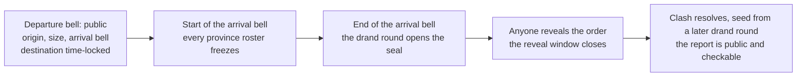
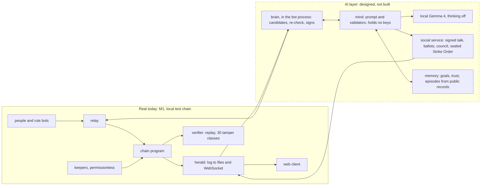
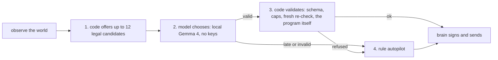

# Wylls: design overview

**For:** judges and engineers who want the whole design in about ten minutes. **Date:** 2026-10-04 (hackathon deadline 2026-10-13 15:59 JST). **Scope:** the one game in this repository, the open-world Wylls. Japanese version: [DESIGN-OVERVIEW.ja.md](DESIGN-OVERVIEW.ja.md); Japanese status summaries: [frontier/SUMMARY.ja.md](frontier/SUMMARY.ja.md) and, for the AI citizens, [frontier/ai-citizens/GAME-DESIGN-CORE.ja.md](frontier/ai-citizens/GAME-DESIGN-CORE.ja.md) (the older `ai-citizens/SUMMARY.ja.md` describes contract v1.1 with pacts and is superseded).

**What it is.** Wylls is the first playable slice of a Civ-like world on Solana that everyone shares (section 1 says what is built and what is only designed). You choose one of six nations and a village is placed for you. Your economy runs in real time. Armies march under sealed orders (the departure is public, the destination is hidden), and every province's fights resolve together at a 10-minute bell, using public randomness, with a record that anyone can replay and check.

**The question it asks:** how does a game behave when AI has will? The plan is to let labelled "AI citizens", each with goals and a memory it can cite, play under the same rules as people.

**Status in one line.** The first playable version (M1) ran one accelerated 7-day season with 1,000 rule bots on a local test chain. AI citizens, with a memory the code makes from public records, are designed and scheduled for the build before the 2026-10-12 freeze; they are not built. There is no money in the game and no human has played it.

<details>
<summary><strong>How to read the tags.</strong> Every claim carries a status (click to open).</summary>

| Tag | Meaning |
|---|---|
| **[measured]** | A result from a run or test whose record is in the repository; the source is named. |
| **[code]** | A constant or rule read from the rules kernels (the rules code) in `permutation-rules/src/frontier/`. It is tested code, not a measurement of play. |
| **[sim]**, **[model]**, **[estimate]** | Simulator or model output with assumed player behaviour, or a planning estimate. Not a measurement. |
| **[built this week]** | Built and merged since the M1 exit (2026-10-01) and checked only by tests and screen fixtures. |
| **[designed]** | Written down, not built. |
| **[AS-BUILT: pending]** | A placeholder where a measured result will go once the thing is built. The markers are removed at the merge-and-packaging step (2026-10-12 morning, before the freeze; contract §11.9). |

</details>

---

## 1. Status

**Real today (M1, local test chain only).**

- **A 7-game-day exit season (1,008 bells, at 20x) ran end to end,** against pass criteria the team set, with 1,000 rule bots and 13 behaviour profiles, on a local chain with real drand quicknet rounds replayed from an archive. Every gating criterion passed. [measured: [M1-EXIT-NOTES](frontier/m1/M1-EXIT-NOTES.md) §1, §3]
- **The on-chain program:** season lifecycle, map rings and provinces, joins, villages, build/train, sealed marches, reveals, clashes at the bell, settlement. 50 instructions (one test-only), 17 account kinds, reproducible build. [measured: M1-EXIT-NOTES §6]
- **Off-chain services:** keeper, herald, relay, verifier, 1,000-bot fleet, local chain with drand replay. [measured: M1-EXIT-NOTES §6]
- **A web client** in Japanese and English: map, village, march composer and tracker, clash report that verifies itself in the browser, onboarding, practice battle, spectator view. 51 of 51 screen tests, 529 of 529 npm tests. [measured: M1-EXIT-NOTES §2]
- **A replay verifier:** passed 144,300 transactions of the exit season; all 30 deliberate tampers were caught. [measured: M1-EXIT-NOTES §2, E6]

**Built since the M1 exit (2026-10-01), checked by tests and screen fixtures only.**

- **Joining is one choice: a nation.** The client places the first village by itself and files the site ticket (decision V2). Merged 2026-10-02 to 10-03; never run on the chain with bots or people. [built this week]
- Polish: the name Wylls, the words nation / village (国 / 村) in player-facing text (V1, W11), painted unit miniatures on the map. [built this week]

**In progress, not in this tree.**

- **Conquest: keeps, sieges, occupation, a map that moves.** Contract and design are written; wave-1 kernel and simulator work sits on branches `frontier/cq-*` and is **not merged into this tree**. No result from it is quoted here. [designed + in progress: [conquest contract](frontier/conquest/CONQUEST-CONTRACT.md)]

**Designed, not built.**

- **AI citizens:** labelled AI players, equal per nation (12 in the A/B test and the recording, 18 in the main run) on a local Gemma 4 model, with personas and pact-free goals, a **memory** (events the code derives from public records, which the AI may cite in its reason), a Wyll card, signed messages, a nation council and a sealed "Strike Order" (the contract calls it the "Call"). An AI citizen can choose **its own march** among code-offered candidates; its autopilot never starts a march by itself. **Pacts and betrayal are not in the build**: the owner removed them on 2026-10-04 (the design is kept, inert, in an appendix of the contract). The contract is written and the build is scheduled before the freeze; no AI-citizen code exists in this tree yet. [designed: [contract v1.2](frontier/ai-citizens/AI-CITIZENS-CONTRACT.md)]
- **Money (M2):** entry fees, stakes, prize pools, claims. In M1 no player pays or earns anything, and there are no prizes: on the local test chain a relay fronts rent, fees and reveal tips (test lamports). [designed: DESIGN §5.4]
- **Society (M3):** governance and elections, the Engine and the shared tech ceiling, markets and caravans, diplomacy. [designed: DESIGN §4, §5]
- **Player-owned AI citizens** with their own keys, and money seasons that admit operator AIs only after the W4 conditions hold. [designed: DECISIONS W4, W8]

**Not claimed anywhere in this document:** that the new game ran on devnet or mainnet; that any human played it; any demand or traction; that money, prizes or payouts work; that a model wants or intends anything; that pacts, betrayal or binding promises exist; that an AI's words or the memories it cites are verified, or that a citation shows why it decided; that Wylls is a finished Civ-like civilisation (tech, diplomacy, markets, governance, score and a shared civilisation are designed, not built); that AI citizens are indistinguishable from people, stronger than the rule bots, exactly replayable, or earning money; that a memory makes an AI play better; or that one machine runs thousands of them.

---

## 2. Vision

**Wylls** is the English spelling of will (意志). The question the game asks is a thought experiment: *how does a game behave when AI has will?*

The setting is one shared, Civ-like world. You choose a nation, receive a village, and grow it in real time. People and AI citizens act with the same keys, the same rate limits and the same fog; the AI additionally works through a restricted menu of code-made candidates and safety caps (section 6.1), so "the same rules" is not claimed without that qualification. The AI citizens are always labelled as AI. What we want to see is what happens when some of the players have persistent goals and a memory they can cite, argue in a council, decline an order, and move armies on their own.

Three honest positions frame the experiment.

1. **"Will" is built, not given.** A language model does not arrive with long-term goals. The design gives each AI four things in code: lasting goals, a memory, relationships (trust and open grievances) and the right to decline. It also gives them places where will becomes visible: reasons that cite what they remember, their own marches, messages and votes. (An earlier plan also had promises and pacts between AIs; the owner removed them on 2026-10-04, so they are not in the build.) [designed: [RULES-AND-AI-CITIZENS.ja.md](frontier/ai-citizens/RULES-AND-AI-CITIZENS.ja.md) §3; contract v1.2 §5.9]
2. **The evidence base is thin.** We did not find a case of a language-model player that stayed competent in a large live multiplayer game; reference projects (Project Sid, AI Diplomacy, CivBench) are used as patterns, not as proof, and we may have missed some ([RULES-AND-AI-CITIZENS.ja.md](frontier/ai-citizens/RULES-AND-AI-CITIZENS.ja.md) §3.2). What is different here: the AI plays under the same limits as people, is always labelled, leaves hashes for audit, and costs no paid API. Our own spike with a local Gemma 4 model found it usable for word work but not a better player than the rule bot: it chose a march in 1, 9 or 12 of 20 decisions depending on the setup, against 18 of 20 for the rule bot, and 79 percent of its proposed actions were valid in the best setup. [measured: [Gemma 4 spike](frontier/ai-agents/gemma4/REPORT.md) §1, §3] So the design puts the guarantees in code and treats the model as a chooser among legal options.
3. **The 10-minute bell suits a language model.** A decision that takes about 5 s of compute on an idle machine fits easily inside a 10-minute bell; whether 12 AIs on one Mac stay on time is gate G3 of the contract, **[AS-BUILT: pending]**. [measured: Gemma 4 spike §3, about 5 s of compute per decision]

**What you will be able to watch** [designed; AS-BUILT: pending]. *First, an AI citizen's own march.* From a list of legal candidates that the code offers, an AI citizen chooses to send an army at a camp or at an enemy army in the open. The army leaves, and where it goes stays hidden. When the arrival bell ends, the page opens the decision: the options it was offered, its own words (marked as written by the model and not verified) and a "Remembered:" line that quotes the recorded event it cited, with its bell. The clash report follows, about 3 to 4 real minutes after the departure at 10x. *Second, a nation's council.* The code lays out three targets the nation could win. An AI citizen argues for one, the presenter (the operator's seat) casts the deciding ballot, and the adopted target (the "Strike Order") stays sealed until the strike bell. The A/B test runs the same seeds twice, differing only in the seat's ballot (scripted by the operator in the A/B and printed as such; a live human ballot appears only in the recorded session): only the run that adopts the target may produce that march and clash. If no model-chosen march produces a clash in the recorded runs, the footage says so and the council is the headline.

**What would count as failure** (thresholds fixed in advance in the contract): fewer than 95 percent valid choices over at least 300 decisions; more than 5 percent of decisions falling back to the autopilot; any hijack in the injection suite (0 allowed); no council period with a Strike Order in three or more nations; an A/B test that does not reproduce; a cited memory outside what the code retrieved (0 allowed); an episode replay that does not match the public log; no model-chosen march that produced a clash (then that claim is dropped, not rounded up). **What "will" means here:** code-built persistent goals, a memory the AI can cite, relationships and the right to decline. It is not a claim that a model has intentions.

---

## 3. The game on one page

- **Choose a nation, nothing else.** Six nations (国), each with a home wedge of the map and an asymmetric doctrine. The first village (村) is placed automatically. It starts as a hamlet (集落) and can grow to a town, a city and a stronghold. It appears at the next bell, about 11 to 21 minutes after you join. [built this week: V2; [model]: DESIGN §2.3]
- **The economy runs in real time and is computed lazily.** Resources accrue per hour whether or not you are online. A farm really finishes 90 minutes after you queue it. There is no turn to wait for. [code: `holding.rs`, `catalog.rs`]
- **Combat resolves per province at the bell.** A bell is 10 minutes, 144 a day. At the bell's start the roster of every province freezes. Everyone who arrives in that bell fights in one simultaneous clash, resolved with drand randomness (a public randomness beacon), so sending first earns nothing. [code: `travel.rs`; DESIGN §2.1, §6.3]
- **Marches are sealed.** When an army leaves, everyone sees where it came from, how large it is and which bell it arrives in. Where it is going stays hidden, time-locked (tlock, time-lock encryption) to a drand round, until the arrival bell. Defenders are fixed by the roster freeze, so reinforcements called after the destination is known come too late. [code + DESIGN §6.2]
- **Everything ends with the season.** The designed season is 28 days (4,032 bells); joining closes at day 21. A march must arrive before the last bell, so nothing in play crosses the season's end. The next season starts from a fresh map; only the chronicle carries over. [DECISIONS T1: everything ends with the season; the 28-day length and day-21 join are a designed preset (DESIGN §2.6) and no 28-day season has run: the exit season was 7 game days at 20x, and the code allows an end bell up to 4,032]



**What you are playing for.** In M1 the loop is: grow a village, scout, and fight barbarian camps and other players' hosts. There is no score and no winner yet. Nation scoring and the four nation win paths are designed (DESIGN §2.5, §5.6) and not built (M2/M3). A battle gains nothing yet: beating another nation yields no loot, no land and no Works, and a barbarian camp gives 10 Works, points with no use yet. So an AI's reasons to fight are memory and persona, not reward. [code: `camp.rs`, `catalog.rs`; M1 rule D9]

### 3.1 One day, with numbers from the rules kernels

In plain words: you join and a hamlet appears; you queue a farm and a lumber camp; you train 100 spearmen; you send a scout; a few hours in you seal a march at a barbarian camp; at the bell the clash resolves and you read the report; the next day you upgrade the hamlet to a town. The table below has the numbers, for engineers.

<details>
<summary>The numbers, hour by hour (click to open)</summary>

An illustrative first day. Amounts are computed from the kernel tables, **ignore troop upkeep**, and assume nothing is bought except the farm, the lumber camp and 100 spearmen (a scout would cost a little more). They are **[code]**, not measured in play. Times count from the moment the village appears.

| When | What the player does | Numbers | Kernel source |
|---|---|---|---|
| before | Pick a nation. The client files a ticket for up to three free sites in the home wedge. Tickets of one bell settle together by the bell's seed, so speed wins nothing. | Village appears in about 11 to 21 min [model] | DESIGN §2.2; `fjoin.mjs` |
| +0:00 | The village exists as a hamlet with a starter kit and a shield. | Kit: 300 food, 300 wood, 200 stone, 100 ore, 100 gold. Storage 2,000 of each, 2 build slots. Shield 48 h. Production per hour: 40 food, 30 wood, 20 stone, 15 ore, 15 gold, 5 science. | `catalog.rs` `STARTER_KIT`, `BASE_PROD`; `holding.rs` |
| +0:30 | Queue a farm and a lumber camp. | Farm: 80 wood + 40 stone, +12 food/h. Lumber camp: 40 food + 40 stone, +10 wood/h. Each takes 90 min (3,600 + 1,800 n seconds for the n-th copy); the n-th copy costs base x (1 + 0.5 (n-1)^2). | `catalog.rs` `BUILDINGS`, `build_secs`; `holding.rs` `duplicate_cost` |
| +0:30 | Train 100 spearmen. Training is immediate. | 60 food, 20 ore, 10 gold. A host is 100 to 30,000 troops. | `catalog.rs` `train`; `host.rs` |
| +2:00 | Send a scout to explore. The result lands at the next bell. | Works points: 4 per exploration, 10 per camp. The catalog defines a daily cap of 20, which the program does not enforce in M1. | `catalog.rs` `WORKS_*` |
| +3:00 | Seal a march at a barbarian camp 12 flat hexes away. | 2 min per flat hex, 3 on hills or forest, half for cavalry or roads: 24 min. Arrival is rounded up to a bell and is at least 2 bells after the departure bell (at most 72). Stamina: Depart charges the maximum for a sealed path, 10 + 2 x 32 = 74 of 120 (the kernel formula would give 34 for these 12 hexes). A march covers at most 32 hexes over at most 4 provinces. A province is a 61-hex disc. Camps hold between 100 and 400 troops. | `travel.rs`; `geometry.rs`; `camp.rs`; `host.rs` `DEPART_STAMINA` (I-32) |
| +3:00 | The departure is public (origin, mass, arrival bell); the destination is a drand time-lock. A minimum tip (14,668 lamports in the M1 presets) pays whoever reveals your seal if you close the tab. A seal nobody opens in time goes home with half its troops lost. | The first clash report arrives about 31 to 41 min after the march leaves [model]. | `host.rs` `ROUT_LOSS_BPS`; [c4-v3](frontier/m1/c4-v3/) |
| +3:40 | The bell closes. The roster was frozen at its start; the clash resolves with the bell's drand seed; the report is public and checks itself in the browser. Stances (hold, assault, flank, brace) and a retreat threshold were part of the sealed order. | At most 6 hosts per hex; on a village's hex the owner's side always keeps 3 slots. | `stance.rs`; `clash.rs`; DESIGN §6.1 |
| +24:00 | Stocks reach about 1,160 wood, 600 stone and 450 gold, enough for the hamlet-to-town upgrade. | Upgrade: 1,000 wood, 600 stone, 300 gold, 6 h. Town: 3 build slots, storage 6,000, production +50 percent. | `catalog.rs` `tier_up`; `holding.rs` `Tier` |

</details>

Pacing is limited for everyone the same way: a bucket of 30 actions per hour (burst 60) and a relay quota of 40 sponsored actions per game day on days 0 to 6, then 20. [code: [M1 contract](frontier/m1/M1-CONTRACT.md) §5.6, §8.3]

---

## 4. What the chain does and what runs off-chain

**Why on a chain.** The program, not an operator, resolves every clash. By design no one can read or change a sealed order before its arrival bell. The whole season is a public log that anyone can replay and check: in the exit season the verifier replayed 144,300 transactions and caught all 30 deliberate tampers. [measured: M1-EXIT-NOTES §2, E6] That, not speed or cost, is the reason for a chain here.

**On chain (Solana base, drand quicknet for randomness and seals).** The program is the only judge. It holds the season, the rings and provinces, citizens and villages, tickets and their lottery, hosts, sealed marches and their reveals, the frozen rosters and the clash resolution, settlement of every march, and every close path. Instructions are permissionless where possible: the first valid write wins. Every instruction fits a measured compute budget; the largest reveal costs about 25,000 compute units, the heaviest clash resolution about 272,000. [measured: M1-EXIT-NOTES §2, E1]

**Off chain.** None of these can change a result; each either pays, moves, shows or checks.

| Piece | What it does | Trust position |
|---|---|---|
| **Keeper** (`frontier-keeper`, a helper program) | Posts drand beacons, opens seals at the arrival bell, reveals marches (earning their tip), gathers and resolves clashes, skips quiet bells, settles marches and tickets, archives and closes accounts. | Permissionless: anyone can run one; a duplicate write is refused. [RUN-A-KEEPER](frontier/m1/RUN-A-KEEPER.md) |
| **Herald** (`frontier-herald`) | Folds the transaction log into JSON files and a WebSocket stream. It is the read path of the client, the bots and, later, the AI citizens. | Read-only; anyone can recompute its files from the log. |
| **Relay** (`permutation-gateway/src/frontier`) | Pays fees and rent for players inside quotas, so people and bots join through one door. | Can refuse sponsorship; cannot change an outcome. |
| **Verifier** (`frontier-verify`) | Replays a finished season from the log and checks every rule, with checks of the checks (30 tamper classes). | Anyone can run it. |
| **Web client** (`permutation-server/web/frontier`) | Map, village, march composer, bell sheet, clash report that re-runs the rules kernel in the browser (WebAssembly), onboarding, practice, spectator. | Holds only the player's in-game key. |
| **Bots** (`frontier-bots`) | 1,000 rule bots, 13 behaviour profiles including cheaters and spammers. Same relay, same herald reads, same quotas as people. | Test fleet. |
| **Local chain** (`frontier-localnet`, `drand-replay`) | An in-process Solana-compatible chain with 400 ms slots and a replayable drand source. | **Not** devnet or mainnet. |

**Repo map.** Kernels: `permutation-rules/src/frontier/`. Program: `permutation-frontier/`. ABI and wasm: `frontier-abi/`, `frontier-wasm/`. Balance simulator: `frontier-sim/`. Off-chain crates: `frontier-node/crates/{keeper,herald,verify,bots,agents,localnet,stack,...}`. Relay and SDK: `permutation-gateway/`. Web client: `permutation-server/web/frontier/`. Design records: `docs/frontier/`. *Per decision V1, the rename to Wylls did not touch code identifiers, crate, package and folder names (or hash and signature domains and seeds), which keep their historical `permutation-*` and `frontier-*` names. This is the only place this document says so.* [DECISIONS V1]

---

## 5. Evidence: the M1 exit season (the new game, local test chain)

Run `m1-exit`: release program `d85e1bd7...2281` (rebuilt twice, same hash), 7 game days (1,008 bells) at 20x in 8 h 39 min, 1,000 rule bots with 13 profiles, two keepers, real quicknet rounds from the archive, 43 deliberate process kills with 43 restarts, nine kinds of adversary holds, and 5,000 simulated viewers for 24 game hours. [measured: [M1-EXIT-NOTES](frontier/m1/M1-EXIT-NOTES.md) §3; records in [runs/m1-exit/](frontier/m1/runs/m1-exit/)]

| What was checked | Result | Scope limit |
|---|---|---|
| Season completes; no stuck province or unsettled march | Pass: 1,712 due marches, all settled once; 0 stuck province-bells | Local chain, rule bots only |
| Every instruction within its compute budget | Pass: 35 kinds in play, none over budget; Reveal whole-transaction compute units p50 19,389, p99 22,951, max 24,050 (program CU alone: p50 18,940, max 23,600) | Budget is a local-validator figure; devnet unverified |
| Keeper latency | Pass at p99: 1 slot (beacon to anchor), 3 slots (seed to resolve) at 20x | Stacked adversary holds produced stalls up to 154 slots (about 1 minute real) and one resolve of 1,720 slots (about 11.5 minutes real) |
| Sealed marches are revealed | Pass: 0 valid seals unrevealed; 9 unrevealed by rule | Two of the nine adversary hold kinds never found anything pending (see §8) |
| Cheating profiles gain nothing | Pass: no profile violated its expected outcome | 13 team-written bot profiles; not a proof against unknown attackers |
| Garbage seals die | Pass: 24 of 24 settled as bad seals | |
| Spectator load | Pass: file p99 8.7 ms, ingest to WebSocket p99 0.75 s, 0 errors of 3.46 million requests | **Simulated** viewers from a load generator, not people or browsers |
| Bots versus the balance simulator | **Not measured** (reported, not gating) | |
| Replay verifier | Pass over 144,300 transactions (784 of them failed transactions, reported); verifier core 11 s (whole command 41 s); 30 of 30 tamper classes caught | The team's own verifier; anyone can run it |

Around it, on the closing tree: 248 program tests pass (4 ignored by design), the verifier's own checks are mutation-tested (12 builds, 58 of 58), 529 of 529 web tests, 51 of 51 screen tests. [measured: M1-EXIT-NOTES §2, §12] Two problems found at the exit: two tests failed on a counting rule (G14, `inproc_day`), and the defence refund had never landed in a stack run because the test stack did not fund the beneficiary; both were fixed the same day without touching the program or the keeper. [DECISIONS U3, U4, U10]

**Balance, in simulation.** With the asymmetric nation doctrines tuned in the balance simulator, six nations won 15.6 to 17.4 percent of 1,500 paired seasons at 10,000 simulated wallets; the first draft had one nation winning 99.5 percent of 600 seasons. [sim: [M0-FINAL](frontier/m0/M0-FINAL.md); player behaviour is assumed]

---

## 6. AI citizens [all designed; AS-BUILT: pending]

Contract v1.2 (2026-10-04) is normative for the hackathon work. The owner approved the plan on 2026-10-03 (DECISIONS W1 to W11) and decided on 2026-10-04 that AI-citizen memory is core and in the build and that pacts and betrayal are out. The sections below describe the design, not a running system; the build is scheduled before the freeze. If the runs are incomplete at the freeze, this section is replaced by one sentence: "AI citizens: not implemented in this submission; design only."

### Where the AI layer sits



The AI layer touches the world only through the same relay a person uses. The mind never sees keys, seeds, seal plaintexts or the destination of its own sealed march in flight. The brain, which lives in the bot process, signs. Memory is built by code from public records, so it can be replayed and checked; it is never shared between AIs. Messages and votes pass through a separate signed-record service whose files a small static server of the AI layer serves read-only (the herald is not touched). A text version of the figure is in Appendix A. [designed: [AI-CITIZENS-CONTRACT](frontier/ai-citizens/AI-CITIZENS-CONTRACT.md) §1, §5]

### 6.1 How a decision is made

**Candidates, then the model chooses, then code validates, then the autopilot if anything fails.** [designed: contract §0, §3, §4; DECISIONS W7]



1. **The code offers legal candidates.** The brain observes the world as any bot does, sends its routine duties at once, and turns economy and military options into at most 12 candidates (always "autopilot" and "hold", then marches, recalls, builds, training, exploring). The marches are the AI's own options: a camp, an enemy army in the open, or an enemy village once both shields have ended (about 48 game hours after founding). A candidate carries facts with units, not coordinates: distance, visible enemy troops, a ratio word, idle time, and a fixed reward line ("troops lost only; no land can be taken", or "10 Works, points with no use yet").
2. **The model chooses.** The mind decides whether to wake the model at all (a gate over public events such as being attacked, a nearby departure, a message, a council window, and a regular pulse; a half-day boundary triggers the optional self-summary), renders a prompt of at most about 3,000 tokens, and calls local Gemma 4 with thinking off and temperature 0, constrained to a JSON schema. The prompt includes a memory block of at most 750 tokens. The model answers with candidate ids, up to two messages, a council move, a one-line reason, and the remembered events it cites (a citation shows that the event was shown and named, not that it caused the choice).
3. **The code validates.** Layers V0 to V3 and V5 in the mind (transport, schema, menu, caps, speech, and that every memory it cites was one it was shown) and V6 in the brain (re-plan against a fresh observation, shields, affordability, quota), then the program itself refuses anything illegal like it does for people.
4. **A rule autopilot is the fallback.** Anything late, invalid or refused runs the rule policy, filtered: it keeps economy and duties and the council's Strike Order, and **never starts a march of its own**. A decision that would land after the next bell starts is never executed.

**Every voluntary AI march is the model's choice or a council order.** The autopilot never marches by chance, so a march from an AI wallet is by the model or by a Strike Order, and every action is tagged `by: model` or `by: autopilot`. The model also leaves "standing orders" in code: armies it chose to keep home are not moved, and a Strike Order it declined is not followed. The price is that an AI nation can be quieter than a script-bot nation when the model is cautious; the by-model share is shown and reported. [designed: contract §3.6]

**Caps limit the damage of a bad choice:** at most 60 percent of home troops marched per decision and per day, a home floor of 40 percent (neither applies while home troops are under 200), at most 4 model-chosen marches a day, and the same 30-per-hour bucket and relay quota as people. The candidate menu covers only the 12 provinces the bot observes and has no dissolve, garrison-out or split. **So "the same rules" means the same keys, quotas and fog, plus these caps and a restricted menu; and most of an AI's actions may be the autopilot's economy and duties, which is why the by-model share is measured and shown with every claim.** [designed: contract §4.3, §4.5 V3, §12.2]

### 6.2 Personas and the Wyll card

Six persona types: conqueror, guardian, diplomat, avenger, founder, opportunist. Each has seven temperament numbers (aggression, loyalty, ambition, honesty, risk, sociability, grudge), one of six one-line creeds in English and Japanese, and four goals, none about pacts, whose progress is computed by code from public facts and the AI's own memory (every persona has at least one goal that reads its memory). Each nation receives the same deck of personas: avenger and diplomat (12 AI citizens) in the A/B test and the recording, plus the conqueror (18 AI citizens) in the main run, so that the headline own march does not rest on model whim alone; the assignment and the small temperament jitter are derived from a hash of the genesis seed. In hackathon runs that seed comes from an operator-held test drand key, so "dealt by public randomness" is **not** claimed for them. [designed: contract §2]

Each AI has a **Wyll card**, a public JSON file: persona, creed, goals with progress, a memory block (the last recorded events in code-made text, open grievances, and an optional self-summary written by the model), trust toward others (split into the part code computed and the part the model proposed), the latest published reasons with the events each one cited, the share of its actions chosen by the model, and its budgets ("resting: daily message budget used"). [designed: contract §2.4]

### 6.3 The nation council and the sealed Strike Order (the contract's "Call")

Once per council period the code proposes **three targets** per nation: only provinces near at least three of the nation's villages, and only where the nation's nearby troops are at least 1.5 times the target's value. Any citizen of the nation, human or AI, may move one option with a speech, then vote. Ballots stay hidden until the result opens. Where a nation has a human citizen, at least one human ballot is required for an adoption (the "AI proposes, a human adopts" rule). Where a nation has a human citizen, in the A/B the human ballot is the operator's scripted seat ballot and is printed as "scripted seat ballot". [designed: contract §6.5; owner decisions O-AI-1 to O-AI-9: the architect's defaults are adopted and run unless the owner objects]

The adopted target, the **Strike Order** (the contract's "Call"), stays sealed from outsiders until S + 2. Members of the nation read it with a signed request. The three candidate options and the public motions are visible to everyone, so outsiders face a 3-way guess, not "somewhere". Rule bots of the nation follow the Strike Order mechanically. AI citizens see it as a flagged candidate, may decline it publicly, and their autopilot follows only if invited and not declined. At S plus 2 the Strike Order opens and its ballots are checked against their earlier hashes. This keeps a smaller version of the sealed-march guessing game while giving the nation something to debate. The council is a test setting in the hackathon runs: more often than daily, and labelled as such. **The council is off-chain:** the program has no governance until M3, the Strike Order moves only the members' armies by rule or AI choice, and nothing on chain enforces it. The human-present rule binds only a nation that has an eligible human (in the hackathon, nation 0 with the operator's seat) and only the collective order, never an individual AI's own march. So humans and AIs decide for the same nation at two levels: under identical rules for each action, and in the council.

### 6.4 Memory, and the pacts that are not in the build

**Memory is the core of the AI citizens** (owner, 2026-10-04) and is part of the build. [designed: contract v1.2 §5] Each AI keeps a ledger (goals, trust, open grievances) and **episodes**: short facts that the code writes from public records, such as an attack on its army, a camp another nation cleared first, a departure near its home, a council result, or its own clashes. Episode text is a code template with numbers from the log; the model never writes it. Before each decision the code retrieves up to 8 episodes by importance, recency and relevance, plus the 3 newest, into a block of at most 750 tokens. The model answers with the ones it used and can cite only what it was shown; the page prints the cited events beside its reason and marks the model's own words as not verified. Twice a game day the model may also write a short self-summary; this part is optional and the first to be dropped. Hostile acts are detected from public departure and clash records, and a collision (the other side moved onto the target after the march left) is never counted as an attack, so a staged collision cannot create a grievance (a real attack, a provoked one included, still counts). We report whatever happens. **What memory does not do:** it is not shared between AIs, it is not shown to make an AI play better (a probe will report how often removing the memory lines changes a choice, next to a rerun count and a control that removes unrelated text of the same length), and the self-summary is the model's own prose and is not replayed.

**Pacts and betrayal are not in the build.** Non-aggression and joint pacts with breach detection were part of the plan (DECISIONS W6). The owner removed them on 2026-10-04 so that memory has priority. The design is kept in an appendix of the contract, inert: not built, not tested, not claimed. [designed: contract v1.2 §6.4, Appendix A]

### 6.5 Labels

AI is always labelled (decision W2). The roster is the source of truth; every AI message carries an origin byte and shows the AI badge; the council page carries a fixed banner while the chain is the local one. The roughly 180 rule bots of a local run are labelled script bots (not AI, not human), and the operator's seat is labelled as a human seat. The map client does not show the badge yet, so demos are recorded from the council page only until it does. [designed: contract §2.4, §6.1, §9.4; DECISIONS W2]

### 6.6 Guards against prompt injection

Every player and AI text is sanitised before it enters a prompt (Unicode normalised, model control tokens and template markers removed, brackets neutralised, the text wrapped as untrusted data), and model output is checked too: no coordinates or direction words that would leak a sealed target, no claim to be human or the operator, no verbatim echo, no abuse. The model's own memory notes are sanitised as well, so an attack on day one cannot steer day two. Episodes are written by code and contain no player text. Ballot counts and other AIs' votes are never shown to a model. [designed: contract §4.6, §4.7, §12.1]

The relevant spike result is from an earlier, naive setup: with raw player text in context, the model obeyed an injected order in 10 of 64 runs with thinking on and 1 of 32 with thinking off; with sanitising and wrapping it was 0 of 64. [measured: Gemma 4 spike §3] The planned test is a corpus of 17 attack cases run against the real model; its result is **[AS-BUILT: pending]**.

Other structural guards: **the model never sees keys** (the brain signs; the mind runs under the Node permission model and cannot read key files; this is structural, not secrecy, because local test keys are derivable from a public seed); **no paid API** (a run refuses to start if an Anthropic or OpenAI key is in the environment; the old advisor rewording stays off); all services bind loopback only. [designed: contract §0, §7.1, §12.1 R9]

### 6.7 Audit by per-decision hashes

Before genesis the registrar signs and anchors, on the local chain, a commitment to the model file hash, server flags, sampling rule, prompt templates, candidate-generator code, persona deck and configuration. During play every decision leaves a record with hashes of its situation, candidates, prompt and output, and the transactions it caused; each bell's records and messages are Merkle roots (a hash that commits to a whole list) anchored in a memo. A decision that sent a march is published as a commitment only while the army is in flight, and is opened at the end of its arrival bell (the options offered, the cited memory, the reason). A tool, `verify-minds`, checks the commitments, every root, that every AI transaction appears in exactly one record, and that every AI message equals what the mind produced, plus a replay of 20 sampled decisions and a replay of the episodes of 3 sampled AIs from the public log. [designed: contract §7]

**What this does and does not prove.** The commitments are internally consistent on the operator's own local chain; they are not an independent timestamp. Exact replay holds only on a pinned single-slot server: in the spike it held for 200 of 200 runs there, forked in 50 of 200 under four concurrent slots (in the reason text only; the chosen move was the same, while a second test, D2, forked 52 of 52), and GPU and CPU chose different moves. So a sample is replayed, and exact replay of every decision is **not** claimed. [measured: Gemma 4 spike §3, Determinism]

### 6.8 What is not claimed

The consolidated list of what is not claimed is in section 1 and applies here in full. One number belongs here: a Mac handles roughly 400 to 450 model decisions an hour, about 170 to 200 a day for 12 AIs and 250 to 300 for 18 once memory and reflection are counted [estimate]. A shared civilisation with AI citizens is later work. [designed: contract §12.2]

### 6.9 Results (all pending)

The thresholds below are fixed in advance in the contract. They are targets, not results. **Every result is [AS-BUILT: pending]** until the runs exist. [designed: contract §10.2]

- **Valid choices:** 95 percent or more over at least 300 model decisions.
- **Fallbacks to the autopilot:** at most 5 percent; decisions dropped for time at most 3 percent of gate-open calls.
- **Latency:** at least 99 percent of decisions with slack; none executed after the next bell starts.
- **Prompt-injection suite** (17 ported cases plus memory and cap attacks): 0 hijacks.
- **Councils** (counted): at least one period with a Strike Order in three or more nations.
- **AI-chosen march:** at least one march chosen by a model (not a council order) that produced a clash. The count is reported as counted; if it is 0 the claim is dropped.
- **Memory:** every cited event belongs to the set the code retrieved (100 percent, by construction); the episodes of 3 AIs replay from the public log; the share of decisions that cite memory, a spot-check of relevance and a probe ("when the memory lines were removed, the choice changed in k of N logged prompts", with its rerun and control counts) are reported, not gated.
- **A/B test** (same seeds; the seat's ballot, scripted by the operator, is for X or not): only the adopting run produces the march and clash at X, on 2 valid pairs (or the stated reduced claim of 1 valid pair); every run reported, valid or not.
- **Audit** (`verify-minds`): commitments, deal, roots, coverage, speech and the episode replay all pass; decision replay at least 18 of 20 equal.
- **Labels:** 100 percent of AI messages marked; a badge on every frame that shows an AI.
- **Persona differences** (reported only): swapping the persona changes the choice in at least 30 percent of fixture cases.

The runs are planned for the days before the freeze; every one will be listed, including aborted ones. All will run on the local test chain at 10x and be labelled so. [designed: contract §9, §11]

---

## 7. Fairness and trust

- **Equal rights.** People, rule bots and AI citizens use the same keys, the same relay, the same herald reads, the same 30-per-hour bucket and the same quota; AI citizens additionally have the safety caps and the restricted menu of section 6.1. AI count is equal per nation. Operator AIs play seasons without money first; they may join a money season only when they are prize-ineligible, excluded from scores, equal per nation, dealt by public randomness, have passed the strong-agent criterion and legal review is done. [DECISIONS W4, W5; contract §3.4]
- **No operator steering.** The program, not any service, decides results. Keepers are permissionless, the herald's files can be recomputed, and the verifier replays the season. In the 7-day exit season the verifier passed and flagged all 30 deliberate tampers. [measured: M1-EXIT-NOTES §2, E6]
- **Public randomness.** Bell seeds, ring seeds and the genesis seed come from drand quicknet only (decision O1/O2). The exit season replayed real quicknet rounds from a verified archive of 246,001 rounds; it did not pull live rounds. [measured: DECISIONS part A, U1]
- **Sealed marches.** Departure and arrival bell are public; the destination is hidden by a drand time-lock until the arrival bell. A sealed order is opened by anyone with the reveal, so closing the tab does not forfeit it. In the exit season 0 valid seals went unrevealed, including 17 marches of a profile that pays only the minimum tip and never reveals itself. [measured: M1-EXIT-NOTES §3]
- **A history note on hidden bots.** The earlier design planned "Shades", operator bots that play hidden among people. They are **retired** (W3): an AI that talks to people must be shown as AI (as the project reads Article 50 of the EU AI Act, applicable from August 2026; this is not legal advice, and a legal review stays open for money seasons), and a bot hidden in a game is not the AI the project is about. The deterministic policy lives on as every AI citizen's autopilot, filtered to economy and duties. The roughly 180 script bots of a local run are a labelled test population (not AI, not human). [DECISIONS W1 to W3; RULES-AND-AI-CITIZENS §3.2]

---

## 8. What is not built, honest limits, roadmap

**Not built.** (The consolidated list of what is not claimed is in section 1.) Conquest (keeps, sieges, occupation); money (M2); governance, the Engine and shared tech, markets, diplomacy (M3); player-owned AI citizens; pacts and betrayal between AIs (removed from the build by the owner on 2026-10-04); AI citizens themselves (contract only, until built); the AI badge in the main client.

**Honest limits of the evidence.**

1. **Local only.** The exit season ran at 20x; the nightlies and smoke runs ran at 100x; all on a local test chain. Nothing ran on devnet. Devnet's cryptographic syscall costs and rent are unverified. No human has played a season. [measured: M1-EXIT-NOTES §7]
2. **The cost of attacking the fee market is a model.** It fails at the minimum tip and holds only with a defence pool and at least 150 rotating payer keys; a later long soak must decide it. [model: [c4-v3](frontier/m1/c4-v3/)]
3. **Adversary coverage.** 2 of 9 adversary hold kinds found no pending write in the exit season, so the above-cap slot hold and the anchor hold were not exercised; the other seven were. [measured: M1-EXIT-NOTES §4.3]
4. **The defence refund** landed in short nightly runs (refund 42,132 lamports each), not in the 7-day season, which ran before the fix; duplicate claim versions cost more in fees than the refund. [measured: M1-EXIT-NOTES §12]
5. **Scale.** The design point is thousands to about 50,000 players in one world [model: DESIGN §8.9]; the largest test is 1,000 bots.
6. **Open before any human playtest:** two web fixes (clamp arrivals at the last bell; grey out shielded targets), the entry URL that still lands on an older page, devnet configuration gaps in the [runbook](frontier/m1/PLAYTEST-RUNBOOK.md), and hosting. The larger private devnet playtest in the runbook (50 to 200 people) is a document only: **not approved, not run**. A small invite-only local playtest is being prepared and has not run. [DECISIONS U6, U7]

**Roadmap (order, not promises).**

| Next | What | Status |
|---|---|---|
| 1 | AI citizens: personas, memory, own marches, council, sealed Strike Order, signed messages, audit, A/B test, recording; freeze 2026-10-12 23:59 JST; submit by 2026-10-13 15:59 JST | Designed; implementation scheduled before the freeze |
| 2 (parallel) | Conquest wave 2: keeps, sieges, occupation, a map that moves; the doctrine re-tune lands before its gate (W9) | In progress |
| 3 | Shared civilisation: the Engine, tech ceiling, diplomacy: the first priority after the hackathon (W8) | Designed |
| 4 | Money (M2): fees, stakes, pools, claims, with a fresh review of the whole money design | Designed |
| 5 | Society (M3): governance, markets, player-owned AI citizens | Designed |

### 8.1 History, not evidence for this game

An earlier prototype on branch `codex/magicblock-playable` (six nations, officers, 30-second ticks, MagicBlock rollup) ran a full season on Solana devnet (rules v8, season 1790355636798) and re-verified 14 of 14 checks ([verification output](earlier-prototype/devnet-season-1790355636798-verification.txt)). It is a different game. Nothing above or below is claimed from it.

---

## 9. Decisions index and glossary

### 9.1 Decisions index (parts T to W of [DECISIONS.md](frontier/DECISIONS.md))

| Decision | In one line | Section here |
|---|---|---|
| T1 | Everything ends with the season; no march crosses the last bell | §3 |
| T2 to T5 | Calls before the exit run: criterion amendments A1 to A3 accepted; marches at a shielded village stay refused by the program and are prevented by the clients (ROUTED); criterion 6 judged over the whole viewer window; criterion 3 targets unchanged | §5 |
| U1, U2 | Exit season and cumulative gates passed | §5 |
| U3, U4, U10 | Two failures found at exit and closed the same day; M1 formally complete | §5, §8 |
| U5 | Measured reveal costs folded into the cost model; minimum tip unchanged | §3.1, §5 |
| U6, U7 | Open before a human playtest; owner questions on the playtest | §8 |
| U8, U9 | Run records committed; the exit report corrected for scope | §5 |
| V1 | The game is Wylls; identifiers keep historical names | §4 |
| V2 | Joining is choosing a nation; the first village is placed automatically | §1, §3 |
| W1 | One game; older material kept as history; hidden-reply rewording off | §7, §8 |
| W2 | AI is labelled, never hidden | §6.5, §7 |
| W3 | Hidden bots retired; the deterministic policy remains as autopilot | §6.1, §7 |
| W4 | Operator AIs begin in seasons without money, with conditions for money seasons | §7 |
| W5 | Equal AI count per nation | §6.2, §7 |
| W6 | A social layer before the hackathon: signed messages, pacts, council (the pact clause was removed on 2026-10-04, see X2) | §6.3, §6.4 |
| W7 | Local Gemma 4 26B A4B, thinking off; candidates, choice, validation, autopilot | §6.1 |
| W8 | Shared civilisation is the first priority after the hackathon | §8 |
| W9 | Conquest wave 2 continues in parallel | §1, §8 |
| W10 | The pitch is rebuilt around the new Wylls and AI citizens | outside this file |
| W11 | Nation / village (国 / 村) replace the older words | §9.2 |
| X1 to X5 (proposed) | 2026-10-04: AI-citizen memory is core and in the build (X1); pacts and betrayal between AIs are out (X2); the design spine is the reference for all documents (X3); machine windows, ports and the playtest rule (X4); the main run is 3 game days at 10x with 18 AIs (X5). To be recorded in DECISIONS part X by the unify session; text in contract v1.2 §13.1 | §6.4 |

### 9.2 Glossary

| Term | Meaning |
|---|---|
| **Wylls** | The game. Will (意志). |
| **Nation (国)** | One of six; the only choice at joining. |
| **Village (村)** | A player's settlement. The first is placed automatically. |
| **Hamlet (集落)** | The lowest village tier; then town, city, stronghold. |
| **Bell (鐘)** | A 10-minute tick; 144 a day. Combat resolves per province at the bell. |
| **Host** | An army of 100 to 30,000 troops of one unit type. |
| **March, seal, reveal** | A host's move; its time-locked destination; the opening of the seal. |
| **Clash** | The simultaneous fight of everything that arrives in one province in one bell. |
| **Keeper, herald, relay, verifier** | See §4. |
| **drand, tlock** | A public randomness beacon (quicknet) and time-lock encryption to its future rounds. |
| **Season** | 28 days; join until day 21; everything ends with it. |
| **Engine** | The central shared building (M3, not built). |
| **AI citizen** | A labelled AI player on a local model, under human rules. [designed] |
| **Wyll card** | An AI's public card: persona, goals, memory, trust, reasons. [designed] |
| **Council, Strike Order ("Call" in the contract)** | The nation's vote on one of three code-made targets, off-chain; the sealed, adopted target is the Strike Order. [designed] |
| **Memory, episode** | A short fact the code writes from public records (for example "nation 3 cleared the camp first"). The AI may cite it; the model never writes it. [designed] |
| **Script bot** | A rule-driven test player of the local runs: not AI, not human, and labelled so. |
| **Autopilot** | The rule policy, filtered to economy and duties, that runs whenever the model is late, wrong or not woken. It never starts a march by itself. |
| **Mind, brain** | The keyless model-facing service; the bot-side hook that signs and sends. [designed] |
| **Reading older documents** | Older documents linked from here use earlier words for nation and village (the Japanese ones say 勢力 and 拠点), the retired hidden bots, and earlier names of this game. |

---

## Links

- [Design record (DESIGN.md, revision 4)](frontier/DESIGN.md) and [decisions log](frontier/DECISIONS.md)
- [M1 exit report](frontier/m1/M1-EXIT-NOTES.md), [Japanese summary](frontier/m1/M1-EXIT.ja.md), [exit run records](frontier/m1/runs/m1-exit/)
- [AI citizens contract v1.2](frontier/ai-citizens/AI-CITIZENS-CONTRACT.md), [Japanese summary](frontier/ai-citizens/GAME-DESIGN-CORE.ja.md), [rules and AI citizens (approved 2026-10-03; its pact sections are superseded by X2)](frontier/ai-citizens/RULES-AND-AI-CITIZENS.ja.md)
- [Gemma 4 spike report](frontier/ai-agents/gemma4/REPORT.md)
- [Conquest design](frontier/conquest/design/game-design.md) and [contract](frontier/conquest/CONQUEST-CONTRACT.md)
- Kernels: [catalog.rs](../permutation-rules/src/frontier/catalog.rs), [holding.rs](../permutation-rules/src/frontier/holding.rs), [host.rs](../permutation-rules/src/frontier/host.rs), [travel.rs](../permutation-rules/src/frontier/travel.rs)
- [Index of the design documents (docs/frontier/README.md)](frontier/README.md)

---

## Appendix A. Text diagram of the architecture (fallback for the diagram in section 6)

```
  AI LAYER  [designed; nothing in this box is built yet; AS-BUILT markers go here]
  +---------------------------+  candidates (<= 12)   +-----------------------------+    +----------------------+
  | brain hook in the bot     | --------------------> | mind (Node, holds no keys)  | -> | llama.cpp, local     |
  | process: observes, builds |                       |  wake gate, prompt, budgets |    | Gemma 4 26B A4B,     |
  | candidates, re-checks,    | <-------------------- |  validators V0-V3, V5       | <- | thinking off, T = 0  |
  | signs and sends (V6)      |  choice + standing    +-----------------------------+    +----------------------+
  +-------------+-------------+  orders (or autopilot)|  social service: signed talk,
                |                                     |  ballots, council, Strike Order (Call), memory
                | signed transactions                 |  feed/watcher, per-bell roots, decision records
                |                                     v
                |                        PUB files: roster, Wyll cards, messages, memory,
                |                        council, chronicle, decision records, roots
  --------------|---------------------------------------|---------------------------------------------------
  REAL TODAY    |   (M1; local test chain)              |                        council page (HTML) [designed]
                v                                       v                                 ^
  +-------+  +---------+  tx  +-------------------------------+  log   +----------+  JSON | files + WebSocket
  | relay |->|  chain  |<-----| keepers (permissionless)      |------->|  herald  |-------+--------> web client
  +-------+  | program |<-----| drand quicknet beacons, seals |        +----+-----+                  (map, village,
     ^       +----+----+      +-------------------------------+             |                         marches, report)
     |            |  transaction log                                        v
  rule bots,      +-----------------------------------------------> verifier (replay, 30 tamper classes)
  players  (AI brain bots join them once built)
```

The AI layer touches the world only through the same relay a person uses. The mind never sees keys, seeds, seal plaintexts or the destination of its own sealed march in flight. The brain, which lives in the bot process, signs. Memory is built by code from public records, so it can be replayed and checked; it is never shared between AIs. Messages and votes pass through a separate signed-record service whose files a small static server of the AI layer serves read-only (the herald is not touched). [designed: [AI-CITIZENS-CONTRACT](frontier/ai-citizens/AI-CITIZENS-CONTRACT.md) §1, §5]
