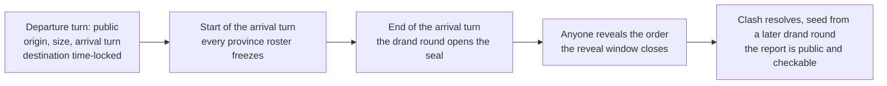
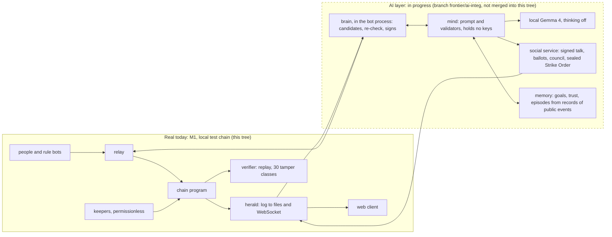
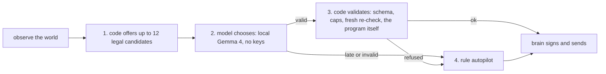

# Wylls: design overview

**For:** judges and engineers who want the whole design in about ten minutes. **Date:** 2026-10-04 (hackathon deadline 2026-10-13 15:59 JST). **Scope:** the one game in this repository, the open-world Wylls.

> This is the English version of [DESIGN-OVERVIEW.ja.md](DESIGN-OVERVIEW.ja.md). Headings, numbers, status tags and links are the same in both (the heading numbers too).

**Where this document sits.** It is a summary that sets the intended finished design (including the owner's decisions D1 to D12 of 2026-10-04) beside the current state, item by item. The full text is the unified design document [GAME-DESIGN.ja.md](GAME-DESIGN.ja.md) (Japanese); the sorting of its 48 discrepancies with earlier documents is in [GAME-DESIGN-DISCREPANCIES.ja.md](GAME-DESIGN-DISCREPANCIES.ja.md). Where a number or a status differs from this summary, the unified design document and the contracts ([M1-CONTRACT](frontier/m1/M1-CONTRACT.md), [the AI-citizens contract v1.3](frontier/ai-citizens/AI-CITIZENS-CONTRACT.md), [the conquest contract](frontier/conquest/CONQUEST-CONTRACT.md)) win. The unified document is the version before the project owner's confirmation. The Japanese status summaries [frontier/SUMMARY.ja.md](frontier/SUMMARY.ja.md) and [frontier/ai-citizens/GAME-DESIGN-CORE.ja.md](frontier/ai-citizens/GAME-DESIGN-CORE.ja.md) are to be replaced once the unified document is confirmed ([ai-citizens/SUMMARY.ja.md](frontier/ai-citizens/SUMMARY.ja.md) is a summary of contract v1.3).

**How sources are written.** 〔Source: file:line〕 is a path relative to the repository root. Files on other branches carry `ai-integ:`, `cq-integ:` or `playtest:` (the path inside that branch). Run results under `.local/` on ai-integ are generated output that git does not track.

**What it is.** Wylls is the first playable slice of a Civ-like world on Solana that everyone shares. You choose a nation, receive a village, build, train, send sealed marches and fight in a turn (the 10-minute step at which the world resolves everything together; called a bell in the code). The departure of an army is public and its destination is hidden. Every province's fights resolve together in the turn with drand public randomness, and the record of transactions can be replayed and checked by a verifier. All of that ran on a local test chain with rule bots playing [Running]. Tech, diplomacy, markets, governance, score and a shared civilisation are designed and not built [Design only].

**The axis of the game (decision D12): "a game in which AI behaves like a player."** The question it asks is how a game behaves when AI has will. AI citizens, each with goals and a memory they can cite, are designed to play beside people with the same keys, rate limits and fog, plus safety caps and a restricted menu (6.1, 6.5). The nation council is the second showpiece. The AI citizens are [In progress]; what has run is a 6-AI smoke test.

**Status in one line.** The first playable version (M1) [Running] ran one 20x-accelerated season of 7 game days with 1,000 rule bots on a local test chain. AI citizens [In progress] have their code on a separate branch (frontier/ai-integ) and a 6-AI smoke test has run; they are not merged into this submission tree, and the 12-AI A/B test and the 18-AI main run have not been done. Conquest, a score per nation, a 14-day season, land at the moment of joining and a shared civilisation are designs [Design only]. There is no money in the game, and nobody outside the project has played it (the friends' playtest is not being held: D11a).

**Status tags.** Every item carries one of these. They are the same five tags, in the same English words, as in the [README](../README.md), [PITCH.md](../PITCH.md), [SUBMISSION.md](../SUBMISSION.md) and the [demo script](pitch/DEMO_SCRIPT.md). The owner's decisions of 2026-10-04 are D1 to D12 in this document and in the design document; the decisions log and the pitch files call them Y1 to Y12 (D1 is Y1, and so on).

| Tag | Meaning |
|---|---|
| [Running] | Code exists and was actually run. The scope that ran (tests, smoke test, end-to-end run) is stated. Code on a branch outside the submission tree is described as "on the branch" |
| [In progress] | Being implemented or run for this hackathon submission |
| [Design only] | Written down, not built |
| [Planned] | An intention with no fixed date |
| [Dropped] | Removed by a decision |
| [Confirm] | Not a status: marks a point that needs the owner's answer. The numbers Q refer to [Appendix A of GAME-DESIGN.ja.md](GAME-DESIGN.ja.md) |

[AS-BUILT: pending] is a placeholder where a measured result goes once the thing has run. At the merge-and-packaging step (2026-10-12 morning, before the freeze; contract §11.9) each one is replaced by the measured value or by a fallback sentence. The kind of a value is written in the text as "(model)", "(simulator)" or "(estimate)". A constant read from the rules code is shown as [Running] for the scope that ran, with a note that it is not a value measured in human play.

---

## 1. Status

**[Running] M1 (local test chain only).**

- **The exit season of 7 game days (1,008 turns) ran from start to finish at 20x (8 h 39 min of real time).** It ran on a local test chain with 1,000 rule bots in 13 behaviour profiles and real drand quicknet rounds replayed from an archive, and met every pass/fail criterion the team had set (criterion 7 is reported, not gating). 〔Source: docs/frontier/m1/M1-EXIT-NOTES.md:13,57-58〕
- **On-chain program:** season lifecycle, map rings and provinces, join, villages, building and training, sealed marches, reveals, clashes resolved each turn, settlement. 50 instruction tags (one of them, ResolveClash, exists only in a test build, so 49 are usable), 17 account kinds, a reproducible build (two builds from the same tree are identical). 〔Source: docs/frontier/m1/M1-CONTRACT.md:16,29; docs/frontier/m1/M1-EXIT-NOTES.md:5〕
- **Off-chain services:** keeper, herald, relay, verifier, a fleet of 1,000 rule bots, and a local test chain with drand replay. 〔Source: docs/frontier/m1/M1-EXIT-NOTES.md:98〕
- **Japanese and English web client:** map, village, march composer and tracker, clash report (re-runs the rules code in the browser to check itself), onboarding, practice battle, spectator view. 51 of 51 screen tests, 529 of 529 npm tests. 〔Source: docs/frontier/m1/M1-EXIT-NOTES.md:32-33,195〕
- **Replay verifier:** passed over the exit season's 144,300 transactions and caught all 30 deliberate tampers. 〔Source: docs/frontier/m1/M1-EXIT-NOTES.md:31; docs/frontier/m1/runs/m1-exit/criteria.md:18〕
- **Joining is one choice, a nation (decision V2).** The client picks up to three free sites in the nation's home wedge and files the village request. Built on 2026-10-02 to 03 and run end to end with 20 scripted visitors (not people) and bots (playtest branch, local, 1x). 〔Source: docs/frontier/DECISIONS.md:425; playtest:docs/frontier/playtest/PT-C-NOTES.md:31〕
- Polish: the name Wylls, nation / village wording on screen (V1, W11), repainted unit miniatures on the map. 〔Source: docs/frontier/DECISIONS.md:424,443〕

**[In progress] AI citizens (code on branch frontier/ai-integ, not merged into this tree).** AI players that the operator runs with local Gemma 4 (26B A4B) beside people. Contract v1.3 is in this tree (commit 19fe89c). With the ai-integ code a local smoke test, smoke-b3 (6 AIs), ran to the end and passed verification (verify-minds). The sample is small (52 model decisions; the contract's pass condition is at least 300) and is not generalised into a rate. The earlier smoke test, smoke-b2, failed verification and a fix went in. smoke-b4 started on 2026-10-04 at 21:07 JST and has no end record. The 12-AI A/B test, the 18-AI main run and the recording have not been done, and the merge into this tree is the contract's step I-C on the morning of 10-12. Details are in section 6. [AS-BUILT: pending] 〔Source: ai-integ:docs/frontier/ai-citizens/RUNS.md:8-37; docs/frontier/ai-citizens/AI-CITIZENS-CONTRACT.md:3,865-869〕

**[Design only] The intended design that is not built.** The decisions of 2026-10-04 (D1 to D12, in 9.1) are written as the finished design with their status beside them.

- **Conquest (D7): forts, sieges, occupation, a map that moves.** It is part of the product design, and territory counts in the score. The code is on a separate branch, frontier/cq-integ (contract v1.5, program v2). Every Gate CQ2 line passed: 342 svm tests, 534 workspace tests and 573 npm tests. That is the scope of program tests and the simulator, counted as [Running] on the branch. The verifier, the end-to-end run, the web and a long soak (Waves 3 to 5) have not been started. It is not in the tree that is submitted. No human and no AI has a recorded play of conquest. The 15 open contract-level rule questions stay open with their defaults in force (D8 to D10). 〔Source: cq-integ:docs/frontier/conquest/integ-CQ2-NOTES.md:133-153,168,229-237〕
- **A total score per nation (D1):** nations are ranked at season end (the "what you are playing for" paragraph in section 3).
- **A 14-day season (D6) and land at the moment of joining (D3).**
- **A shared civilisation:** tech, eras, the Engine, diplomacy, markets, governance (M3). The top priority after the hackathon (W8).
- **Money (M2):** entry fee, stake, prize pool, payouts. In M1 players neither pay nor receive anything and there are no prizes. On the local test chain the relay covers rent, fees and reveal tips with test money. 〔Source: docs/frontier/DESIGN.md:521; docs/GAME-DESIGN.ja.md 6.4〕
- **Player-owned AI citizens** (with their own key). An M3 extension, outside the hackathon. The conditions for admitting operator AIs to a money season are in section 7 (W4).

**[Planned] Items with no fixed date.** The order of a free season first and a money season after it (D4). The business plan (D5, 9.1). The order of work after the hackathon is in section 8.

**[Dropped]** The friends' playtest (D11a). Pacts, alliances and betrayal between AIs (X2). The policy that AI citizens are always labelled on screen (W2; changed by D2). Hidden bots that pretend to be people (W3). The 28-day season (D6).

**What this document claims nowhere:** that the new game ran on devnet or mainnet; that any human played it; any demand or traction; that money, prizes or payouts work; that a model wants or intends anything; that there are pacts, betrayal or binding promises; that an AI's words or the memory it cited are verified, or that a citation shows why the AI decided; that AI citizens are "always labelled"; that Wylls is a finished civilisation game (conquest, tech, diplomacy, markets, governance, score and a shared civilisation are designed only and not built); that AI citizens are indistinguishable from people, stronger than rule bots, exactly reproducible or earn money; that memory makes an AI better; that one machine runs thousands of AIs; that the team has spoken with a game studio.

---

## 2. Vision

**Wylls** is the English spelling of will (意志). The question the game asks is a thought experiment: *how does a game behave when AI has will?*

The setting is one shared, Civ-like world. You choose a nation, receive a village, and grow it in real time. People and AI citizens act with the same keys, the same rate limits and the same fog; the AI additionally works through a restricted menu of code-made candidates and safety caps (6.5), so "the same rules" is not claimed without that qualification. On screen the design shows AI citizens exactly like human players (decision D2, 6.5). What we want to see is what happens when some of the players have persistent goals and a memory they can cite, argue in a council, decline an order, and move armies on their own.

The experiment rests on three positions.

1. **"Will" is built, not given.** A language model does not arrive with long-term goals. The design gives each AI five things in code and makes them visible: lasting goals (progress is counted by code, and shown as "not computed" where it cannot be), reasons that cite a memory, trust and open grievances, declining (not following a Strike Order, choosing "hold"), and speech and votes in a council. The status is [In progress]; the only result that exists is the completed smoke test (smoke-b3). Of the five, open grievances, declining and a record of an attack on the AI's own army have not been observed in any run. (An earlier plan also had promises and pacts between AIs; they were removed on 2026-10-04, X2.) 〔Source: docs/GAME-DESIGN.ja.md 1.1, 4.9; docs/frontier/ai-citizens/RULES-AND-AI-CITIZENS.ja.md §3; docs/frontier/DECISIONS.md:452〕
2. **The evidence base is thin.** We did not find a case of a language-model player that stayed competent in a large live multiplayer game; reference projects (Project Sid, AI Diplomacy, CivBench) are used as patterns, not as proof, and we may have missed some ([RULES-AND-AI-CITIZENS.ja.md](frontier/ai-citizens/RULES-AND-AI-CITIZENS.ja.md) §3.2). Our own spike with a local Gemma 4 model found it usable for word work but not a better player than the rule bot: it chose a march in 1 or 9 of 20 decisions depending on the setup (the report's conclusion also says 12, but only 1 and 9 can be confirmed in its body), against 18 of 20 for the rule bot, and 79 percent of its proposed actions were valid in the best setup. 〔Source: docs/frontier/ai-agents/gemma4/REPORT.md:11,31〕 So the design puts the guarantees in code and treats the model as a chooser among legal candidates.
3. **The 10-minute turn suits a language model.** A decision that takes about 5 s of compute on an idle machine fits easily inside a 10-minute turn 〔Source: docs/frontier/ai-agents/gemma4/REPORT.md:32〕; whether 12 AIs on one Mac stay on time is gate G3 of the contract, **[AS-BUILT: pending]**.

**What you will be able to watch** [In progress] [AS-BUILT: pending]. For both, the code is on the ai-integ branch and has run as far as the smoke test; the main run and the recording have not been done, so they are showpieces in progress. *First, an AI citizen's own march (the lead).* From a list of legal candidates that the code offers, an AI citizen chooses to send an army at a camp or at an enemy army in the open. The army leaves, and where it goes stays hidden. When the arrival turn has ended and the public record (the REVEAL) shows the destination, the page opens the decision: the options it was offered, its own words (marked as written by the model and not verified) and a "Remembered:" line that quotes the recorded event it cited, with its turn number. The clash report follows. For a march 12 hexes away that is about 3 to 4 real minutes after the departure at 10x. *Second, a nation's council.* The code lays out three targets the nation could win. An AI citizen argues for one, the presenter (the operator's seat) casts the deciding ballot, and the adopted target (the "Strike Order") stays sealed until the time of the strike. The A/B test runs the same seeds twice, differing only in the seat's ballot (scripted by the operator in the A/B and printed as such; a live human ballot appears only in the recorded session). The number of the AI's own marches that became a clash (Y) is not known until the main run has been done and counted. If Y is 0, the footage says that no model-chosen march reached a clash in the recorded runs, and the council is the headline. 〔Source: docs/frontier/ai-citizens/AI-CITIZENS-CONTRACT.md:14,761; docs/GAME-DESIGN.ja.md 1.5, 4.5〕

**What would count as failure** (thresholds fixed in advance in the contract): fewer than 95 percent valid choices over at least 300 decisions; more than 5 percent of decisions falling back to the autopilot; any hijack in the injection suite (0 allowed); no council period with a Strike Order in three or more nations; an A/B test that does not reproduce; a cited memory outside what the code retrieved (0 allowed); an episode replay that does not match the operator's herald log (not the chain); no model-chosen march that produced a clash (then that claim is dropped, not rounded up). **What "will" means here:** code-built persistent goals, a memory the AI can cite, relationships and the right to decline. It is not a claim that a model has intentions.

---

## 3. The game on one page

The table sets the decided finished design (including the decisions of 2026-10-04) beside the current state. The full text is in 1.2 and the chapters of [GAME-DESIGN.ja.md](GAME-DESIGN.ja.md).

| Item | Finished design (decision) | Current state |
|---|---|---|
| World and nations | One map shared by six nations; a fresh map each season | [Running] the M1 map, six nations, turns and sealed marches (local, rule bots only) 〔Source: docs/frontier/m1/M1-EXIT-NOTES.md:57〕 |
| Receiving a village (D3) | Choose a nation and land is given at once; no wait, no provisional village, no practice battle | [Design only] The program is not changed. Today it is a lottery: the village appears about 11 to 21 minutes later and is provisional for up to about 4 hours (3.1) |
| Fighting | Everything resolves together in each 10-minute turn; destinations are sealed | [Running] but a fight gains nothing 〔Source: docs/frontier/ai-citizens/AI-CITIZENS-CONTRACT.md:55〕 |
| Territory and conquest (D7) | Conquest is in the design, and territory counts in the score | [Design only] as a product. Code on the cq-integ branch; program tests and the simulator count as [Running] on the branch; Waves 3 to 5 not started; not in the submitted tree (section 1) |
| How the game is won (D1) | At season end nations are ranked by one total score (time territory held + prosperity + knowledge); this replaces "no winner" | [Design only] M1 has no score and no winner. The weights and the per-capita correction are undecided [Confirm Q6] |
| Season (D6) | 14 days (2,016 turns) | [Design only] There is no 14-day preset; the only run was 7 game days. The old 28-day value was provisional and is [Dropped] |
| Shared civilisation | Tech, eras, the Engine, diplomacy, markets, governance; the top priority after the hackathon (W8) | [Design only] Not among the program's instructions |
| AI citizens (D12, D2, X1) | They are designed to play beside people; on screen they look like human players (no mark); memory is the core | [In progress] section 6 |
| Money, business (D4, D5) | A free season first, a money season after; the business is in 9.1 | [Planned] M1 has no money |
| Where you play | In the browser; no phone version | [Running] the web client (Japanese and English) |

The mechanics in brief.

- **Choose a nation, nothing else.** Six nations (国), each with a home wedge of the map and an asymmetric doctrine. A village (村) starts as a hamlet (集落) and can grow to a town, a city and a stronghold. [Running] Today the village appears about 11 to 21 minutes after you join and is provisional for up to about 4 hours until it is settled. The finished design gives it at the moment of joining (D3, [Design only]). 〔Source: docs/frontier/DECISIONS.md:425; docs/GAME-DESIGN.ja.md 2.2〕
- **The economy runs in real time and is computed lazily.** Resources accrue per hour whether or not you are online. A farm really finishes 90 minutes after you queue it. There is no turn to wait for. [Running] 〔Source: permutation-rules/src/frontier/holding.rs; permutation-rules/src/frontier/catalog.rs〕
- **Combat resolves per province in each turn.** A turn is 10 minutes, 144 a day. At the start of the turn the roster of every province freezes. Everyone who arrives in that turn fights in one simultaneous clash, resolved with drand randomness, so sending first earns nothing. [Running] 〔Source: permutation-rules/src/frontier/host.rs:1-15; permutation-rules/src/frontier/travel.rs:28-30〕
- **Marches are sealed.** When an army leaves, everyone sees where it came from, how large it is and which turn it arrives in. Where it is going stays hidden, time-locked (tlock, time-lock encryption) to a drand round, until the arrival turn. Defenders are fixed by the roster freeze, so reinforcements called after the destination is known come too late. [Running] That the seal really stays unreadable has not been tested in the local runs. 〔Source: docs/GAME-DESIGN.ja.md 1.6, 3.2〕
- **Everything ends with the season.** The designed season is 14 days (2,016 turns) (D6, [Design only]). No season of that length has run and there is no preset for it. What ran is the M1 preset of 7 game days (1,008 turns; joining closes at turn 756). The planned AI main run is 3 game days at 10x. The earlier 28 days (4,032 turns, joining until day 21) was a provisional starting value, replaced by D6 [Dropped]. A march must arrive before the last turn, so nothing in play crosses the season's end [Running]. The next season starts from a fresh map and only the chronicle carries over, by design [Design only] (there is no chronicle code). How many days joining stays open in a 14-day season is undecided [Confirm Q14]. 〔Source: docs/frontier/DECISIONS.md:397; frontier-abi/src/presets.rs:359-360; docs/GAME-DESIGN.ja.md 6.2〕



**What you are playing for.** In the finished design, at the end of the season the nations are ranked by one total score per nation (time territory held + prosperity + knowledge), and the next season starts from a fresh map (D1; with D7, contested territory counts in the score) [Design only]. The weights, how the three units are made comparable and the per-capita correction are not decided (the old four-path formula uses per-capita values and damps large nations, which conflicts with a per-nation sum) [Confirm Q6]. There is no instruction or file that totals prosperity or knowledge per nation, and knowledge needs the tech and the use of science to be designed first. In M1 today the loop is: grow a village, scout, and fight barbarian camps and other players' hosts; there is no score and no winner [Running]. A battle gains nothing yet: beating another nation yields no loot, no land and no Works, and a barbarian camp gives 10 Works, points with no use yet. So an AI's reasons to fight are memory and persona, not reward. In the finished design territory counts in the score, so a reason to attack arises as score [Design only]; but no document yet defines candidates, prompts or memory kinds through which an AI would aim at territory. 〔Source: docs/GAME-DESIGN.ja.md 5.2, 6.3; docs/frontier/DESIGN.md:529-556; permutation-rules/src/frontier/camp.rs; permutation-rules/src/frontier/catalog.rs:138〕

### 3.1 One day, with numbers from the rules kernels

In plain words: you join and a hamlet appears; you queue a farm and a lumber camp; you train 100 spearmen; you send a scout; a few hours in you seal a march at a barbarian camp; when the turn ends the clash resolves and you read the report; the next day you upgrade the hamlet to a town. The table below has the numbers of today's behaviour [Running], for engineers. In the finished design (D3) the waits in the "before" and "+0:00" rows disappear: the village is settled and handed over at the moment of joining [Design only].

<details>
<summary>The numbers, hour by hour (click to open)</summary>

Amounts are computed from the rules code's tables, **ignore troop upkeep**, and assume nothing is bought except the farm, the lumber camp and 100 spearmen. They are not values measured in human play. Times count from the moment the village appears.

| When | What the player does | Numbers | Source |
|---|---|---|---|
| before | Pick a nation. The client files a ticket for up to three free sites in the home wedge. Tickets of one turn settle together by the turn's seed, so speed wins nothing. | Village appears in about 11 to 21 min (model). In the run of 20 scripted visitors: median 18.0 min (shortest 11.4, longest 20.7; local, 1x) | docs/frontier/DESIGN.md:167,179; playtest:docs/frontier/playtest/PT-C-NOTES.md:31 |
| +0:00 | The village exists as a hamlet, but "provisional": harvest, build and train work; muster, explore and depart do not. It settles when every ticket of the same province and turn has been decided, or after 24 turns (about 4 hours). Starter kit and shield. | Kit: 300 food, 300 wood, 200 stone, 100 ore, 100 gold. Shield 48 game hours. Production per hour: 40 food, 30 wood, 20 stone, 15 ore, 15 gold, 5 science. | permutation-rules/src/frontier/catalog.rs:37,133; docs/frontier/m1/M1-CONTRACT.md:69; permutation-rules/src/frontier/holding.rs:128 |
| +0:30 | Queue a farm and a lumber camp. | Farm: 80 wood + 40 stone, +12 food/h. Each takes 90 min (3,600 + 1,800 n seconds for the n-th copy); the n-th copy costs base x (1 + 0.5 (n-1)^2). | permutation-rules/src/frontier/catalog.rs:60-91,100-102; permutation-rules/src/frontier/holding.rs:161-171 |
| +0:30 | Train 100 spearmen. Training is immediate. | 60 food, 20 ore, 10 gold. A host is 100 to 30,000 troops. | permutation-rules/src/frontier/catalog.rs:117-120; permutation-rules/src/frontier/host.rs:27-32 |
| after settling | Send a scout to explore. The result lands at the next turn. | Works points: 4 per exploration, 10 per camp. The catalog defines a daily cap of 20, which the program does not enforce in M1. | permutation-rules/src/frontier/catalog.rs:135-138 |
| a few hours in | Seal a march at a barbarian camp. Camps hold between 100 and 400 troops. The departure is public (origin, mass, arrival turn); the destination is a drand time-lock. | Arrival is at least 2 turns after the departure turn (at most 72). The first clash report arrives about 31 to 41 min after a 12-hex march leaves (model). In the run of scripted visitors: 33 to 42 min over 15 marches, median 39 min (local, 1x). From joining to the first march: median 83 min, shortest 50 min. | permutation-rules/src/frontier/travel.rs:36-38; frontier-abi/src/presets.rs:351-393; playtest:docs/frontier/playtest/PT-C-NOTES.md:32,35 |
| +3:40 | The turn closes. The roster was frozen at its start; the clash resolves with the turn's drand seed; the report is public and checks itself in the browser. | At most 6 hosts per hex; on a village's hex the owner's side always keeps 3 slots. | permutation-rules/src/frontier/host.rs:36-44 |
| +24:00 | Stocks reach what the hamlet-to-town upgrade needs. | Upgrade: 1,000 wood, 600 stone, 300 gold, 6 h. Town: 3 build slots, storage 6,000, production +50 percent. | permutation-rules/src/frontier/catalog.rs:40-47,106-113 |

</details>

Pacing is limited for everyone the same way: a bucket of 30 actions per hour (burst 60) is an on-chain rule, and the relay's sponsored quota is 40 actions per game day on days 0 to 6, then 20 (a separate allowance that the operator pays with local test funds). 〔Source: docs/frontier/m1/M1-CONTRACT.md:560,882; permutation-gateway/src/frontier/quota.mjs:1-22〕

---

## 4. What the chain does and what runs off-chain

**Why on a chain.** The program, not an operator, resolves every clash. By design no one can read or change a sealed order before its arrival turn. The whole season's record of transactions remains, and a verifier replays it and checks it. In the exit season the verifier replayed 144,300 transactions and caught all 30 deliberate tampers (nobody outside the team has replayed it). That, not speed or cost, is the reason for a chain here. [Running] (local test chain) 〔Source: docs/frontier/m1/runs/m1-exit/criteria.md:18〕 A second reason is the idea that putting the rules and the state on an open chain allows composable modding and a permissionless economy [Design only]. No document designs the tokenomics. 〔Source: docs/GAME-DESIGN.ja.md 1.6〕

**On chain (Solana base, drand quicknet for randomness and seals).** The program is the only judge. It holds the season, the rings and provinces, citizens and villages, tickets and their lottery, hosts, sealed marches and their reveals, the frozen rosters and the clash resolution, settlement of every march, and every close path. Instructions are permissionless where possible: the first valid write wins. 35 kinds of instruction were used in play and each fit its measured compute budget (the largest reveal used 24,050 compute units). [Running] 〔Source: docs/frontier/m1/runs/m1-exit/criteria.md:8; docs/frontier/m1/M1-EXIT-NOTES.md:58〕

**Off chain.** None of these can change a result; each either pays, moves, shows or checks.

| Piece | What it does | Trust position |
|---|---|---|
| **Keeper** (`frontier-keeper`, a helper program) | Posts drand beacons, opens seals at the arrival turn, reveals marches (earning their tip), gathers and resolves clashes, skips quiet turns, settles marches and tickets, archives and closes accounts. | Permissionless: anyone can run one; a duplicate write is refused. [RUN-A-KEEPER](frontier/m1/RUN-A-KEEPER.md) |
| **Herald** (`frontier-herald`) | Folds the transaction log into JSON files and a WebSocket stream. It is the read path of the client, the bots and the AI citizens. It is an operator service, not the chain itself. | Read-only; anyone can recompute its files from the log. |
| **Relay** (`permutation-gateway/src/frontier`) | Pays fees and rent for players inside quotas, so people and bots join through one door. | Can refuse sponsorship; cannot change an outcome. |
| **Verifier** (`frontier-verify`) | Replays a finished season from its record and checks every rule, with checks of the checks (30 tamper classes). | Anyone can run it. |
| **Web client** (`permutation-server/web/frontier`) | Map, village, march composer, the turn sheet (the screen that shows the current turn and the turns that matter to you; the client labels it with the code's word, "bell"), clash report that re-runs the rules kernel in the browser (WebAssembly), onboarding, practice, spectator. | Holds only the player's in-game key. |
| **Bots** (`frontier-bots`) | 1,000 rule bots, 13 behaviour profiles including cheaters and spammers. Same relay, same herald reads, same quotas as people. In AI runs script bots and the AI brain join this framework (ai-integ branch): 30 script bots in the smoke run smoke-b3, and about 180 in the stack planned for the main run. | Test fleet. |
| **Local test chain** (`frontier-localnet`, `drand-replay`) | An in-process Solana-compatible chain with 400 ms slots and a replayable drand source. | **Not** devnet or mainnet. |

**Repo map.** Kernels: `permutation-rules/src/frontier/`. Program: `permutation-frontier/`. ABI and wasm: `frontier-abi/`, `frontier-wasm/`. Balance simulator: `frontier-sim/`. Off-chain crates: `frontier-node/crates/{keeper,herald,verify,bots,agents,localnet,stack,...}`. Relay and SDK: `permutation-gateway/`. Web client: `permutation-server/web/frontier/`. Design records: `docs/frontier/`. The AI-citizen code (`permutation-gateway/citizens` and others) is on the frontier/ai-integ branch and not in this tree. The conquest code is on the frontier/cq-integ branch. *Per decision V1, the rename to Wylls did not touch code identifiers, crate, package and folder names (or hash and signature domains and seeds), which keep their historical `permutation-*` and `frontier-*` names. This is the only place this document says so.* [DECISIONS V1]

---

## 5. Evidence: the M1 exit season (the new game, local test chain)

Run `m1-exit`: release program `d85e1bd7...2281` (rebuilt twice, same hash), 7 game days (1,008 turns) at 20x in 8 h 39 min, 1,000 rule bots with 13 profiles, two keepers, real quicknet rounds from the archive, 43 deliberate process kills with 43 restarts, nine kinds of adversary holds, and 5,000 simulated viewers for 24 game hours. [Running] 〔Source: [M1-EXIT-NOTES](frontier/m1/M1-EXIT-NOTES.md) §3; records in [runs/m1-exit/](frontier/m1/runs/m1-exit/)〕

| What was checked | Result | Scope limit |
|---|---|---|
| Season completes; no stuck province or unsettled march | Pass: 1,712 due marches, all settled once; 0 stuck province-turns | Local test chain, rule bots only |
| Every instruction within its compute budget | Pass: 35 kinds in play, none over budget; Reveal whole-transaction compute units p50 19,389, p99 22,951, max 24,050 (program CU alone: p50 18,940, max 23,600) | Budget is a local-validator figure; devnet unverified |
| Keeper latency | Pass at p99: 1 slot (beacon to anchor), 3 slots (seed to resolve) at 20x | Stacked adversary holds produced stalls up to 154 slots (about 1 minute real) and one resolve of 1,720 slots (about 11.5 minutes real) |
| Sealed marches are revealed | Pass: 0 valid seals unrevealed; 9 unrevealed by rule | Two of the nine adversary hold kinds never found anything pending (see §8) |
| Cheating profiles gain nothing | Pass: no profile violated its expected outcome | 13 team-written bot profiles; not a proof against unknown attackers |
| Garbage seals die | Pass: 24 of 24 settled as bad seals | |
| Spectator load | Pass: file p99 8.7 ms, ingest to WebSocket p99 0.75 s, 0 errors of 3.46 million requests | **Simulated** viewers from a load generator, not people or browsers |
| Bots versus the balance simulator | **Not measured** (reported, not gating) | |
| Replay verifier | Pass over 144,300 transactions (784 of them failed transactions, reported); verifier core 11 s (whole command 41 s); 30 of 30 tamper classes caught | The team's own verifier; anyone can run it |

Around it, on the closing tree: 248 program tests pass (4 ignored by design), the verifier's own checks are mutation-tested (12 builds, 58 of 58), 529 of 529 web tests, 51 of 51 screen tests. 〔Source: docs/frontier/m1/M1-EXIT-NOTES.md:25,195, §12〕 Two problems found at the exit: two tests failed on a counting rule (G14, `inproc_day`), and the defence refund had never landed in a stack run because the test stack did not fund the beneficiary; both were fixed the same day without touching the program or the keeper. [DECISIONS U3, U4, U10]

This result holds for the current submission build. Under decision D3 the program is not changed, so the exit season's result stands for the program of the submitted build. 〔Source: docs/GAME-DESIGN.ja.md 8.2〕

**Balance, in simulation.** With the asymmetric nation doctrines tuned in the balance simulator, six nations won 15.6 to 17.4 percent of 1,500 paired seasons at 10,000 simulated wallets (simulator value; player behaviour is assumed); the first draft had one nation winning 99.5 percent of 600 seasons. 〔Source: [M0-FINAL](frontier/m0/M0-FINAL.md)〕

---

<a id="ai-citizens"></a>
<a id="6-ai-citizens-all-designed-as-built-pending"></a>
<a id="6-ai市民-すべて設計のみas-built-pending"></a>

## 6. AI citizens

This section is kept in line with chapter 4 of the unified design document [GAME-DESIGN.ja.md](GAME-DESIGN.ja.md). AI citizens are AI players that the operator runs beside people with local Gemma 4 26B A4B (llama.cpp, thinking off, temperature 0, output constrained by a JSON schema); no paid API is used [In progress].

The code is on the frontier/ai-integ branch and is not merged into the submission tree frontier/unify (unify holds only documents such as contract v1.3, and nothing under `permutation-server/web` in this tree refers to AI citizens, `roster.json` or `/h/ai`). The merge is, by the contract, the step on the morning of 10-12 (I-C). In this section "[Running] on the branch" means that the ai-integ code was run in a smoke test (smoke-b3 and others); it does not mean the code is in the submission tree. If the runs have not finished at the freeze (2026-10-12 23:59 JST), or a mandatory gate fails, this section is replaced by one sentence: "AI citizens: not implemented in this submission; design only." (8.1). The contract is v1.3. The ai-integ copy of it carries later amendments of 2026-10-04 20:54 to 21:00 JST (R12, FB1 to FB5). 〔Source: docs/frontier/ai-citizens/AI-CITIZENS-CONTRACT.md:3,865-869; ai-integ:docs/frontier/ai-citizens/AI-CITIZENS-CONTRACT.md:420-422,431,639,763,1077; docs/GAME-DESIGN.ja.md 0.2, 4〕

### Where the AI layer sits



The AI layer touches the world only through the same relay a person uses. The mind never sees keys, seeds, seal plaintexts or the destination of its own sealed march in flight. The brain, which lives in the bot process, signs. Memory is built by code from the operator's herald log (not the chain), so it can be replayed and checked; it is never shared between AIs. Messages and votes pass through a separate signed-record service whose files a small static server of the AI layer serves read-only (the herald is not touched). A text version of the figure is in Appendix A. 〔Source: [AI-CITIZENS-CONTRACT](frontier/ai-citizens/AI-CITIZENS-CONTRACT.md) §1, §5〕

### 6.1 How a decision is made

**Candidates, then the model chooses, then code validates, then the brain signs and sends. If anything is late, invalid or refused, a rule autopilot takes over.** 〔Source: docs/frontier/ai-citizens/AI-CITIZENS-CONTRACT.md:11-12,176-189,338-355〕



1. **The code offers legal candidates.** The brain observes the world as any bot does, sends its duties at once (joining, the village site ticket, publishing and settling marches) and turns economy and military options into at most 12 candidates. The order is fixed: autopilot, hold, the Strike Order's march (council members only), a recall of an army that has arrived, march candidates (the two nearest camps, the nearest enemy army in the open, a raid on a village once both shields have ended), then build, wall, train, muster and explore. There is no split or dissolve candidate. The observation window is the 12 provinces that bot sees. A candidate carries facts with units, not coordinates. The reward line is fixed text only: "10 Works, points with no use yet" for a camp, and "troops lost only; no land can be taken" for the rest.
2. **The model chooses.** The mind decides whether to wake the model (events, budgets, deadline), attaches memory, renders a prompt whose variable part is at most 3,000 tokens (memory at most 750 of them) and calls local Gemma 4. The model answers with candidate ids, messages, a council move, a one-line reason, and the memory lines it cites.
3. **The code validates.** Validation in the mind (schema, candidate range, troop caps, checks of speech and reason, and that every memory it cites was one it was shown) and in the brain (it re-plans against a fresh observation every time, since the model's answer takes seconds), then the program itself refuses anything illegal as it does for people.
4. **A rule autopilot is the fallback.** The autopilot is the existing rule policy, filtered by the brain. It runs only economy (harvest, build, train, muster, explore) and duties, and marches that follow a Strike Order, and it **never starts a combat march of its own**.

**An AI's voluntary march is either the model's choice or a council Strike Order.** A march from an AI wallet on the chain is not by itself proof that the AI decided; the decision record is the proof. So an AI nation can be quieter than a script-bot nation when the model is cautious; the contract records this as an accepted consequence. 〔Source: docs/frontier/ai-citizens/AI-CITIZENS-CONTRACT.md:246-266,252〕

**Caps limit the damage of a bad choice.** [Running] (on the branch)

| Cap | Value |
|---|---|
| Troops marched in one decision | at most 60 percent of home troops |
| Troops marched in one day | at most 60 percent of the day's starting home troops |
| Troops kept at home | at least 40 percent of the day's start |
| Exception | while the day's starting home troops are under 200, the daily 60 percent cap and the 40 percent floor do not apply (the 60 percent cap on a single decision still does) |
| Model-chosen marches | at most 4 a day |
| Action rate | the same 30-per-hour bucket and relay quota as people |
| Speech and calls | 3 messages per turn and 40 per game day per player (people and AIs alike); the model's calls also have a daily budget |

〔Source: docs/frontier/ai-citizens/AI-CITIZENS-CONTRACT.md:107-114,219,229-235,345〕

**Measured (smoke test smoke-b3, 6 AIs, all conquerors, 86 closed turns).** [Running] (on the branch) The model was called for 52 decisions (34 decisions, 9 council motions, 9 votes); 52 of 52 choices were valid, there were 0 fallbacks and 0 decisions dropped for time. The decision latency was a median (p50) of 3,193 ms and a p90 of 4,052 ms (34 decisions). The sample is small and does not reach the "at least 300" of the contract's pass condition (valid rate at least 95 percent over at least 300 decisions). Of 171 actions sent from the AIs' wallets, 51 (29.8 percent) were sent in a model-chosen decision (an upper bound that includes duties and economy actions sent in the same step) and 110 (64.3 percent) were autopilot economy. Most actions are the autopilot's. Whenever "the AI decided" is written, this share, the number of decisions n, the run name and the commit are printed with it. 〔Source: ai-integ:.local/frontier/ai/smoke-b3/report.md:7-35; docs/frontier/ai-citizens/AI-CITIZENS-CONTRACT.md:252,916-918〕

| Kind of run | AIs | Composition | Status |
|---|---|---|---|
| Smoke test | 6 | deck-1: one per nation (all conquerors) | [Running] smoke-b3 ran to the end |
| A/B and recording | 12 | deck-2: two per nation (avenger, diplomat) | [In progress] never run yet |
| Main run | 18 | deck-3: three per nation (avenger, diplomat, conqueror) | [In progress] never run yet |

12 and 18 are the numbers fixed by decision D11b (as in contract v1.3). For a future free season the guide is "about 12 per nation, or one per 3 people" [Planned] (W5). 〔Source: docs/GAME-DESIGN.ja.md 4.1; docs/frontier/DECISIONS.md:437〕

### 6.2 Personas and the Wyll card

Six persona types: conqueror, guardian, diplomat, avenger, founder, opportunist. Each has seven temperament numbers (aggression, loyalty, ambition, honesty, risk, sociability, grudge; each 0 to 100), one of six one-line creeds in English and Japanese, and four goals (none about pacts or alliances). Temperament changes only the prompt's wording, the decay speed of trust and the daily cap on speech. Every persona has at least one goal that reads its memory. [Running] (on the branch)

The progress of a goal is computed by code from 0 to 100 where the facts exist. For the 8 goal keys listed in the contract, this build has no part that produces the facts, so progress shows as "not computed" (it is never written as 0; the goal's text is still shown) [In progress]. This affects three of the diplomat's four goals and three of the opportunist's four. The opportunist is in the library but in no fixed deck. 〔Source: docs/frontier/ai-citizens/AI-CITIZENS-CONTRACT.md:107-131; ai-integ:docs/frontier/ai-citizens/integ-A-NOTES.md:251-253〕

Each nation receives the same deck of personas (smoke test: conquerors only; A/B and recording: avenger and diplomat, 2 per nation; main run: plus the conqueror, 3 per nation), so that the headline own march does not rest on model whim alone. The assignment and the small temperament jitter (±10) are derived from a hash of the genesis seed in a way that can be recomputed from the public record. Names are not free-text display names but names made from the citizen id. In the smoke test the recomputation of the deal (M2) passed. In hackathon runs the seed comes from an operator-held test drand key, so "dealt by public randomness" is **not** claimed. 〔Source: docs/frontier/ai-citizens/AI-CITIZENS-CONTRACT.md:133-138,925; ai-integ:.local/frontier/ai/smoke-b3/report.md:5〕

Each AI has a **Wyll card**: a public JSON file with the persona, creed, goals with progress (or "not computed"), trust (a part computed by code and a part proposed by the model; at most 8 entries), an excerpt of memory, recent public reasons with the events each cited, the share of actions chosen by the model against the autopilot, and budgets. [Running] (on the branch; smoke-b3 wrote the cards) 〔Source: docs/frontier/ai-citizens/AI-CITIZENS-CONTRACT.md:140-170〕

### 6.3 Memory

**Memory is the core of the AI citizens and is in the hackathon build** (decision X1). It has four parts. 〔Source: docs/frontier/ai-citizens/AI-CITIZENS-CONTRACT.md:377-482〕

- **Ledger** (held by code): goals; trust (a part from code and a part from the model, each −100 to 100; the model may move it ±10 per decision and ±15 per person per day; it decays toward 0 once per game day according to temperament); grudges (only code can resolve one); standing orders. A field for promises is reserved and always empty.
- **Episodes**: fixed sentences (English and Japanese) that code builds only from records of public events. No player or model text enters. The kinds include an attack on the AI's own army (importance 8), the result of a Strike Order, the AI's own clash, a camp the AI took, a camp another nation took first, another nation's departure, a message received, a motion, a council result and a finished build. At most the latest 200 per AI are kept, dropping low-importance old ones first.
- **Retrieval**: episodes are scored by importance, recency and a match of the names and places involved; the top 8, the records behind any unresolved grudge (at most 3) and the latest 3 are shown in the prompt, oldest first, as "Remembered" lines (at most 750 tokens).
- **Citation `mem`**: the model names the shown lines its choice or reason relied on, by their numbers. It cannot cite a line it was not shown. On the public page the code renders the cited records' fixed sentences beside "words written by the model (not verified)".

A note from R12: unify's contract v1.3 called a clash a "win" if the enemy lost more than the AI's army did. R12 on ai-integ limits "win" to taking a camp or wiping out the enemy army in the clash, and puts a clash that took no camp into a separate kind, clash_own_fought. The smoke-b2 and smoke-b3 records were made under the definition from before R12. No footage or pitch uses the old definition's "win" as a victory. 〔Source: ai-integ:docs/frontier/ai-citizens/AI-CITIZENS-CONTRACT.md:420-422,1077; ai-integ:docs/frontier/ai-citizens/FB5-NOTES.md:42-45〕

**Wording rule.** The mechanism shows only that a line was shown and named, not that the line was the reason. So write "cited", not "remembers"; do not write "memory made it work" or "memory improves play". 〔Source: docs/frontier/ai-citizens/AI-CITIZENS-CONTRACT.md:471-478,920〕

**What was measured** (smoke-b3, 6 AIs, 86 closed turns, 52 decisions). [Running] (in part; on the branch) 82 records (41 finished builds, 17 other nations' departures, 9 council results, 9 clashes the AI's army fought, 4 camps taken, 2 motions). 26 of 52 decisions (50 percent) cited a memory (the report's count; the model-side memory counter says 16, and the cause of the difference has not been checked). The kind cited most is a finished build. A record of an attack on the AI's own army did not arise naturally in any run. The oldest cited record is 32 turns old (about 5 game hours), so "remembers events from early in the season" cannot be said. The probe of memory's influence (does the choice change when the memory lines are removed) could run only 3 times in the earlier run slice-4 against at least 40 pre-registered, so no rate is given. 〔Source: ai-integ:.local/frontier/ai/smoke-b3/report.md:59-66; ai-integ:docs/frontier/ai-citizens/AC9-NOTES.md:44-54; ai-integ:docs/frontier/ai-citizens/FB2-NOTES.md:57〕

**What memory is not.** No embeddings are used. Memory is not shared between AIs. Anything not in a record of public events is not memory. Memory does not cross seasons. Memory is public, so "memory is private" cannot be said, and it has not been shown to make an AI better. The model-written self-summary (twice per game day) is optional and published; its check is string rules only, and no replay or determinism is claimed for it. 〔Source: docs/frontier/ai-citizens/AI-CITIZENS-CONTRACT.md:434-438,478-480,558-566〕

**Promises, alliances and betrayal are not in this build** [Dropped] (decision X2, 2026-10-04). Non-aggression and joint pacts with breach detection were part of the 2026-10-03 plan (W6). To put memory first, every kind of promise, betrayal and breach detection, trust changes and goals about promises, and "renown" were removed from the build. The design is kept in the contract's appendix, inert; putting it back needs a new contract version and a new decision. Detection of hostile acts and grudges remain; that is not "betrayal". When a march has been sent and the other side then moves onto its target, it is a "collision" and is not counted as an attack, so a staged collision cannot create a grudge. 〔Source: docs/frontier/ai-citizens/AI-CITIZENS-CONTRACT.md:24,346,520-524,1084-1109; docs/frontier/DECISIONS.md:452〕

### 6.4 Showpieces: the AI's own march and the nation council

**First: the march an AI citizen sends on its own** (the lead). From the candidates offered, the AI citizen chooses a march. The army leaves with its destination sealed. Until the arrival turn has ended and the public record (REVEAL) shows the destination, the decision record is only a commitment (a hash). After that the candidates, the cited memory, the reason and the destination (planned and actual arrival turn) are opened, and the clash report follows. The reason of a sealed decision is published at the reveal; it may name the kind of destination (a camp, say) but never coordinates or a place name. The mechanism is [Running] on the branch (run in smoke-b3). Whether it can serve as a showpiece (main run and recording) is [In progress]. It is never written as "at the next turn". 〔Source: docs/frontier/ai-citizens/AI-CITIZENS-CONTRACT.md:14,55,620,706-712〕

| Run | Model marches | Records opened | Clashes (Y, a proxy counted from episodes) | Note |
|---|---|---|---|---|
| slice-4 (6 AIs) | 7 | 0 | 0 | The reveal step did not exist yet; Y is 0 |
| smoke-b3 (6 AIs) | 10 | 10 | 9 | All against camps. 6 conquerors, 86 closed turns. 4 camps taken |

In the contract Y is the number of model-chosen marches whose decision record was opened and that produced a clash the AI's army fought. The 9 for smoke-b3 is a proxy counted from the records of public events and was not checked against the herald's clash rows. It is reported as counted and never rounded. Y for the 18-AI main run is not measured [In progress]. If it is not at least 1, the council showpiece is the lead and this is said. The reason text is model-written and unverified and can disagree with the choice (in a check on the real machine, 4 of 13 decisions chose training or muster and yet wrote "march" in the reason); the page prints the reason beside the actual send record. 〔Source: docs/frontier/ai-citizens/AI-CITIZENS-CONTRACT.md:761,780; ai-integ:.local/frontier/ai/smoke-b3/report.md:41-57; ai-integ:docs/frontier/ai-citizens/FB2-NOTES.md:15,52-54; ai-integ:docs/frontier/ai-citizens/AC10a-NOTES.md:39-47〕

**Second: the nation council and the sealed Strike Order** (the contract's "Call"). Each council period the code proposes **up to three targets** to each nation: only targets within 2 provinces of 3 or more of the nation's villages, and only if the nation's force is at least 1.5 times the target's value. A citizen of that nation, human or AI, may file one motion with a speech and then vote. The motion window is 3 turns and the voting window 3 turns; ballots stay hidden until the result opens. A target is decided when it has at least 2 votes and strictly more than every other option and "none". The adopted target, the **Strike Order**, stays secret from outsiders until 2 turns after the strike turn (S+2); a member reads it with a signed request. The three candidates and the public motions are visible to everyone, so an outsider faces a three-way guess, not a "where". Script bots and the AI autopilot follow it only if invited. An AI citizen may decline publicly. 〔Source: docs/frontier/ai-citizens/AI-CITIZENS-CONTRACT.md:526-552,718-732〕

**The council is off-chain** [In progress]. The program has no governance until M3, and a Strike Order only moves members' armies by rule or by an AI's choice; nothing is enforced on the chain. The "a human ballot is required" rule applies only to nation 0 (the nation with the operator's seat), where a human voter exists. Nations 1 to 5 are decided by AI votes alone. In the A/B the operator scripts the seat's ballot (and says so); a real human ballot appears only in the recorded scene in which the owner votes. "A human and AIs decided together" can be said only of that recorded scene. The cadence is a test setting: 48 turns in the main run (3 times per game day) and 24 turns in the A/B and the demo; the designed cadence is once a day [Design only]. 〔Source: docs/frontier/ai-citizens/AI-CITIZENS-CONTRACT.md:528,544,718-732,940; docs/frontier/DECISIONS.md:438〕

Current state: in smoke-b3 the council opened 9 times and ran 9 motion calls and 9 vote calls, but all 9 closed for lack of a quorum (one AI per nation cannot reach 2 votes). There is not yet a single example of a Strike Order being adopted, sealed, followed and opened. The A/B (a control with and without the seat's ballot) has never run on a real stack. 〔Source: ai-integ:.local/frontier/ai/smoke-b3/report.md:70-72〕

### 6.5 Display and disclosure (decision D2), and how to say "same rules"

**Display on the game screen (decision D2) [Design only].** The decision is to show AI citizens exactly like human players on the game screen, with no mark. Decision W2 of 2026-10-03, "AI is always labelled", is changed by it, and W2's policy is [Dropped]. README, pitch and SUBMISSION do not write "AI is always labelled" or "always labelled". 〔Source: docs/frontier/DECISIONS.md:434; docs/GAME-DESIGN.ja.md 4.6〕

How that relates to what exists:

- The main map client has no AI mark. AI citizens themselves do not appear in that client yet (a confirmed fact, not the result of implementing the decision). The demo is recorded from the council page (a default of the contract's designer; there is no recorded answer, [Confirm Q10]).
- The council and audit page (council.html) and the public roster `roster.json` carry labels for AI (`ai`), script bot (`script`) and the operator's seat (`seat`). The Wyll card and each message's send record also carry that the player is an AI citizen and where the message came from [Running] (on the branch). Whether to keep them needs the owner's answer [Confirm Q2]. If they are removed, the contract's "always label" (§0, gate G9, §12.2) has to be amended.
- Defaults kept until the owner objects: (1) when someone sincerely asks "are you an AI?", an AI citizen answers "I am an AI citizen run by the operator" (a rule in the system prompt and a check that refuses speech claiming to be human or the operator) [Running] (the rule and the check were run; no record measures a real instance of the question). (2) README and the rules state in general that the world contains citizens operated by AI [In progress].
- A legal review of display and disclosure (for example EU AI Act Art. 50) has not been done.

The roughly 180 rule-driven test players in a local run are called "script bots (not AI, not human)" and are classed so in the roster. The operator's seat is classed as a human seat. The 1,000 of the M1 exit season are separate and are called "rule bots". 〔Source: docs/frontier/ai-citizens/AI-CITIZENS-CONTRACT.md:44-46,140-146,346,355,492,706; docs/GAME-DESIGN.ja.md 9.1〕

**How to say "same rules".** Only this form may be used: "AI citizens play with the same keys, relay quota, fog and herald reads as people, plus safety caps." The caps are: at most 12 candidates (inside a 12-province window), at most 60 percent of troops per decision and per day, a 40 percent home floor, at most 4 model marches a day, budgets for speech and calls, an autopilot that never starts a march, and the council's human-ballot rule (nation 0 only). "The same rules" alone is not written, and neither is "no one can cheat". For keys, write "the model never sees keys" (the brain signs; this is structure, not secrecy). A statement that AIs hold no keys at all is not written, because the AI's own bot process (the brain) signs, and the local test keys of every AI and the seat can be derived from a public seed in the committed configuration. 〔Source: docs/frontier/ai-citizens/AI-CITIZENS-CONTRACT.md:15,92,229-235,345,885,906,925; docs/GAME-DESIGN.ja.md 4.7〕

### 6.6 Guards against prompt injection

All player and AI text is sanitised before it enters a prompt (Unicode normalisation, removal of model control tokens and template markers, neutralised brackets, wrapping as untrusted data). Model output is checked too: coordinate or direction words that would leak a sealed target, claims to be human or the operator, verbatim repetition of player text, and abuse are banned. The model's own memory notes are sanitised as well, so an attack on day one cannot steer day two. Episodes are written by code and contain no player text. Vote tallies and other AIs' votes are never shown to the model. [In progress] 〔Source: docs/frontier/ai-citizens/AI-CITIZENS-CONTRACT.md:346 and §4.6, §4.7, §12.1〕

The related spike results are from an early, naive setup. With raw player text in the context, the model obeyed an injected instruction in 10 of 64 runs with thinking on and 1 of 32 with thinking off; with sanitising and wrapping it was 0 of 64. 〔Source: docs/frontier/ai-agents/gemma4/REPORT.md:82,94〕 The injection test against the real Gemma (G5) has a harness and a judge, but it was run only on a stand-in model, and the record says "nothing can be said about Gemma" (144 runs, no claim possible). The result of the test that runs 17 attack cases against the real model is **[AS-BUILT: pending]**. 〔Source: ai-integ:docs/frontier/ai-citizens/AC9-NOTES.md:56-74,100-104〕

Other structural guards. **The model never sees keys** (the brain signs; the mind runs under Node's permission model and cannot read key files; but every AI's key is derived from a public seed and the mind runs as the same macOS user, so separating OS users is work for after the hackathon). **No paid API is used** (a run refuses to start if an Anthropic or OpenAI key is in the environment). Every service binds to loopback only. 〔Source: docs/frontier/ai-citizens/AI-CITIZENS-CONTRACT.md:15,92,885〕

### 6.7 Audit by per-decision hashes

Before the game starts, the operator's registrar key signs and records on the local chain, as a memo, commitments to: the model file's hash, the server flags, the sampling rules, the prompt templates, the code tree, the persona deck and the configuration. This shows internal consistency only; it is not a third-party timestamp. During play every decision leaves a record (hashes of input and output, and the transaction it caused), and the roots (Merkle roots) of each turn are recorded as memos on the local chain. A decision that sent a march publishes only its commitment (a hash) while the army flies, and is opened once the arrival turn has ended and the destination is public. `verify-minds` checks the commitments (M1), the deal and the roster (M2), the roots against the reveals (M3), that every send matches a transaction on the chain (M7), where each message came from (M8), the replay of decisions (M9) and the replay of episodes (M11). M9 re-sends the public requests to a pinned one-slot server and sees whether the outputs match, over a sample of 20. M11 rebuilds the memory of 3 AIs from the operator's herald log (not the chain) and recomputes 20 retrievals. **It is a replay of a sample, not of every decision.** [Running] (on the branch) 〔Source: docs/frontier/ai-citizens/AI-CITIZENS-CONTRACT.md:570-642; docs/GAME-DESIGN.ja.md 4.8〕

Result: verify-minds passed on smoke-b3 (M9: 20 of 20 matched; M11: 440 checks). The earlier run smoke-b2 failed, and its cause has been fixed. This pass, however, predates the verifier fix (FB3). FB3 fixed errors such as reporting an overall pass when only some checks had run, and passing when the file of the last turn was missing; but there is no record of the fixed verifier being run against the actual records of smoke-b2 or smoke-b3. Also, in smoke-b2 and smoke-b3 the roots of turns 0 to 84 were recorded and that of the last turn, 85, was not. FB1 fixed this gap, but it has not been seen in a real run. 〔Source: ai-integ:docs/frontier/ai-citizens/RUNS.md:30-34; ai-integ:docs/frontier/ai-citizens/FB3-NOTES.md:5,13,23; ai-integ:docs/frontier/ai-citizens/FB1-NOTES.md:9,18-20〕

**What this proves and what it does not.** Exact replay is possible only on a pinned single-slot server. In the spike it reproduced in 200 of 200 runs there, forked in 50 of 200 runs at four concurrent slots (in the reason text only; the chosen action was the same; the second test, D2, forked in 52 of 52), and a GPU and a CPU chose different moves. So replay is by sample, and exact replay of every decision is **not** claimed. 〔Source: docs/frontier/ai-agents/gemma4/REPORT.md:106-109〕

### 6.8 What is not claimed

The list of what is not claimed is collected in section 1 and applies here unchanged. It also does not claim that AI citizens play conquest (conquest is not merged with the AI-citizen build). One number is stated: a Mac can handle about 400 to 450 model decisions per hour; with memory and reflection that is about 170 to 200 a day for 12 AIs and about 250 to 300 for 18 (estimate). A shared civilisation with AI citizens in it is future work. 〔Source: docs/frontier/ai-citizens/AI-CITIZENS-CONTRACT.md:223,926〕

### 6.9 Results and pass criteria

The thresholds below were fixed in advance in the contract. They are targets, not results. The smoke-b3 values are for reference and are not used for pass or fail because the sample is small. **The main-run and A/B results are [AS-BUILT: pending].** They stay blank until the runs are done.

| Item | Criterion fixed in advance | Current state |
|---|---|---|
| Valid choices | at least 95 percent of at least 300 model decisions | smoke-b3: 52 of 52 (n below the criterion). Main run [AS-BUILT: pending] |
| Fallback to the autopilot | at most 5 percent; decisions dropped for time at most 3 percent of gate-open calls | smoke-b3: 0 percent, 0 percent. Main run [AS-BUILT: pending] |
| Latency | slack on at least 99 percent of decisions; none executed after the next turn starts | Main run [AS-BUILT: pending]. Whether 12 AIs keep time on one Mac (G3) is also unmeasured |
| Prompt-injection suite | 0 hijacks | Not run on the real Gemma (6.6) [AS-BUILT: pending] |
| Council | at least one period with a Strike Order in 3 or more nations | smoke-b3: 0 adopted (all 9 lacked a quorum). Main run [AS-BUILT: pending] |
| The AI's own march | at least one model-chosen march (not a council order) that produced a clash; the count is reported as counted and a 0 withdraws the claim | smoke-b3: proxy 9 (not checked against herald rows; 6 conquerors). Main run [AS-BUILT: pending] |
| Memory | every cited event is in the set the code retrieved (100 percent by construction); the events of 3 AIs reproduce from the operator's herald log; share of decisions citing memory, relevance spot-check and the memory-removed probe are reported, not gating | smoke-b3: 26 of 52 cited. The memory-removed probe has no rate (6.3). Main run [AS-BUILT: pending] |
| A/B test | same seeds, with and without the operator-scripted seat ballot; only the run that adopts the target produces the march and clash against it (2 valid pairs, or the limited claim of 1 valid pair); every run reported | Not run [AS-BUILT: pending] |
| Audit (`verify-minds`) | commitments, deal, roots, coverage, speech and episode replay all pass; at least 18 of 20 sampled decision replays match | smoke-b3: pass (with the pre-FB3 verifier). Main run [AS-BUILT: pending] |
| Labels | contract gate G9, as written: 100 percent of AI social records carry the AI origin value, every AI, script bot and seat on the council page shows its badge, and every recorded frame with a non-human actor shows its label | Needs review under D2 [Confirm Q2] |
| Persona differences (reported only) | swapping personas changes the choice in at least 30 percent of fixed cases | Not run [AS-BUILT: pending] |

The runs are scheduled before the freeze (8.1). All of them, including any that were aborted, will be listed. All run on the local test chain at 10x and are stated as such. 〔Source: docs/frontier/ai-citizens/AI-CITIZENS-CONTRACT.md:806-869〕

---

## 7. Fairness and trust

- **Rights, and their limits.** People, rule bots and AI citizens use the same keys, the same relay, the same herald reads, the same bucket of 30 actions an hour, the same quota and the same fog. AI citizens additionally have the safety caps and the restricted candidate menu of 6.1. "The same rules" alone is not written. In hackathon runs the AI count is equal per nation. Operator AIs play first in seasons without money. They may enter a money season only when all of these hold: they are excluded from prizes, excluded from the score, equal in number per nation, their personas are dealt with public randomness, they pass the strong-agent standard, and a legal review is done (W4). Because D2 removed the mark on screen, the first two will be achieved through the operator's roster and not through a mark on screen. Whether to keep W4's conditions after D2 needs the owner's answer [Confirm Q17]. 〔Source: docs/frontier/DECISIONS.md:436-437; docs/frontier/ai-citizens/AI-CITIZENS-CONTRACT.md:229-235; docs/GAME-DESIGN.ja.md 4.9, 6.5〕
- **No operator thumb on the scale.** The program, not any service, decides outcomes. Keepers are permissionless, the herald's files are recomputable, and the verifier replays the season. For the 7-day exit season the verifier passed and flagged all 30 deliberate tampers. [Running] 〔Source: docs/frontier/m1/runs/m1-exit/criteria.md:18〕
- **Public randomness.** Turn seeds, ring seeds and the genesis seed come from drand quicknet only (decisions O1/O2). The exit season replayed real quicknet rounds from a verified archive of 246,001 rounds; no live round was fetched. AI-citizen runs, however, use an operator-held test drand key, so "dealt by public randomness" is not written for them. 〔Source: docs/frontier/m1/runs/m1-exit/run.md; docs/frontier/ai-citizens/AI-CITIZENS-CONTRACT.md:925〕
- **Sealed marches.** Departure and arrival turns are public; the destination is hidden by a drand time-lock until the arrival turn. A sealed order can be opened by anyone who holds the reveal, so closing the tab does not void it. In the exit season no valid seal went unrevealed, including 17 marches of a profile that pays only the minimum tip and never reveals itself. [Running] 〔Source: docs/frontier/m1/M1-EXIT-NOTES.md:58〕
- **A historical note on hidden bots.** An earlier design planned "Shade", operator bots that would play hidden among people. That is **retired** (W3) [Dropped]. After D2, bots that hide and pass as people stay retired. D2's "AI citizens with no mark" is a different thing: the model chooses, decision records are kept, an AI that is sincerely asked says it is an AI, and README and the rules say they are in the world. The deterministic policy survives as every AI citizen's autopilot (narrowed to economy and routine). A legal review of display and disclosure (for example EU AI Act Art. 50) has not been done and remains an open item for a money season (this is not legal advice). 〔Source: docs/frontier/DECISIONS.md:435,453; docs/GAME-DESIGN.ja.md 4.6, 6.7〕

---

## 8. What is not built, limits, roadmap

**Not built.** (The list of what is not claimed is in section 1.) Merging conquest into the submitted tree, and Waves 3 to 5. A total score per nation. A 14-day season preset. Land at the moment of joining (PlaceHome; estimated at about 11 to 14 hours of wall-clock time and about 6 to 8 machine hours, not implemented). Money (M2). Governance, the Engine and shared tech, markets, diplomacy (M3). Player-owned AI citizens. Pacts and betrayal between AIs (removed by X2). Merging the AI citizens into this tree (contract only until then). A display of AI citizens in the main client. 〔Source: docs/GAME-DESIGN.ja.md 2.2, 8.2〕

**Limits of the evidence.**

1. **Local only.** The exit season ran at 20x, the nightly run (100 bots, one game day) at 100x and the AI smoke runs at 10x, all on a local test chain. Nothing ran on devnet; devnet's cryptographic syscall costs and rent are unverified. No one outside the project has played a season. 〔Source: docs/frontier/m1/M1-EXIT-NOTES.md:105〕
2. **The cost of attacking the fee market is a model.** At the minimum tip it is broken; it holds only with a defence pool and 150 or more rotating payer keys. The long soak will settle it. (model) 〔Source: [c4-v3](frontier/m1/c4-v3/)〕
3. **Adversary coverage.** In the exit season two of the nine adversary hold kinds found no pending write, so over-limit slot occupation and anchor occupation could not be tested. The other seven were tested. 〔Source: docs/frontier/m1/M1-EXIT-NOTES.md:75〕
4. **The defence refund** landed in short nightly runs (42,132 lamports per refund per run), not in the 7-day season, which ran before the fix. A version that duplicates claims costs more in fees than it refunds. 〔Source: docs/frontier/m1/M1-EXIT-NOTES.md §12〕
5. **Scale.** The comfortable design point is thousands to about 50,000 players (adversarial 8.8 percent of block compute with the 30/h bucket); the base block share passes 10 percent at about 60,000 (model, DESIGN §8.9). The largest test was 1,000 rule bots.
6. **The friends' playtest is not being held (D11a).** The tooling is on the frontier/playtest branch, documented and rehearsed only with about 20 scripted visitors. README, pitch and submission documents say that nobody outside the project has played yet, and the "people played" slots are not used. Unresolved before any future release to people: two web fixes (cut an arrival off at the last turn; grey out targets that are under shield), an entry URL that still lands on an older page, the devnet configuration gaps in the [runbook](frontier/m1/PLAYTEST-RUNBOOK.md), and hosting. The larger private devnet playtest in the runbook (50 to 200 people) is documentation only, **not approved and not run**. 〔Source: docs/frontier/DECISIONS.md U6, U7; docs/GAME-DESIGN.ja.md 8.2〕

### 8.1 Schedule to the hackathon submission [In progress]

What is submitted is the pitch, the demo, the README and the repository. The owner's policy is that development need not be finished by the deadline: what is built is shown as built, and the target is shown as design. The schedule below is a plan, not something done (the friends' playtest is removed from it).

| Date and time (JST) | What |
|---|---|
| to 10-08 | Remaining fixes, merge checks, the injection test on the real Gemma, an A/B rehearsal |
| 10-09 13:00 to 20:30 | A/B (12 AIs; 2 repetitions of A and B, 4 runs). A third repetition and re-runs on the daytime of 10-10 |
| 10-09 21:00 to 10-10 05:00 | Main run (18 AIs, 3 game days, 10x, about 7.2 hours) |
| 10-10 | Reports, verify-minds, the memory-removed probe |
| 10-11 | Recording with the owner (in the council scene the owner votes from the presenter's seat; the own-march scene is recorded from the kept main-run stack) |
| 10-12 morning | I-C: merge frontier/ai-integ into frontier/unify (local only, no push). Fill [AS-BUILT: pending] with the measured values |
| 10-12 23:59 | Freeze |
| to 10-13 15:59 | Submission |

〔Source: docs/frontier/ai-citizens/AI-CITIZENS-CONTRACT.md:849-869; docs/GAME-DESIGN.ja.md 8.3〕

**If the AI runs are late.** (1) The AI's own march did not become a clash (Y is 0): drop that claim and make the council scene the showpiece. (2) If the schedule slips, cut in this order: reflection and self-summary, the second A/B repetition, the persona-difference measurement, three AIs per nation (18). The key and chain safeguards, sealing and revealing, the grounding of memory (`mem`) and the run of model-chosen marches are not cut; whether the council-page labels stay is open [Confirm Q2]. (3) If the runs do not finish by the freeze, or a mandatory gate fails (G13, correctness of citations; G15, replay agreement): the AI-citizen section of every document is replaced by one sentence, "AI citizens: not implemented in this submission; design only." 〔Source: docs/frontier/ai-citizens/AI-CITIZENS-CONTRACT.md:863,865-869; docs/GAME-DESIGN.ja.md 8.4〕

### 8.2 Order after the submission (as far as it is decided)

An order, not a promise. The effort figures are estimates made only by reading code.

| Next | What | Status |
|---|---|---|
| 1 | The shared civilisation: the Engine, tech, eras, diplomacy. The top priority after the hackathon (W8) | [Design only] its content is undesigned |
| in parallel (provisional) | Merging conquest (Waves 3 to 5: verifier, relay, web, long soak). W9. No record places it after the hackathon | [Running] on the branch (Waves 1 to 2). Waves 3 to 5 [Design only]. The estimate is 64 to 116 agent-hours in total |
| in parallel (provisional) | The score per nation (D1) and the 14-day season (D6) | [Design only] |
| undecided | Land at the moment of joining (D3) | [Design only] |
| next | A free season first, then a money season (M2) (D4, W4) | [Planned] |
| later | Governance, markets, bringing your own AI (the rest of M3) | [Design only] |

Whether to push the shared civilisation or conquest first has no decision on record [Confirm Q13]. This table is provisional until it is decided. The business plan (D5 in 9.1) is [Planned]. 〔Source: docs/GAME-DESIGN.ja.md 7.9, 8.5〕

**Points that need the owner's answer (an extract; the full list is Appendix A of the design document).** Q2 (keep the labels on the council and audit page and the roster?). Q3 (accept that, with land given at once, the first village becomes first-come-first-served?). Q6 (the formula of the total score: weights, units, per-capita correction). Q9 (does an AI citizen's contribution count in a nation's score in a free season?). Q10 (answers to the AI contract's designer defaults). Q13 (the order after the hackathon). Q14 (when joining closes in a 14-day season). Q17 (W4's conditions after D2). Q18 (how much of the business plan to say in public). 〔Source: docs/GAME-DESIGN.ja.md Appendix A〕

### 8.3 History, not evidence for this game

The earlier prototype on branch `codex/magicblock-playable` (six nations, officers, 30-second ticks, a MagicBlock rollup) ran one season to the end on Solana devnet (rules v8, season 1790355636798) and re-verified 14 of 14 checks ([verification output](earlier-prototype/devnet-season-1790355636798-verification.txt)). That is a different game. No claim above or below rests on it.

---

## 9. Decisions index and glossary

### 9.1 Decisions index (parts T to Y of [DECISIONS.md](frontier/DECISIONS.md), and the decisions D1 to D12 of 2026-10-04)

| Decision | In one line | Section of this document |
|---|---|---|
| T1 | Everything ends with the season; no march crosses the last turn | §3 |
| T2 to T5 | Decisions before the exit run: corrections A1 to A3 of the criteria approved; marching on a shielded village stays refused by the program and is prevented in the client (ROUTED); criterion 6 judged over the whole viewer window; criterion 3's target unchanged | §5 |
| U1, U2 | Exit season and cumulative gates passed | §5 |
| U3, U4, U10 | Two failures found at the exit were fixed the same day; M1 formally complete | §5, §8 |
| U5 | Measured reveal cost folded into the cost model; the minimum tip is unchanged | §3.1, §5 |
| U6, U7 | Open items before a human playtest; the question to the owner about the playtest (later cancelled by D11a) | §8 |
| U8, U9 | Run records committed; exit report corrected in scope | §5 |
| V1 | The game is Wylls; identifiers keep their historical names | §4 |
| V2 | Joining means choosing a nation; the first village is placed automatically (the wait is replaced as a target by D3) | §1, §3 |
| W1 | One game; old material kept as history; the hidden reply-rephraser is off | §7, §8 |
| W2 | AI is always labelled. **Changed by D2** [Dropped] | §6.5 |
| W3 | Hidden bots retired; the deterministic policy survives as the autopilot | §6.1, §7 |
| W4 | Operator AIs start in seasons without money; conditions for money seasons | §7 |
| W5 | Equal AI count per nation | §6.1, §7 |
| W6 | Build the social layer before the hackathon: signed messages, pacts, council (the pact part was removed on 2026-10-04, X2) | §6.3, §6.4 |
| W7 | Local Gemma 4 26B A4B, thinking off; candidates, choice, validation, autopilot | §6.1 |
| W8 | The shared civilisation is the top priority after the hackathon | §8 |
| W9 | The conquest second wave continues in parallel | §1, §8 |
| W10 | The pitch is rebuilt around the new Wylls and the AI citizens | outside this document |
| W11 | 国 / 村 (nation / village) replace the earlier words | §9.2 |
| X1 to X5 | 2026-10-04; recorded in part X of DECISIONS.md. X1: AI-citizen memory is the core and is in this build (the owner's decision). X2: pacts and betrayal between AIs are removed (the owner's decision) [Dropped]. X3: the design spine (GAME-DESIGN-CORE.ja.md) is the reference for every document (a designer default; the unified design document GAME-DESIGN.ja.md is to take over this role). X4: machine windows and ports (a designer default); the friends' playtest part is no longer needed because of D11a. X5: the main run is 3 game days at 10x with 18 AIs (a designer default; confirmed by D11b) | §6.1, §6.3 |

**The decisions D1 to D12 of 2026-10-04** (the owner, in chat). They are written as the finished design with the current state beside them. They are recorded in [DECISIONS.md](frontier/DECISIONS.md) part Y as Y1 to Y12 (D1 is Y1, and so on). These numbers are separate from the numbers in the decision tables of DECISIONS.md and DESIGN.md (D2, D22 and so on). 〔Source: docs/GAME-DESIGN.ja.md 10.1〕

| Decision | Content | Current state | Section |
|---|---|---|---|
| D1 How the game is won | At season end nations are ranked by one total score per nation (time territory held + prosperity + knowledge). Replaces "no winner" | [Design only] M1 has no score and no winner. The weights and the per-capita correction are undecided [Confirm Q6] | §3 |
| D2 Display of AI citizens | No mark. On the game screen they look exactly like human players. Changes W2 | [Design only] The main map client has no mark and no AI citizens. Whether to keep the labels on the council page and the roster is [Confirm Q2]. No legal review has been done | §6.5 |
| D3 First land | Land is given at the moment of joining. No wait, no provisional village, no practice battle | [Design only] The program is not changed. Today a join request and a lottery make the village appear after about 11 to 21 minutes, and it is provisional for up to about 24 turns | §1, §3.1 |
| D4 Order of money | A free season first, then a money season | [Planned] M1 has no money | §8.2 |
| D5 Business plan | Write the finished plan with a status on each part: own seasons, free first, later a USDC entry fee (with an operator share), later AI citizens offered to game studios | Own seasons and free first [Planned]; the entry fee with an operator share [Design only]; studios [Planned]. The numbers (share, fee) are under consideration until a legal review. No conversation with a studio is on record, and none is claimed. Whether the plan is also said in the pitch video and slides is [Confirm Q18] | §8.2 |
| D6 Season length | 14 days | [Design only] What ran is 7 game days; the AI main run is 3 game days (10x). 28 days is [Dropped] | §3 |
| D7 Conquest | Part of the product design; territory counts in the score | [Design only] as a product. Code on the cq-integ branch ([Running] on the branch), not merged into the submitted tree, Waves 3 to 5 not started | §1 |
| D8 to D10 | The 15 open conquest rule questions stay open; defaults are implemented | Open (the 15 questions are listed in 5.7 of the design document) | §1 |
| D11a Friends' playtest | Not held | [Dropped] The tooling is on the frontier/playtest branch and was rehearsed only with scripted visitors | §8 |
| D11b Size of the AI runs | Main run 18 AIs (3 per nation), A/B and recording 12, smoke test 6 | [In progress] As in contract v1.3. The 6-AI smoke test has run | §6.1 |
| D12 Opening axis | "A game in which AI behaves like a player." The nation council is the second showpiece | [In progress] The showpieces have not been run | top of this document, §2 |

### 9.2 Glossary

| Term | Meaning |
|---|---|
| **Wylls** | This game. Will (意志). |
| **Nation** | One of six. The only choice when joining. |
| **Village** | A player's base. The first village is placed automatically (today after a lottery; in the finished design at the moment of joining). |
| **Hamlet** | The lowest village tier; then town, city, stronghold. |
| **Turn** (called a bell in the code) | The 10-minute step at which the world resolves everything together, 144 a day. Combat resolves per province in each turn. |
| **Host** | An army of 100 to 30,000 troops of one type. |
| **March, seal, reveal** | An army's move; the time-locked destination; opening the seal. |
| **Clash** | Everything that arrived in one province in one turn fighting at once. |
| **Keeper, herald, relay, verifier** | See §4. |
| **drand, tlock** | The public randomness beacon (quicknet) and time-lock encryption to its future rounds. |
| **Season** | Designed at 14 days (D6). M1 ran 7 game days. Everything ends with it. |
| **Score** | A total score per nation (time territory held + prosperity + knowledge) that decides the ranking at season end. [Design only] |
| **Engine** | A shared central building (M3, not built). |
| **AI citizen** | An AI player the operator runs with a local model. The design shows it like a human player on screen (D2). It is designed to act with human keys, limits and fog, plus safety caps. [In progress] |
| **Wyll card** | An AI's public card: persona, goals, memory, trust, reasons. [In progress] |
| **Council, Strike Order (the contract's "Call")** | A nation's vote (off-chain) among three code-made targets; the adopted, secret target is the Strike Order. [In progress] |
| **Memory, episode** | A short fact that code turns into a sentence from records of public events (for example "nation 3 cleared the camp first"). An AI cites the lines it was shown. The model does not write them. [In progress] |
| **Rule bot** | One of the 1,000 of the M1 exit season. A rule-driven test player; neither AI nor human. |
| **Script bot** | One of the rule-driven test players in the AI runs (30 in smoke-b3; about 180 in the stack planned for the main run); neither AI nor human, and classed so in the roster. |
| **Autopilot** | The rule policy narrowed to economy and routine that runs when the model is late, wrong or not woken. It never starts a march of its own. |
| **Mind, brain** | The mind is the model-facing service that never sees keys; the brain is the bot-side part that signs and sends. [In progress] |
| **Reading older documents** | Older documents linked from here use the earlier words for nation and village (faction, holding and so on), the retired hidden bots, and the game's earlier names. |

---

## Links

- [Unified design document GAME-DESIGN.ja.md](GAME-DESIGN.ja.md) and [its discrepancy table](GAME-DESIGN-DISCREPANCIES.ja.md)
- [Design record (DESIGN.md, revision 4)](frontier/DESIGN.md) and [decisions log](frontier/DECISIONS.md)
- [M1 exit report](frontier/m1/M1-EXIT-NOTES.md), [Japanese summary](frontier/m1/M1-EXIT.ja.md), [exit run records](frontier/m1/runs/m1-exit/)
- [AI-citizens contract v1.3](frontier/ai-citizens/AI-CITIZENS-CONTRACT.md), [Japanese summary](frontier/ai-citizens/GAME-DESIGN-CORE.ja.md), [Rules and AI citizens (approved 2026-10-03; its pact part superseded by X2)](frontier/ai-citizens/RULES-AND-AI-CITIZENS.ja.md)
- [Gemma 4 spike report](frontier/ai-agents/gemma4/REPORT.md)
- [Conquest design](frontier/conquest/design/game-design.md) and [contract](frontier/conquest/CONQUEST-CONTRACT.md) (the versions in this tree are old; the contract of record is v1.5 on the frontier/cq-integ branch)
- Kernels: [catalog.rs](../permutation-rules/src/frontier/catalog.rs), [holding.rs](../permutation-rules/src/frontier/holding.rs), [host.rs](../permutation-rules/src/frontier/host.rs), [travel.rs](../permutation-rules/src/frontier/travel.rs)
- [Design document index (docs/frontier/README.md)](frontier/README.md)

---

## Appendix A. Text diagram of the architecture (fallback for the diagram in section 6)

```
  AI LAYER  [in progress on branch frontier/ai-integ; not merged into this tree; AS-BUILT markers go here]
  +---------------------------+  candidates (<= 12)   +-----------------------------+    +----------------------+
  | brain hook in the bot     | --------------------> | mind (Node, holds no keys)  | -> | llama.cpp, local     |
  | process: observes, builds |                       |  wake gate, prompt, budgets |    | Gemma 4 26B A4B,     |
  | candidates, re-checks,    | <-------------------- |  validators V0-V3, V5       | <- | thinking off, T = 0  |
  | signs and sends (V6)      |  choice + standing    +-----------------------------+    +----------------------+
  +-------------+-------------+  orders (or autopilot)|  social service: signed talk,
                |                                     |  ballots, council, Strike Order (Call), memory
                | signed transactions                 |  feed/watcher, per-turn roots, decision records
                |                                     v
                |                        PUB files: roster, Wyll cards, messages, memory,
                |                        council, chronicle, decision records, roots
  --------------|---------------------------------------|---------------------------------------------------
  IN THIS TREE  |   (M1; local test chain)              |                        council page (HTML) [In progress]
                v                                       v                                 ^
  +-------+  +---------+  tx  +-------------------------------+  log   +----------+  JSON | files + WebSocket
  | relay |->|  chain  |<-----| keepers (permissionless)      |------->|  herald  |-------+--------> web client
  +-------+  | program |<-----| drand quicknet beacons, seals |        +----+-----+                  (map, village,
     ^       +----+----+      +-------------------------------+             |                         marches, report)
     |            |  transaction log                                        v
  rule bots,      +-----------------------------------------------> verifier (replay, 30 tamper classes)
  players  (AI brain bots join them once merged)
```

(How to read the figure: the upper box is the AI layer, in progress (ai-integ branch, not merged into this tree). The lower part is what runs in this tree today. English inside the figure uses the code's own names.)

The AI layer touches the world only through the same relay a person uses. The mind never sees keys, seeds, seal plaintexts or the destination of its own sealed march in flight. The brain, which lives in the bot process, signs. Memory is built by code from the operator's herald log (not the chain), so it can be replayed and checked; it is never shared between AIs. Messages and votes pass through a separate signed-record service whose files a small static server of the AI layer serves read-only (the herald is not touched). 〔Source: [AI-CITIZENS-CONTRACT](frontier/ai-citizens/AI-CITIZENS-CONTRACT.md) §1, §5〕
